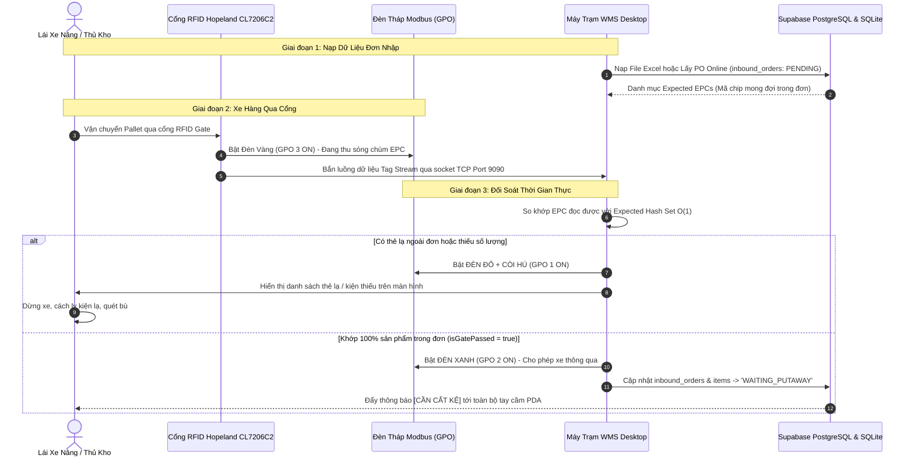

# BÁO CÁO KỸ THUẬT: QUY TRÌNH NGHIỆP VỤ KHO VẬN THÔNG MINH RFID (WMS)
> **Hệ thống:** RFID Warehouse Management System (RFID WMS)  
> **Nền tảng ứng dụng:** Flutter Desktop (Quản trị & Cổng Gate) + Flutter PDA Android (SEUIC UTouch 2)  
> **Cơ sở dữ liệu:** PostgreSQL 17 (Supabase Realtime Cloud) + SQLite Offline-First Cache  
> **Phần cứng tích hợp:** Cổng RFID Hopeland CL7206C2 (TCP Port 9090), Đèn tháp Modbus TCP/GPO, Đầu đọc di động SEUIC UHF AAR  
> **Phiên bản tài liệu:** 2.0 (Chuẩn báo cáo đồ án / đề án tốt nghiệp & tài liệu kỹ thuật vận hành)

---

## MỤC LỤC
1. [TỔNG QUAN HỆ THỐNG & MA TRẬN PHÂN ĐỊNH TRÁCH NHIỆM (RACI)](#1-tổng-quan-hệ-thống--ma-trận-phân-định-trách-nhiệm-raci)
2. [4 NGUYÊN TẮC VẬN HÀNH BẤT BIẾN (CORE BUSINESS RULES)](#2-4-nguyên-tắc-vận-hành-bất-biến-core-business-rules)
3. [SƠ ĐỒ 0: CHUỖI GIÁ TRỊ NGHIỆP VỤ TOÀN TRÌNH (END-TO-END MASTER FLOW)](#3-sơ-đồ-0-chuỗi-giá-trị-nghiệp-vụ-toàn-trình-end-to-end-master-flow)
4. [SƠ ĐỒ 1: QUY TRÌNH NHẬP KHO & ĐỐI SOÁT CỔNG RFID GATE TỰ ĐỘNG](#4-sơ-đồ-1-quy-trình-nhập-kho--đối-soát-cổng-rfid-gate-tự-động)
5. [SƠ ĐỒ 2: QUY TRÌNH CẤT KỆ 2-HỘP & BẢN ĐỒ KHO 2D TRÊN PDA](#5-sơ-đồ-2-quy-trình-cất-kệ-2-hộp--bản-đồ-kho-2d-trên-pda)
6. [SƠ ĐỒ 3: QUY TRÌNH QUẢN LÝ KHO NỘI BỘ, ĐIỀU CHUYỂN & KIỂM KÊ RFID](#6-sơ-đồ-3-quy-trình-quản-lý-kho-nội-bộ-điều-chuyển--kiểm-kê-rfid)
7. [SƠ ĐỒ 4: QUY TRÌNH XUẤT KHO CHUẨN FIFO & ĐỐI SOÁT CỔNG 2 PHA](#7-sơ-đồ-4-quy-trình-xuất-kho-chuẩn-fifo--đối-soát-cổng-2-pha)
8. [CƠ CHẾ ĐỒNG BỘ DỮ LIỆU & RÀNG BUỘC CSDL SUPABASE / SQLITE](#8-cơ-chế-đồng-bộ-dữ-liệu--ràng-buộc-csdl-supabase--sqlite)
9. [HƯỚNG DẪN XUẤT ẢNH & ĐƯA VÀO BÁO CÁO MICROSOFT WORD / LATEX](#9-hướng-dẫn-xuất-ảnh--đưa-vào-báo-cáo-microsoft-word--latex)

---

## 1. TỔNG QUAN HỆ THỐNG & MA TRẬN PHÂN ĐỊNH TRÁCH NHIỆM (RACI)

Hệ thống Kho Vận Thông Minh RFID (RFID WMS) giải quyết bài toán cốt lõi của kho hàng hiện đại: **Tự động hóa đối soát không tiếp xúc, triệt tiêu sai lệch kiểm kê, dẫn đường cất kệ thông minh và đảm bảo nghiêm ngặt nguyên tắc xuất hàng FIFO.**

### 1.1. Các Tác Nhân Vận Hành Chính
1. **Phòng Mua Hàng & Kinh Doanh (Purchasing & Sales):** Khởi tạo đơn mua hàng (PO - Purchase Order) và đơn bán hàng (SO - Sales Order), theo dõi tiến độ giao nhận hàng.
2. **Kế Toán Kho & Trưởng Kho (Warehouse Accounting & Supervisors):** Đối chiếu chứng từ, phê duyệt đơn, giám sát tỷ lệ lấp đầy kệ, phê duyệt xử lý sai lệch kiểm kê kho.
3. **Thủ Kho & Đội Xe Nâng Hiện Trường (Operators & Forklift Drivers):** Bốc dỡ hàng, dán tem chip RFID, lái xe nâng qua cổng kiểm soát, thao tác cất kệ/nhặt hàng bằng tay cầm PDA.
4. **Hệ Thống Công Nghệ RFID WMS & Thiết Bị Ngoại Vi (Smart RFID System):** Cổng đọc Hopeland CL7206C2 cố định, tháp đèn Modbus 3 màu kèm còi, tay cầm PDA SEUIC UTouch 2 Android, máy trạm Desktop, CSDL Supabase PostgreSQL 17 và SQLite.

### 1.2. Ma Trận Phân Định Trách Nhiệm RACI Matrix
*(Chú thích: **R** = Responsible - Người trực tiếp thực hiện; **A** = Accountable - Người phê duyệt & chịu trách nhiệm; **C** = Consulted - Người phối hợp/tham vấn; **I** = Informed - Người nhận thông báo)*

| STT | Bước Nghiệp Vụ Thực Tế | Phòng Kinh Doanh / Thu Mua | Trưởng Kho / Kế Toán | Thủ Kho & Xe Nâng | Hệ Thống RFID WMS |
| :---: | :--- | :---: | :---: | :---: | :---: |
| **I** | **GIAI ĐOẠN 1: MUA HÀNG & NHẬP KHO QUA CỔNG RFID GATE** | | | | |
| 1.1 | Lập Đơn Mua Hàng (PO) / Nạp file Excel Packing List | **R** | A | - | Tự động phân tích (I) |
| 1.2 | Tiếp nhận hàng tại bến, dán chip RFID / đóng Pallet | - | I | **R** | - |
| 1.3 | Xe nâng chở Pallet qua Cổng RFID Hopeland CL7206C2 | - | I | **R** | Thu chùm sóng EPC (A) |
| 1.4 | Đối soát thời gian thực & Phản hồi Đèn tháp Modbus | - | - | Quan sát đèn (I) | **Đối soát 100% (R)** |
| 1.5 | Xử lý ngoại lệ: Báo động Đỏ + Còi hú khi có thẻ lạ / thiếu | - | A | **Kiểm đếm lại (R)** | Khóa cổng (A) |
| 1.6 | Cổng thông qua (Đèn Xanh), chuyển trạng thái `WAITING_PUTAWAY` | I | A | Bàn giao (R) | **Đồng bộ CSDL & Báo PDA (R)** |
| **II** | **GIAI ĐOẠN 2: CẤT KỆ VÀ ĐỊNH VỊ Ô KỆ LƯU TRỮ (PUTAWAY)** | | | | |
| 2.1 | Nhận thông báo tác vụ `[CẦN CẤT KỆ]` trên tay cầm PDA | - | - | **Mở PDA nhận việc (R)** | Tự động đẩy Notification (A) |
| 2.2 | Quét Barcode Pallet, hệ thống kích hoạt Giao diện 2-Hộp | - | - | **Thao tác PDA (R)** | Phân tích SKU & Số lượng (R) |
| 2.3 | Thuật toán gợi ý ô kệ tối ưu & Bản đồ dẫn đường 2D | - | - | Đi theo chỉ dẫn (I) | **Tính vị trí & Dẫn đường (R)** |
| 2.4 | Bóp cò PDA quét mã Barcode tem dán trên kệ vật lý | - | - | **Quét xác nhận (R)** | Thẩm định tọa độ kệ (A) |
| 2.5 | Cam kết lưu kho: `item.locationId = targetLocation`, `IN_STOCK` | - | Theo dõi sổ (I) | Hoàn tất tác vụ (R) | **Ghi CSDL & Log Transaction (R)** |
| **III**| **GIAI ĐOẠN 3: QUẢN LÝ KHO NỘI BỘ, ĐIỀU CHUYỂN & KIỂM KÊ** | | | | |
| 3.1 | Quản lý kho 4-Tab (Pallet, Kệ, Lịch sử biến động, Sản phẩm) | - | Giám sát (A) | Tra cứu nhanh (R) | Hiển thị Real-time 2D (R) |
| 3.2 | Điều chuyển hàng giữa các kệ (Location Transfer) | - | A | **Thực hiện trên PDA (R)** | Cập nhật vị trí mới (R) |
| 3.3 | Dồn gộp thùng hàng giữa các Pallet (Pallet Merge) | - | A | **Thực hiện trên PDA (R)** | Chuyển liên kết Pallet (R) |
| 3.4 | Bóp cò PDA quét RFID kiểm kê theo Kệ / Zone | - | Giám sát (A) | **Cầm súng quét (R)** | Phân loại 4 nhóm sai lệch (R) |
| 3.5 | Lập biên bản chênh lệch, cân chỉnh tồn kho (`ADJUST`) | - | **Phê duyệt (A)** | Ký biên bản (C) | Cân bằng tồn kho CSDL (R) |
| **IV** | **GIAI ĐOẠN 4: XUẤT KHO CHUẨN FIFO & GIẢI PHÓNG VỊ TRÍ KỆ** | | | | |
| 4.1 | Tiếp nhận Đơn đặt hàng (SO) & Khởi tạo Đơn Xuất PO | **R** | Phê duyệt (A) | - | Tạo `outbound_orders` (I) |
| 4.2 | Thuật toán FIFO bắt buộc: Lọc lô hàng có `created_at` cũ nhất | - | Kiểm soát hạn (A) | Tuân thủ lệnh (I) | **Thuật toán FIFO (R)** |
| 4.3 | Wizard chỉ đường nhặt hàng tối ưu qua các kệ kho | - | - | **Soạn hàng theo Wizard (R)** | Dẫn đường tối ưu (A) |
| 4.4 | Xe hàng qua Cổng RFID Xuất: Đối soát 2 pha (Pallet + Hàng) | - | Giám sát (A) | **Lái xe nâng (R)** | Đối soát 2 pha (R) |
| 4.5 | Đèn Xanh thông qua, đánh dấu đơn hàng `SHIPPED` | - | Theo dõi (I) | Bàn giao (R) | **Đổi trạng thái CSDL (R)** |
| 4.6 | Giải phóng vị trí kệ: `locationId = null`, kệ trở về TRỐNG | - | - | - | **Giải phóng tự động CSDL (R)** |
| 4.7 | In Phiếu Xuất Kho (Delivery Note) & Bàn giao vận chuyển | **Theo dõi (I)** | **Ký phiếu xuất (A)** | Bàn giao hàng (R) | Lưu vết hoàn tất (R) |

---

## 2. 4 NGUYÊN TẮC VẬN HÀNH BẤT BIẾN (CORE BUSINESS RULES)

1. **Nguyên Tắc Không Chạm Qua Cổng Tự Động (Touchless RFID Gate Verification):**
   - Không đếm tay từng thùng. Cổng RFID cố định Hopeland CL7206C2 quét chùm hàng trăm thẻ EPC đồng thời qua 4 ăng-ten phân cực tròn trong thời gian 1-3 giây.
   - Xe hàng chỉ được phép rời cổng khi Đèn Tháp chuyển sang **ĐÈN XANH** (`GPO 2 ON`). Khi có bất kỳ thẻ lạ ngoài đơn hoặc thiếu số lượng, hệ thống lập tức bật **ĐÈN ĐỎ + CÒI HÚ** (`GPO 1 ON`) và khóa cổng.
2. **Nguyên Tắc Cất Kệ 2-Hộp Có Xác Thực Tem Kệ (Two-Step Validated Putaway):**
   - Hàng hóa sau khi qua cổng phải được đưa vào kệ lưu trữ ngay, không được lưu cữu tại vùng đệm.
   - Thủ kho bắt buộc phải dùng PDA quét Barcode dán trên vị trí kệ vật lý (`location_code`). Hệ thống chỉ cho phép bấm `[XÁC NHẬN CẤT KỆ]` khi vị trí quét khớp với tọa độ hợp lệ, triệt tiêu hoàn toàn lỗi cất nhầm vị trí.
3. **Nguyên Tắc Xuất Hàng FIFO Nghiêm Ngặt (First-In, First-Out Enforcement):**
   - Thuật toán hệ thống tự động khóa và chỉ định các kiện hàng có ngày nhập `created_at` xa nhất trong kho để xuất trước.
   - Nếu nhân viên nhặt nhầm lô hàng mới hơn, hệ thống trên PDA và Cổng RFID sẽ **báo động đỏ và từ chối xuất**, bắt buộc trả hàng về kệ và nhặt đúng kiện chỉ định.
4. **Nguyên Tắc Giải Phóng Vị Trí Tức Thì (Instant Location Release):**
   - Ngay khi kiện hàng được xác nhận qua Cổng RFID Xuất, WMS lập tức cập nhật `item.locationId = null` và `pallet.locationId = null`, đưa sức chứa của ô kệ trở lại trạng thái `AVAILABLE / EMPTY` (Còn chỗ / Trống) trong thời gian thực, sẵn sàng đón đợt hàng nhập kế tiếp mà không cần dọn dẹp thủ công.

---

## 3. SƠ ĐỒ 0: CHUỖI GIÁ TRỊ NGHIỆP VỤ TOÀN TRÌNH (END-TO-END MASTER FLOW)

Sơ đồ tổng quan mô tả dòng chảy hàng hóa và dữ liệu xuyên suốt 5 phân đoạn lớn trong kho hàng RFID:

```mermaid
flowchart LR
    %% STYLE DEFINITIONS
    classDef startEnd fill:#0F172A,stroke:#38BDF8,stroke-width:2px,color:#FFFFFF,font-weight:bold;
    classDef stepNode fill:#FFFFFF,stroke:#0284C7,stroke-width:2px,color:#0F172A,font-weight:bold;
    classDef gateNode fill:#F0FDF4,stroke:#16A34A,stroke-width:2px,color:#15803D,font-weight:bold;
    classDef warningNode fill:#FEF2F2,stroke:#DC2626,stroke-width:2px,color:#B91C1C,font-weight:bold;

    A([1. MUA HÀNG & TIẾP NHẬN<br/>Lập PO / Nạp Excel Packing List]):::startEnd --> B[2. CỔNG RFID GATE NHẬP<br/>Hopeland CL7206C2 Đối Soát 100%]:::gateNode
    B -->|Đèn Xanh: WAITING_PUTAWAY| C[3. CẤT KỆ THÔNG MINH PDA<br/>Gợi ý vị trí + Sơ đồ 2D + Tem Kệ]:::stepNode
    C -->|Lưu kho: IN_STOCK| D[4. QUẢN LÝ KHO & KIỂM KÊ<br/>Điều chuyển / Dồn Pallet / Audit 4 Nhóm]:::stepNode
    D -->|Khởi tạo Đơn Xuất PO| E[5. XUẤT KHO FIFO & CỔNG GATE<br/>Wizard 10 Kệ + Cổng 2 Pha + Giải Phóng Kệ]:::gateNode
    E --> F([6. GIAO HÀNG & BÀN GIAO<br/>In Phiếu Delivery Note]):::startEnd

    B -.->|Lỗi thẻ lạ / Thiếu| B1[Báo Động Đỏ + Còi Hú<br/>Kiểm tra xử lý kiện lạ]:::warningNode
    B1 -.-> B
    E -.->|Vi phạm FIFO / Sai hàng| E1[Báo Động Đỏ + Chặn Cổng<br/>Nhặt lại đúng kiện FIFO]:::warningNode
    E1 -.-> E
```



---

## 4. SƠ ĐỒ 1: QUY TRÌNH NHẬP KHO & ĐỐI SOÁT CỔNG RFID GATE TỰ ĐỘNG

Quy trình nhập kho tự động đảm bảo kiểm đếm 100% số lượng sản phẩm không cần bóc dỡ từng thùng:



---

## 5. SƠ ĐỒ 2: QUY TRÌNH CẤT KỆ 2-HỘP & BẢN ĐỒ KHO 2D TRÊN PDA

Quy trình cất hàng chuẩn xác, loại trừ 100% rủi ro để sai vị trí kệ:

```mermaid
flowchart TD
    classDef pdaNode fill:#EFF6FF,stroke:#2563EB,stroke-width:2px,color:#1E40AF,font-weight:bold;
    classDef algoNode fill:#FAF5FF,stroke:#9333EA,stroke-width:2px,color:#6B21A8,font-weight:bold;
    classDef checkNode fill:#FFFBEB,stroke:#D97706,stroke-width:2px,color:#B45309,font-weight:bold;
    classDef dbNode fill:#F0FDF4,stroke:#16A34A,stroke-width:2px,color:#15803D,font-weight:bold;
    classDef errNode fill:#FEF2F2,stroke:#DC2626,stroke-width:2px,color:#B91C1C,font-weight:bold;

    P1[1. Mở PDA: Bấm thẻ thông báo 'CẦN CẤT KỆ']:::pdaNode --> P2[2. Quét Barcode dán trên Pallet / Thùng hàng]:::pdaNode
    P2 --> P3[Mở PdaPutawayScreen: Kích hoạt Luồng 2-Hộp]:::pdaNode
    
    subgraph UI_2_HOP ["GIAO DIỆN 2-HỘP TRÊN MÀN HÌNH PDA"]
        P3 --> U1[HỘP 1: Thông tin hàng hóa<br/>Mã Pallet, SKU, Tên SP, Đơn nguồn]:::pdaNode
        P3 --> U2[HỘP 2: Gợi ý vị trí Kệ tối ưu<br/>Thuật toán tìm Zone -> Kệ trống cùng SKU]:::algoNode
        U2 --> U3[SƠ ĐỒ BẢN ĐỒ KHO 2D<br/>Vẽ đường line dẫn hướng tới kệ đích]:::algoNode
    end

    U3 --> P4[3. Thủ kho di chuyển hàng tới đúng ô kệ đích]:::pdaNode
    P4 --> P5[4. Bóp cò PDA quét mã Barcode dán trên Kệ vật lý]:::pdaNode
    
    P5 --> C1{Mã Kệ hợp lệ<br/>& Trùng tọa độ?}:::checkNode
    C1 -- Không khớp / Kệ đầy --> E1[Cảnh báo Rung + Chuông lỗi<br/>Yêu cầu quét đúng kệ chỉ định]:::errNode
    E1 --> P4

    C1 -- Khớp chuẩn xác --> P6[5. Bấm nút 'XÁC NHẬN CẤT KỆ']:::pdaNode
    P6 --> D1[CAM KẾT CSDL SUPABASE & SQLITE:<br/>- item.status = 'IN_STOCK'<br/>- item.locationId = targetLocation.id<br/>- location.status = 'AVAILABLE' hoặc 'FULL'<br/>- Ghi nhật ký: Transaction IN (Putaway)]:::dbNode
    D1 --> P7([Hoàn tất cất kệ: Chuyển kiện tiếp theo]):::pdaNode
```

---

## 6. SƠ ĐỒ 3: QUY TRÌNH QUẢN LÝ KHO NỘI BỘ, ĐIỀU CHUYỂN & KIỂM KÊ RFID

Hệ thống cung cấp 4 module nghiệp vụ nội bộ độc lập giúp quản trị tồn kho chuẩn xác:

```mermaid
flowchart LR
    classDef transNode fill:#EFF6FF,stroke:#2563EB,stroke-width:2px,color:#1E40AF;
    classDef mergeNode fill:#F0FDF4,stroke:#16A34A,stroke-width:2px,color:#15803D;
    classDef auditNode fill:#FAF5FF,stroke:#9333EA,stroke-width:2px,color:#6B21A8;
    classDef dashNode fill:#FFFBEB,stroke:#D97706,stroke-width:2px,color:#B45309;

    subgraph SUB_A ["PHÂN HỆ A: ĐIỀU CHUYỂN KỆ (TRANSFER)"]
        T1[Quét mã Kệ Nguồn] --> T2[Chọn Thùng / Pallet] --> T3[Quét Kệ Đích] --> T4[Lưu locationId mới<br/>Ghi log MOVE]:::transNode
    end

    subgraph SUB_B ["PHÂN HỆ B: DỒN PALLET (MERGE)"]
        M1[Quét Pallet Nguồn] --> M2[Chọn Thùng Cần Gom] --> M3[Quét Pallet Đích] --> M4[Chuyển palletId<br/>Giải phóng Pallet cũ]:::mergeNode
    end

    subgraph SUB_C ["PHÂN HỆ C: KIỂM KÊ RFID (AUDIT 4 NHÓM)"]
        A1[Tạo Phiên Kiểm Kê<br/>Chọn Zone / Kệ] --> A2[Bóp cò súng PDA<br/>Quét chùm sóng RFID] --> A3{Phân Loại 4 Nhóm}:::auditNode
        A3 -->|1. Khớp đúng kệ| R1[MATCH - Màu Xanh]:::mergeNode
        A3 -->|2. Thiếu thực tế| R2[MISSING - Màu Đỏ]:::auditNode
        A3 -->|3. Lạc vị trí| R3[WRONG_LOC - Màu Cam]:::dashNode
        A3 -->|4. Thẻ lạ ngoài kho| R4[UNKNOWN_EPC - Màu Tím]:::transNode
        A3 --> A4[Cân chỉnh tồn kho ADJUST<br/>Xuất báo cáo Excel]:::auditNode
    end

    subgraph SUB_D ["PHÂN HỆ D: QUẢN TRỊ 4-TAB & BẢN ĐỒ 2D"]
        D1[Tab 1: Quản lý Pallet]:::dashNode
        D2[Tab 2: Vị trí Kệ Kho (1-Chạm)]:::dashNode
        D3[Tab 3: Lịch sử Biến Động]:::dashNode
        D4[Tab 4: Tra cứu & Map 2D]:::dashNode
    end
```

---

## 7. SƠ ĐỒ 4: QUY TRÌNH XUẤT KHO CHUẨN FIFO & ĐỐI SOÁT CỔNG 2 PHA

Đảm bảo nguyên tắc lô nhập cũ nhất được xuất trước, giải phóng vị trí ô kệ tự động:

```mermaid
flowchart TD
    classDef startNode fill:#0F172A,stroke:#38BDF8,stroke-width:2px,color:#FFFFFF,font-weight:bold;
    classDef actionNode fill:#EFF6FF,stroke:#2563EB,stroke-width:2px,color:#1E40AF,font-weight:bold;
    classDef fifoNode fill:#FAF5FF,stroke:#9333EA,stroke-width:2px,color:#6B21A8,font-weight:bold;
    classDef checkNode fill:#FFFBEB,stroke:#D97706,stroke-width:2px,color:#B45309,font-weight:bold;
    classDef successNode fill:#F0FDF4,stroke:#16A34A,stroke-width:2px,color:#15803D,font-weight:bold;
    classDef dangerNode fill:#FEF2F2,stroke:#DC2626,stroke-width:2px,color:#B91C1C,font-weight:bold;

    O1([1. Tiếp nhận Đơn Đặt Hàng SO: Khởi tạo outbound_orders]):::startNode --> O2[2. THUẬT TOÁN ĐỐI SOÁT FIFO<br/>Truy vấn hàng IN_STOCK, sắp xếp theo created_at cũ nhất]:::fifoNode
    O2 --> O3{Kiểm tra lô hàng<br/>chọn xuất?}:::checkNode

    O3 -- Có lô cũ hơn chưa xuất --> E1[CẢNH BÁO VI PHẠM FIFO!<br/>Chặn xuất đơn, yêu cầu lấy đúng lô đề xuất]:::dangerNode
    E1 --> O2

    O3 -- Đúng chuẩn FIFO --> O4[3. WIZARD CHỈ ĐƯỜNG LẤY HÀNG<br/>Tối ưu lộ trình di chuyển qua 10 kệ kho trên PDA]:::actionNode
    O4 --> O5[Thủ kho quét xác nhận từng kiện hàng và đưa ra khu tập kết xuất]:::actionNode
    O5 --> O6[4. XE HÀNG QUA CỔNG RFID XUẤT<br/>Hopeland CL7206C2 kích hoạt Đèn Vàng]:::actionNode

    subgraph PHA_2 ["QUY TRÌNH ĐỐI SOÁT 2 PHA TẠI CỔNG"]
        O6 --> P1[PHA 1: Quét nhận diện mã RFID Pallet]:::actionNode
        P1 --> P2[PHA 2: Quét chùm toàn bộ chip EPC sản phẩm]:::actionNode
    end

    P2 --> C2{Đúng 100% số lượng<br/>& mã hàng trong PO?}:::checkNode
    C2 -- Sai hàng / Thừa / Thiếu --> E2[BÁO ĐỘNG ĐỎ + CÒI HÚ (GPO 1)<br/>Khóa cổng, bắt buộc kiểm tra lại xe hàng]:::dangerNode
    E2 --> O5

    C2 -- Đạt 100% chuẩn xác --> O7[BẬT ĐÈN XANH (GPO 2 ON)<br/>Đơn hàng chuyển: SHIPPED, isGatePassed = true]:::successNode
    O7 --> O8[5. TỰ ĐỘNG GIẢI PHÓNG VỊ TRÍ KỆ TRONG CSDL:<br/>- item.status = 'DELIVERED'<br/>- item.locationId = null (Xóa liên kết kệ)<br/>- pallet.locationId = null (Giải phóng pallet)<br/>- Vị trí ô kệ chuyển về: AVAILABLE / EMPTY<br/>- Ghi Transaction Log: OUT]:::successNode
    O8 --> O9([6. In Phiếu Xuất Kho Delivery Note & Bàn giao Khách Hàng]):::startNode
```

---

## 8. CƠ CHẾ ĐỒNG BỘ DỮ LIỆU & RÀNG BUỘC CSDL SUPABASE / SQLITE

Để đảm bảo quy tắc **Tuyệt đối không dùng Mock Data (No Mock Data)**, toàn bộ dữ liệu nghiệp vụ được kiểm soát chặt chẽ thông qua hệ thống bảng và khóa ngoại:

| Tên Bảng | Vai Trò Trong Quy Trình Nghiệp Vụ | Ràng Buộc & Trạng Thái |
| :--- | :--- | :--- |
| `inbound_orders` | Lưu trữ Đơn Nhập Hàng từ nhà cung cấp | Trạng thái: `PENDING` -> `WAITING_PUTAWAY` -> `COMPLETED` |
| `inbound_order_details` | Chi tiết số lượng và SKU từng dòng hàng trong đơn nhập | Khóa ngoại tham chiếu `order_id` và `sku` |
| `items` | Bản ghi từng sản phẩm/thùng mang mã chip RFID duy nhất (EPC) | Trạng thái: `PENDING_INBOUND` -> `WAITING_PUTAWAY` -> `IN_STOCK` -> `DELIVERED` |
| `pallets` | Quản lý mã Pallet chứa các thùng hàng | Gán `location_id` khi cất kệ, gán `null` khi xuất kho |
| `locations` | Danh mục tọa độ ô kệ vật lý (Zone, Rack, Shelf, Bin) | Trạng thái sức chứa: `EMPTY` -> `AVAILABLE` -> `FULL` |
| `outbound_orders` | Lưu trữ Đơn Xuất Hàng theo nguyên tắc FIFO | Trạng thái: `NEW` -> `PICKING` -> `SHIPPED` -> `DELIVERED` |
| `outbound_order_details`| Chi tiết số lượng SKU cần xuất trong đơn | Đối soát chặt chẽ với số lượng chip thực tế đọc tại cổng |
| `inventory_transactions`| Nhật ký vết toàn bộ biến động kho (Audit Trail) | Phân loại giao dịch: `IN` (Nhập/Cất kệ), `OUT` (Xuất), `MOVE` (Chuyển kệ), `ADJUST` (Cân chỉnh) |
| `inventory_sessions` | Phiên kiểm kê định kỳ bằng súng PDA di động | Trạng thái: `CREATED` -> `IN_PROGRESS` -> `COMPLETED` |
| `inventory_session_details`| Kết quả phân loại từng thẻ trong phiên kiểm kê | 4 phân loại: `MATCH`, `MISSING`, `WRONG_LOC`, `UNKNOWN_EPC` |

---

## 9. HƯỚNG DẪN XUẤT ẢNH & ĐƯA VÀO BÁO CÁO MICROSOFT WORD / LATEX

Để đưa sơ đồ vào báo cáo đồ án, khóa luận hoặc tài liệu vận hành với chất lượng cao nhất:

1. **Sử dụng Trình Báo Cáo Chuyên Dụng:**
   - Mở file [`Bao_Cao_Nghiep_Vu_Kho_RFID.html`](file:///c:/Users/NGO%20VAN%20HAI/OneDrive/Documents/rfidwarehouse/Bao_Cao_Nghiep_Vu_Kho_RFID.html) bằng bất kỳ trình duyệt web nào (Chrome, Edge, Firefox).
   - Trang web đã được thiết kế sẵn với tông màu **Light Theme chuẩn in ấn học thuật**, viền sắc nét và font chữ rõ ràng.
2. **Xuất Ảnh Độ Phân Giải Cao (300 DPI):**
   - Trên mỗi sơ đồ (Tổng thể, Nhập kho, Cất kệ, Quản lý nội bộ, Xuất kho FIFO), bấm nút **"📷 Tải Ảnh PNG Sắc Nét"**.
   - Ảnh tải về sẽ có nền trắng hoặc trong suốt, chuẩn tỷ lệ vàng, chèn vào Microsoft Word hoặc Google Docs sẽ hiển thị ngay ngắn, chữ to rõ, không bị mờ hay vỡ font.
3. **In hoặc Xuất Trực Tiếp Ra File PDF Báo Cáo:**
   - Bấm nút **"🖨️ In / Xuất PDF Toàn Bộ Báo Cáo"** trên thanh công cụ của trang HTML.
   - Trình duyệt sẽ mở hộp thoại in với CSS `@media print` đã được tối ưu hóa: tự động ngắt trang A4 chuẩn chỉnh, ẩn các thanh menu công cụ, giữ nguyên các bảng biểu và sơ đồ vector.
4. **Nhúng Trực Tiếp Vào Markdown / Notion / GitHub:**
   - Các đoạn mã Mermaid trong tài liệu này có thể copy và paste trực tiếp vào các trình soạn thảo hỗ trợ Mermaid (như Obsidian, Notion, GitHub Markdown, GitLab).
