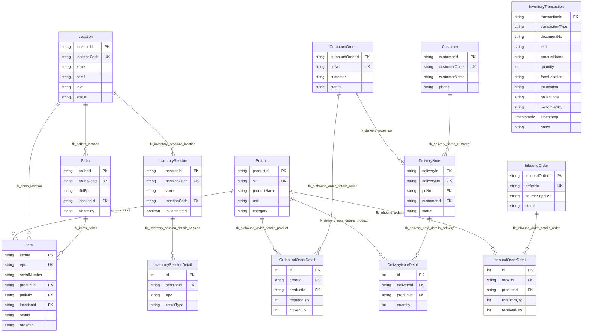
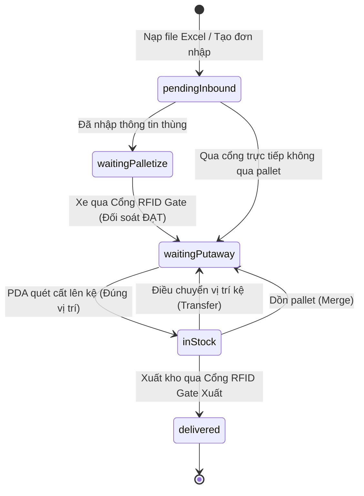

# BẢN ĐỒ KIẾN TRÚC & MÃ NGUỒN DỰ ÁN (CODE GRAPH)
> **Dành cho các AI Coding Agents & Nhà phát triển:** 
> File này phản ánh tổng thể kiến trúc hệ thống, sơ đồ phụ thuộc (dependencies), phân luồng dữ liệu (data flow) và danh mục các thành phần trong dự án.
> **Quy tắc bắt buộc:** Mọi Agent khi thực hiện thay đổi kiến trúc, thêm màn hình, sửa luồng nghiệp vụ hoặc refactor dịch vụ đều **PHẢI** cập nhật bổ sung vào file này.

---

## 1. Sơ Đồ Kiến Trúc Phụ Thuộc Tổng Thể (System Architecture Graph)

```mermaid
graph TD
    subgraph Presentation_Layer["TẦNG GIAO DIỆN (PRESENTATION LAYER)"]
        Main["lib/main.dart"] --> Wrapper["lib/screens/desktop_pda_wrapper.dart"]
        
        Wrapper -->|Windows / macOS / Linux / Web >= 850px| Desktop["DESKTOP PLATFORM (desktop_main_layout.dart)"]
        Wrapper -->|Android / iOS / Web < 850px| PDA["PDA HANDHELD PLATFORM (pda_home_screen.dart)"]
        
        subgraph Desktop_Screens["Desktop Views"]
            Desktop --> D_Receive["desktop_goods_receive_view.dart (Nhập Cổng RFID)"]
            Desktop --> D_Delivery["desktop_goods_delivery_view.dart (Xuất Kho FIFO)"]
            Desktop --> D_Inventory["desktop_inventory_view.dart (Kiểm Kê Kho: Tạo Đơn & Nạp File Quét Đủ)"]
            Desktop --> D_Warehouse["desktop_warehouse_management_view.dart (Quản Lý Kho: Pallet, Vị Trí, Lịch Sử, Sản Phẩm)"]
            Desktop --> D_Location["desktop_location_management_view.dart (Sơ Đồ Kệ Kho & Vị Trí Lưu Trữ)"]
            Desktop --> D_Lookup["desktop_lookup_view.dart (Tra Cứu Chi Tiết & Thẻ Kho)"]
            Desktop --> D_Studio["desktop_uhf_studio_view.dart (Hopeland Studio)"]
            Desktop --> D_Config["desktop_connection_config_view.dart (Cấu Hình Kết Nối)"]
            Desktop --> D_Users["desktop_user_management_view.dart (Phân Quyền)"]
        end

        subgraph PDA_Screens["PDA Mobile Views"]
            PDA --> P_Putaway["pda_putaway_screen.dart (Cất Kệ Hàng Hóa)"]
            PDA --> P_Transfer["pda_transfer_screen.dart (Chuyển Vị Trí Kệ)"]
            PDA --> P_Merge["pda_merge_pallets_screen.dart (Dồn Gộp Pallet)"]
            PDA --> P_Audit["pda_inventory_screen.dart (Kiểm Kê Di Động)"]
            PDA --> P_Warehouse["pda_warehouse_management_screen.dart (Quản Lý Kho Di Động: Pallet, Vị Trí, Lịch Sử, Sản Phẩm)"]
        end
    end

    subgraph Business_State_Layer["TẦNG TRẠNG THÁI & NGHIỆP VỤ (STATE & LOGIC)"]
        Repo["WarehouseRepository (Singleton State Engine)"]
        Auth["AuthService (Xác Thực & Phân Quyền)"]
        Theme["EyeCareThemeService (Giao Diện Dịu Mắt)"]
        
        Desktop_Screens -->|Đọc / Ghi trạng thái| Repo
        PDA_Screens -->|Đọc / Ghi trạng thái| Repo
        Desktop_Screens --> Theme
        PDA_Screens --> Theme
        Desktop_Screens --> Auth
        PDA_Screens --> Auth
    end

    subgraph Hardware_Layer["TẦNG PHẦN CỨNG & MẠNG (HARDWARE & ADAPTERS)"]
        D_Receive -->|Điều khiển đèn| Tower["TowerLightService (Modbus TCP / HTTP)"]
        D_Receive -->|Nhận thẻ từ cổng| DesktopUHF["DesktopUhfTcpService (Port 9090 TCP)"]
        D_Delivery -->|Nhận thẻ xuất| DesktopUHF
        D_Studio -->|Cấu hình anten, dBm| DesktopUHF
        
        PDA_Screens -->|Bóp cò tay súng| MobileUHF["UhfService (Native Android Plugin)"]
        D_Receive -->|Đọc phiếu Excel| Excel["ExcelImportService"]
        Repo -->|Đồng bộ ERP| ERP["ErpBravoService"]
    end

    subgraph Persistence_Layer["TẦNG LƯU TRỮ DỮ LIỆU (DATABASE & CLOUD)"]
        Repo <--> LocalDB["DatabaseService (SQLite)"]
        Repo <--> CloudSync["SupabaseSyncService (Realtime WebSocket)"]
        CloudSync <--> Postgres[("Supabase Cloud / PostgreSQL 17")]
    end
```



---

## 2. Danh Mục Các Thành Phần Mã Nguồn (Component Directory Registry)

| Thư mục / File | Vai trò & Trách nhiệm chính |
|---|---|
| [`lib/main.dart`](file:///c:/Users/MNT/Documents/uhf/lib/main.dart) | Điểm khởi chạy ứng dụng, nạp CSDL vào RAM, khởi tạo UHF/Auth/Sync, áp dụng theme EyeCare. |
| [`lib/screens/desktop_pda_wrapper.dart`](file:///c:/Users/MNT/Documents/uhf/lib/screens/desktop_pda_wrapper.dart) | Bộ điều hướng thích ứng tự động (Desktop Layout trên PC, PDA Layout trên tay cầm Android). |
| **`lib/services/`** | **Tầng Dịch Vụ & Nghiệp Vụ Cốt Lõi** |
| ├── [`warehouse_repository.dart`](file:///c:/Users/MNT/Documents/uhf/lib/services/warehouse_repository.dart) | Quản lý toàn bộ dữ liệu trong RAM: danh mục hàng, pallet, vị trí kệ, đơn nhập/xuất, logic FIFO, cổng RFID, cơ chế giải phóng vị trí kệ/pallet khi xuất kho. |
| ├── [`desktop_uhf_tcp_service.dart`](file:///c:/Users/MNT/Documents/uhf/lib/services/desktop_uhf_tcp_service.dart) | Kết nối TCP Socket với Cổng RFID Gate cố định (Hopeland CL7206C/Speedata), giải mã byte raw sang EPC. |
| ├── [`uhf_service.dart`](file:///c:/Users/MNT/Documents/uhf/lib/services/uhf_service.dart) | Driver UHF trên tay cầm PDA Android (Chainway C72e / Cruise2), bắt sự kiện nút bóp cò vật lý. |
| ├── [`tower_light_service.dart`](file:///c:/Users/MNT/Documents/uhf/lib/services/tower_light_service.dart) | Điều khiển đèn tháp tín hiệu giao thông tại cổng (Xanh = Đạt, Vàng = Chờ, Đỏ = Chip lạ/Lỗi + Còi). |
| ├── [`excel_import_service.dart`](file:///c:/Users/MNT/Documents/uhf/lib/services/excel_import_service.dart) | Phân tích file Excel phiếu nhập mẫu (`Template-Goods-Receive-v3.xlsx`), trích xuất SKU, Thùng, NCC. |
| ├── [`database_service.dart`](file:///c:/Users/MNT/Documents/uhf/lib/services/database_service.dart) | Quản lý CSDL SQLite cục bộ trên máy trạm và PDA khi offline. |
| ├── [`supabase_sync_service.dart`](file:///c:/Users/MNT/Documents/uhf/lib/services/supabase_sync_service.dart) | Đồng bộ dữ liệu 2 chiều thời gian thực lên Supabase PostgreSQL 17 Cloud. |
| ├── [`auth_service.dart`](file:///c:/Users/MNT/Documents/uhf/lib/services/auth_service.dart) | Quản lý tài khoản người dùng, phiên làm việc (Session) và phân quyền chức năng (RBAC). |
| **`lib/screens/desktop/`** | **Giao Diện Máy Bàn Quản Trị (Desktop WMS)** |
| ├── [`desktop_main_layout.dart`](file:///c:/Users/MNT/Documents/uhf/lib/screens/desktop/desktop_main_layout.dart) | Khung giao diện chính Desktop (Thanh điều hướng Sidebar, tìm kiếm toàn cục, huy hiệu kết nối). |
| ├── [`desktop_goods_receive_view.dart`](file:///d:/rfidwarehouse/lib/screens/desktop/desktop_goods_receive_view.dart) | Cổng Nhập kho RFID Gate, đối soát chip trực tiếp, điều khiển đèn tháp, khóa quét an toàn khi đủ 100%, bảo lưu danh sách bảng cho tới khi PDA cất kệ hoàn tất. |
| ├── [`desktop_goods_delivery_view.dart`](file:///d:/rfidwarehouse/lib/screens/desktop/desktop_goods_delivery_view.dart) | Cổng Xuất kho RFID Gate Desktop, cột NGÀY NHẬP theo date xa nhất (FIFO), đối soát 2 pha theo chip EPC, wizard chỉ đường lấy hàng qua 10 kệ. |
| ├── [`desktop_inventory_view.dart`](file:///c:/Users/MNT/Documents/uhf/lib/screens/desktop/desktop_inventory_view.dart) | Quản lý kiểm kê kho, đối soát tồn thực tế với hệ thống, lập phiếu kiểm kê. |
| ├── [`desktop_lookup_view.dart`](file:///c:/Users/MNT/Documents/uhf/lib/screens/desktop/desktop_lookup_view.dart) | Tra cứu chi tiết hàng hóa & mã RFID (dạng cột chuẩn theo Mặt hàng SKU và dạng Bảng phẳng toàn bộ). Đã xuất kho hiển thị rõ "ĐÃ XUẤT KHO". |
| ├── [`desktop_warehouse_management_view.dart`](file:///c:/Users/MNT/Documents/uhf/lib/screens/desktop/desktop_warehouse_management_view.dart) | Sơ đồ mặt bằng kho 2D tương tác, dựng vị trí các dãy kệ, cổng Gate, vị trí Pallet. |
| ├── [`desktop_location_management_view.dart`](file:///d:/rfidwarehouse/lib/screens/desktop/desktop_location_management_view.dart) | Quản lý vị trí lưu trữ và kệ kho, chỉ tính toán sản phẩm tồn kho thực tế (`inStock`), bỏ qua hàng đã xuất. |
| ├── [`desktop_uhf_studio_view.dart`](file:///c:/Users/MNT/Documents/uhf/lib/screens/desktop/desktop_uhf_studio_view.dart) | Hopeland Studio cấu hình thông số kỹ thuật đầu đọc (dBm công suất, dải tần, buzzer, antenna). |
| ├── [`desktop_connection_config_view.dart`](file:///c:/Users/MNT/Documents/uhf/lib/screens/desktop/desktop_connection_config_view.dart) | Cấu hình IP LAN, cổng Port, COM port và chế độ tự động kết nối lại. |
| ├── [`desktop_user_management_view.dart`](file:///c:/Users/MNT/Documents/uhf/lib/screens/desktop/desktop_user_management_view.dart) | Quản lý danh sách nhân viên, tài khoản, phân quyền thao tác. |
| **`lib/screens/pda/`** | **Giao Diện Tay Cầm Di Động (PDA WMS)** |
| ├── [`pda_home_screen.dart`](file:///c:/Users/MNT/Documents/uhf/lib/screens/pda/pda_home_screen.dart) | Bàn làm việc di động với lưới các phím tắt tác vụ nhanh (đã thay thế Trạng thái kệ & Tra cứu mã bằng Quản lý kho). |
| ├── [`outbound_screen.dart`](file:///d:/rfidwarehouse/lib/screens/outbound_screen.dart) | Xuất kho RFID PDA đồng bộ với Desktop, cột NGÀY NHẬP theo date xa nhất (FIFO), đối soát 2 pha theo chip EPC, 3 ô chỉ số ĐÃ QUÉT - THIẾU - LẠ. |
| ├── [`pda_putaway_screen.dart`](file:///c:/Users/MNT/Documents/uhf/lib/screens/pda/pda_putaway_screen.dart) | Quy trình cất hàng lên kệ: quét mã pallet/thùng, dẫn đường tới kệ và quét xác nhận vị trí kệ đích. |
| ├── [`pda_transfer_screen.dart`](file:///c:/Users/MNT/Documents/uhf/lib/screens/pda/pda_transfer_screen.dart) | Luân chuyển hàng hóa hoặc thùng giữa các vị trí kệ trong kho. |
| ├── [`pda_merge_pallets_screen.dart`](file:///c:/Users/MNT/Documents/uhf/lib/screens/pda/pda_merge_pallets_screen.dart) | Dồn gộp thùng hàng từ nhiều pallet vào một pallet tổng để tối ưu không gian. |
| ├── [`pda_inventory_screen.dart`](file:///c:/Users/MNT/Documents/uhf/lib/screens/pda/pda_inventory_screen.dart) | Bóp cò kiểm kê theo từng ô kệ, cảnh báo chip lạ lạc vị trí. |
| ├── [`pda_warehouse_management_screen.dart`](file:///d:/rfidwarehouse/lib/screens/pda/pda_warehouse_management_screen.dart) | Quản lý kho di động chuyên dụng cho tay cầm PDA gồm 4 tabs: Pallet, Vị Trí Kho (3 nút trạng thái nhanh 1-chạm ĐẦY/SẮP HẾT/CÒN CHỖ, chi tiết hàng thực), Lịch Sử (giao dịch & đơn xuất/nhập), Sản Phẩm (quét barcode/RFID súng cầm tay). |
| **`lib/widgets/`** | **Thư Viện Widget Dùng Chung** |
| ├── [`warehouse_floor_plan_widget.dart`](file:///c:/Users/MNT/Documents/uhf/lib/widgets/warehouse_floor_plan_widget.dart) | Canvas vẽ sơ đồ 2D mặt bằng kho, cổng RFID, vị trí pallet và đường đi dẫn hướng. |
| ├── [`warehouse_location_grid_widget.dart`](file:///c:/Users/MNT/Documents/uhf/lib/widgets/warehouse_location_grid_widget.dart) | Ma trận trực quan hóa các ô kệ kho kèm màu sắc trạng thái đầy/trống. |
| ├── [`tower_light_widget.dart`](file:///c:/Users/MNT/Documents/uhf/lib/widgets/tower_light_widget.dart) | Widget hiển thị trạng thái đèn tháp 3 màu (Xanh/Vàng/Đỏ) trên UI. |
| ├── [`gate_pass_fail_banner.dart`](file:///c:/Users/MNT/Documents/uhf/lib/widgets/gate_pass_fail_banner.dart) | Banner thông báo kết quả qua cổng (Đạt / Báo động sai sót). |
| ├── [`sonar_radar_widget.dart`](file:///c:/Users/MNT/Documents/uhf/lib/widgets/sonar_radar_widget.dart) | Radar mô phỏng mức sóng RSSI để định vị thẻ RFID bị thất lạc. |
| **`database/`** | **Cơ Sở Dữ Liệu & Ràng Buộc Toàn Vẹn (PostgreSQL 17 / Supabase)** |
| ├── [`supabase_schema.sql`](file:///c:/Users/MNT/Documents/uhf/supabase_schema.sql) | Toàn bộ schema khởi tạo 17 bảng (bao gồm `inventory_transactions`), RLS, Realtime và tự động đồng bộ đầy đủ PK, UK, FK an toàn. |
| ├── [`create_foreign_keys.sql`](file:///c:/Users/MNT/Documents/uhf/create_foreign_keys.sql) | Script độc lập thiết lập toàn diện 17 Khóa chính (PK), 10 Ràng buộc duy nhất (UK), dọn dẹp orphan data, 14 Khóa ngoại (FK) và B-Tree Indexes cho Supabase. |


---

## 3. Sơ Đồ Thực Thể Dữ Liệu & Khóa Ngoại (Entity Relationship Diagram - ERD)




---

## 4. Vòng Đời Trạng Thái Hàng Hóa (Item Lifecycle State Machine)



---

## 5. Hướng Dẫn Dành Cho Các AI Agent Khi Thực Hiện Thay Đổi (Agent Maintenance Protocol)

1. **Khi thêm/sửa một View hoặc Screen mới:**
   - Cập nhật mục `Presentation_Layer` trong sơ đồ Mermaid ở Mục 1.
   - Bổ sung tên file và mô tả trách nhiệm vào bảng Danh Mục Thành Phần ở Mục 2.
2. **Khi thay đổi cấu trúc dữ liệu hoặc trạng thái (`ItemStatus`, `Item`, `Pallet`...):**
   - Cập nhật sơ đồ ERD ở Mục 3 và Vòng đời trạng thái ở Mục 4.
3. **Tuyệt đối tuân thủ quy tắc No Mock Data:**
   - Không được tạo mock data tĩnh hardcode chèn vào code runtime.
   - Mọi thay đổi phải vượt qua toàn bộ bộ kiểm thử tự động:
     ```bash
     flutter test
     ```
4. **Quy tắc an toàn phần cứng RFID & Barcode trên PDA (Hardware Scanner Lifecycle):**
   - Khi khởi tạo màn hình mới (`initState`) hoặc thoát màn hình (`dispose`), bắt buộc gọi `_uhf.stopInventory()` để tránh rò rỉ sóng quét ngầm.
   - Luôn kiểm tra cờ chủ động quét (`if (!_isScanning) return;`) trong stream `onTagRead` để đảm bảo chỉ ghi nhận mã khi người dùng thực sự bóp cò hoặc bấm quét.

---

## 6. Hạ Tầng Đội Ngũ AI Antigravity (.agents / Workspace AI Squad)

Hệ thống tích hợp sẵn cấu trúc Agentic Workspace để tối ưu hoá làm việc nhóm với Antigravity IDE:

| Thành phần | Đường dẫn | Chức năng |
| :--- | :--- | :--- |
| **Team Orchestrator** | `AGENTS.md` | Bộ chỉ huy quy tắc & điều phối tác vụ |
| **RFID Hardware Engineer** | `.agents/skills/rfid-hardware-engineer/SKILL.md` | Chuyên trách Hopeland CL7206C2, SEUIC UTouch 2 AAR, Tower Light Modbus |
| **Supabase DB Architect** | `.agents/skills/supabase-db-architect/SKILL.md` | Chuyên trách PostgreSQL 17, schema, FKs, index, SQLite sync |
| **Flutter UI/UX Specialist** | `.agents/skills/flutter-ui-taste/SKILL.md` | Chuyên trách UI Desktop/PDA, theme, micro-animation, 2D floor plan |
| **QA Test Engineer** | `.agents/skills/qa-test-engineer/SKILL.md` | Chuyên trách chạy & bảo vệ 145/145 test tự động không bị hồi quy |
| **MCP Integration** | `.agents/mcp_config.json` | Cấu hình công cụ ngoại vi và dịch vụ tích hợp cho IDE |

