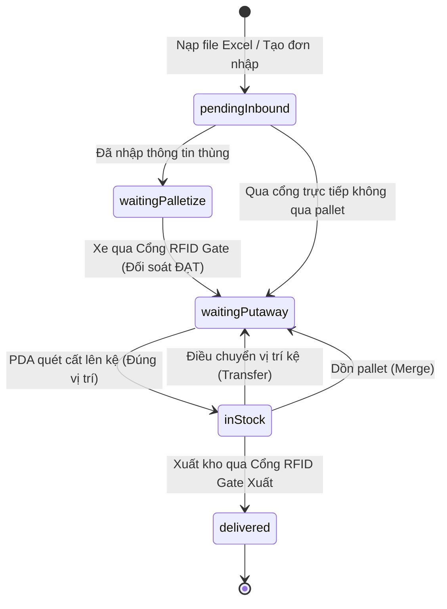

# BẢN ĐỒ KIẾN TRÚC & MÃ NGUỒN DỰ ÁN (CODE GRAPH)
> **Dành cho các AI Coding Agents & Nhà phát triển:** 
> File này phản ánh tổng thể kiến trúc hệ thống, sơ đồ phụ thuộc (dependencies), phân luồng dữ liệu (data flow) và danh mục các thành phần trong dự án.
> **Quy tắc bắt buộc:** Mọi Agent khi thực hiện thay đổi kiến trúc, thêm màn hình, sửa luồng nghiệp vụ hoặc refactor dịch vụ đều **PHẢI** cập nhật bổ sung vào file này.

---

## 1. Sơ Đồ Kiến Trúc Phụ Thuộc Tổng Thể (System Architecture Graph)

```mermaid
graph TD
    subgraph Presentation_Layer["TẦNG GIAO DIỆN (PRESENTATION LAYER)"]
        Main["lib/main.dart (Non-blocking bootstrap)"] --> Splash["lib/screens/splash/splash_screen.dart (Màn hình chờ tải CSDL & Logo Nhật Minh)"]
        Splash --> Wrapper["lib/screens/desktop_pda_wrapper.dart"]
        
        Wrapper -->|Windows / macOS / Linux / Web >= 850px| Desktop["DESKTOP PLATFORM (desktop_main_layout.dart)"]
        Wrapper -->|Android / iOS / Web < 850px| PDA["PDA HANDHELD PLATFORM (pda_home_screen.dart)"]
        
        subgraph Desktop_Screens["Desktop Views"]
            Desktop --> D_Receive["desktop_goods_receive_view.dart (Nhập Cổng RFID)"]
            Desktop --> D_Delivery["desktop_goods_delivery_view.dart (Xuất Kho FIFO)"]
            Desktop --> D_Inventory["desktop_inventory_view.dart (Kiểm Kê Kho: Tạo Đơn & Nạp File Quét Đủ)"]
            Desktop --> D_Warehouse["desktop_warehouse_management_view.dart (Quản Lý Kho: Pallet, Vị Trí, Lịch Sử, Sản Phẩm)"]
            Desktop --> D_Location["desktop_location_management_view.dart (Sơ Đồ Kệ Kho & Vị Trí Lưu Trữ)"]
            Desktop --> D_Lookup["desktop_lookup_view.dart (Tra Cứu Chi Tiết & Thẻ Kho)"]
            Desktop --> D_Studio["desktop_uhf_studio_view.dart (Hopeland Studio)"]
            Desktop --> D_Config["desktop_connection_config_view.dart (Cấu Hình Kết Nối)"]
            Desktop --> D_Users["desktop_user_management_view.dart (Phân Quyền)"]
            Desktop --> D_Report["desktop_report_view.dart (Báo Cáo Tồn Kho RFID)"]
        end

        subgraph PDA_Screens["PDA Mobile Views"]
            PDA --> P_Inbound["pda_inbound_screen.dart (Nhập Kho & Chọn Đơn PO Supabase)"]
            PDA --> P_Outbound["pda_goods_delivery_screen.dart (Xuất Kho Đối Soát PO)"]
            PDA --> P_Putaway["pda_putaway_screen.dart (Cất Kệ Hàng Hóa)"]
            PDA --> P_Transfer["pda_transfer_screen.dart (Chuyển Vị Trí Kệ)"]
            PDA --> P_Merge["pda_merge_pallets_screen.dart (Dồn Gộp Pallet)"]
            PDA --> P_Audit["pda_inventory_screen.dart (Kiểm Kê Di Động)"]
            PDA --> P_Warehouse["pda_warehouse_management_screen.dart (Quản Lý Kho Di Động: Pallet, Vị Trí, Lịch Sử, Sản Phẩm)"]
        end
    end

    subgraph Business_State_Layer["TẦNG TRẠNG THÁI & NGHIỆP VỤ (STATE & LOGIC)"]
        Repo["WarehouseRepository (Singleton State Engine)"]
        Auth["AuthService (Xác Thực & Phân Quyền)"]
        Theme["EyeCareThemeService (Giao Diện Dịu Mắt)"]
        
        Desktop_Screens -->|Đọc / Ghi trạng thái| Repo
        PDA_Screens -->|Đọc / Ghi trạng thái| Repo
        Desktop_Screens --> Theme
        PDA_Screens --> Theme
        Desktop_Screens --> Auth
        PDA_Screens --> Auth
    end

    subgraph Hardware_Layer["TẦNG PHẦN CỨNG & MẠNG (HARDWARE & ADAPTERS)"]
        D_Receive -->|Điều khiển đèn| Tower["TowerLightService (Modbus TCP / HTTP)"]
        D_Receive -->|Nhận thẻ từ cổng| DesktopUHF["DesktopUhfTcpService (Port 9090 TCP)"]
        D_Delivery -->|Nhận thẻ xuất| DesktopUHF
        D_Studio -->|Cấu hình anten, dBm| DesktopUHF
        
        PDA_Screens -->|Bóp cò tay súng| MobileUHF["UhfService (Native Android Plugin)"]
        D_Receive -->|Đọc phiếu Excel| Excel["ExcelImportService"]
        D_Report -->|Xuất file báo cáo| ReportExport["ReportExportService (Excel/CSV)"]
        Repo -->|Đồng bộ ERP| ERP["ErpBravoService"]
    end

    subgraph Persistence_Layer["TẦNG LƯU TRỮ DỮ LIỆU (DATABASE & CLOUD)"]
        Repo <--> LocalDB["DatabaseService (SQLite)"]
        Repo <--> CloudSync["SupabaseSyncService (Realtime WebSocket)"]
        CloudSync <--> Postgres[("Supabase Cloud / PostgreSQL 17")]
    end
```



---

## 2. Danh Mục Các Thành Phần Mã Nguồn (Component Directory Registry)

| Thư mục / File | Vai trò & Trách nhiệm chính |
|---|---|
| [`lib/main.dart`](file:///c:/Users/MNT/Documents/uhf/lib/main.dart) | Điểm khởi chạy ứng dụng, nạp CSDL vào RAM, khởi tạo UHF/Auth/Sync, áp dụng theme EyeCare. |
| [`lib/screens/desktop_pda_wrapper.dart`](file:///c:/Users/MNT/Documents/uhf/lib/screens/desktop_pda_wrapper.dart) | Bộ điều hướng thích ứng tự động (Desktop Layout trên PC, PDA Layout trên tay cầm Android). |
| **`lib/services/`** | **Tầng Dịch Vụ & Nghiệp Vụ Cốt Lõi** |
| ├── [`warehouse_repository.dart`](file:///c:/Users/MNT/Documents/uhf/lib/services/warehouse_repository.dart) | Quản lý toàn bộ dữ liệu trong RAM: danh mục hàng, pallet, vị trí kệ, đơn nhập/xuất, logic FIFO, cổng RFID, cơ chế giải phóng vị trí kệ/pallet khi xuất kho. |
| ├── [`desktop_uhf_tcp_service.dart`](file:///c:/Users/MNT/Documents/uhf/lib/services/desktop_uhf_tcp_service.dart) | Kết nối TCP/Serial COM/RS485 với Cổng RFID Gate cố định (Hopeland CL7206C/Speedata qua C# Bridge), tự động lưu và ghi nhớ cấu hình phần cứng vào `uhf_hardware_config.json`, tự động kết nối khi khởi động ứng dụng và tự phục hồi kết nối. |
| ├── [`uhf_service.dart`](file:///c:/Users/MNT/Documents/uhf/lib/services/uhf_service.dart) | Driver UHF trên tay cầm PDA Android (Chainway C72e / Cruise2 / SEUIC UTouch 2), tích hợp Cổng Ủy Quyền Quét (Scan Authorization Gate) chặn quét tự động, chỉ cho phép bóp cò/quét khi ở màn hình Nhập, Xuất hoặc Kiểm kho. |
| ├── [`tower_light_service.dart`](file:///c:/Users/MNT/Documents/uhf/lib/services/tower_light_service.dart) | Điều khiển đèn tháp tín hiệu giao thông tại cổng (Xanh = Đạt, Vàng = Chờ, Đỏ = Chip lạ/Lỗi + Còi). |
| ├── [`excel_import_service.dart`](file:///c:/Users/MNT/Documents/uhf/lib/services/excel_import_service.dart) | Phân tích file Excel phiếu nhập mẫu (`Template-Goods-Receive-v3.xlsx`), trích xuất SKU, Thùng, NCC. |
| ├── [`database_service.dart`](file:///c:/Users/MNT/Documents/uhf/lib/services/database_service.dart) | Quản lý CSDL SQLite cục bộ trên máy trạm và PDA khi offline. |
| ├── [`supabase_sync_service.dart`](file:///c:/Users/MNT/Documents/uhf/lib/services/supabase_sync_service.dart) | Đồng bộ dữ liệu 2 chiều thời gian thực lên Supabase PostgreSQL 17 Cloud. |
| ├── [`auth_service.dart`](file:///c:/Users/MNT/Documents/uhf/lib/services/auth_service.dart) | Quản lý tài khoản người dùng, phiên làm việc (Session) và phân quyền chức năng (RBAC). |
| ├── [`report_export_service.dart`](file:///d:/rfidwarehouse/lib/services/report_export_service.dart) | Xuất báo cáo kho & Form Mẫu Biểu Phiếu chuẩn doanh nghiệp (5 loại: Phiếu Nhập Kho, Phiếu Xuất Kho Kiêm Bàn Giao, Biên Bản Kiểm Kê, Báo Cáo Tồn Kho, Sổ Biến Động Kho) ra file Excel (.xlsx) hoặc CSV (.csv). Tự động điền dữ liệu thực tế từ hệ thống vào biểu mẫu có tiêu đề, thông tin đơn, bảng chi tiết hàng hóa/chip RFID, dòng tổng cộng và chữ ký xác nhận (không cần nạp file mẫu). |
| **`lib/screens/splash/`** | **Màn Hình Khởi Động (Splash Screen)** |
| ├── [`splash_screen.dart`](file:///d:/rfidwarehouse/lib/screens/splash/splash_screen.dart) | Màn hình mở đầu ứng dụng: Hiển thị Logo Công ty Nhật Minh ("Tiếp nối công nghệ"), hiệu ứng sóng quét vô tuyến RFID (Pulse Radar Waves 3 lớp tỏa tròn đa sắc vàng kim & ngọc bích), dòng thông điệp trạng thái động và thanh tiến trình công nghệ cao. Tự động chuyển cảnh sau 1.8s (có nút BỎ QUA). |
| **`lib/screens/desktop/`** | **Giao Diện Máy Bàn Quản Trị (Desktop WMS)** |
| ├── [`desktop_main_layout.dart`](file:///c:/Users/MNT/Documents/uhf/lib/screens/desktop/desktop_main_layout.dart) | Khung giao diện chính Desktop (Thanh điều hướng Sidebar, tìm kiếm toàn cục, huy hiệu kết nối). |
| ├── [`desktop_goods_receive_view.dart`](file:///c:/Users/MNT/Documents/uhf/lib/screens/desktop/desktop_goods_receive_view.dart) | Cổng Nhập kho RFID Gate: Tự động đối soát đơn hàng theo RFID, không phụ thuộc chip pallet nếu đã quét đủ 100% chip sản phẩm. Khi đối soát thành công, đánh dấu `isGatePassed = true` và chuyển sang trạng thái sẵn sàng đón đợt hàng tiếp theo. |
| ├── [`desktop_goods_delivery_view.dart`](file:///c:/Users/MNT/Documents/uhf/lib/screens/desktop/desktop_goods_delivery_view.dart) | Cổng Xuất kho RFID Gate Desktop tập trung 100% vào giám sát và đối soát xuất kho qua cổng RFID (đã loại bỏ hoàn toàn nút và view Lịch Sử Xuất Kho dư thừa để quy về một mối tại Trung Tâm Lịch Sử Kho), hỗ trợ nạp file Excel/PO, cột NGÀY NHẬP theo date xa nhất (FIFO), đối soát 2 pha theo chip EPC, wizard chỉ đường lấy hàng qua 10 kệ. |
| ├── [`desktop_inventory_view.dart`](file:///c:/Users/MNT/Documents/uhf/lib/screens/desktop/desktop_inventory_view.dart) | Quản lý kiểm kê kho, đối soát tồn thực tế với hệ thống, lập phiếu kiểm kê. |
| ├── [`desktop_lookup_view.dart`](file:///c:/Users/MNT/Documents/uhf/lib/screens/desktop/desktop_lookup_view.dart) | Tra cứu chi tiết hàng hóa & mã RFID (dạng cột chuẩn theo Mặt hàng SKU và dạng Bảng phẳng toàn bộ). Đã xuất kho hiển thị rõ "ĐÃ XUẤT KHO". |
| ├── [`desktop_warehouse_management_view.dart`](file:///d:/rfidwarehouse/lib/screens/desktop/desktop_warehouse_management_view.dart) | Sơ đồ mặt bằng kho 2D tương tác, dựng vị trí các dãy kệ, cổng Gate, vị trí Pallet. Tab Quản lý Pallet hiển thị tối giản 3 chỉ số cốt lõi. Tab Quản Lý Lịch Sử hợp nhất toàn diện 4 nghiệp vụ kho (Nhập kho, Xuất kho, Điều chuyển, Kiểm kê) với 4 thẻ chỉ số trực quan, thanh chuyển danh mục 5 tab (Tất cả, Nhập kho, Xuất kho, Điều chuyển, Kiểm kê), bộ lọc trạng thái, tìm kiếm đa năng và hộp thoại chi tiết chuyên biệt cho từng nghiệp vụ. |
| ├── [`desktop_location_management_view.dart`](file:///d:/rfidwarehouse/lib/screens/desktop/desktop_location_management_view.dart) | Sơ đồ lưới trạng thái kệ kho (Rack Grid) & Chi tiết kệ kho: Chuẩn hóa toàn bộ thẻ KPI và biểu tượng theo phong cách Lịch Sử (nền icon phủ màu 12% alpha dịu mắt, độ tương phản cao, nút "Chi tiết →" màu Cyan). Giao diện Chi tiết kệ được tinh gọn triệt để: loại bỏ hoàn toàn các trường thừa (Sức chứa tối đa, Dãy, Thứ tự lối đi), chỉ hiển thị đúng 3 ô chỉ số cốt lõi (Số Pallet, Số Hàng, Số SKU) và bảng chi tiết hàng hóa phân nhóm 4 cột (Mã SP, Tên SP, Số lượng, Ngày nhập). |
| ├── [`desktop_uhf_studio_view.dart`](file:///c:/Users/MNT/Documents/uhf/lib/screens/desktop/desktop_uhf_studio_view.dart) | Hopeland Studio cấu hình thông số kỹ thuật đầu đọc (RS232, TCP, RS485, USB, dBm công suất, dải tần, buzzer, antenna). Tự động nạp và ghi nhớ cấu hình đã kết nối thành công. |
| ├── [`desktop_connection_config_view.dart`](file:///c:/Users/MNT/Documents/uhf/lib/screens/desktop/desktop_connection_config_view.dart) | Cấu hình IP LAN, cổng Port, COM port và chế độ tự động kết nối lại. |
| ├── [`desktop_user_management_view.dart`](file:///c:/Users/MNT/Documents/uhf/lib/screens/desktop/desktop_user_management_view.dart) | Quản lý danh sách nhân viên, tài khoản, phân quyền thao tác. |
| ├── [`desktop_report_view.dart`](file:///d:/rfidwarehouse/lib/screens/desktop/desktop_report_view.dart) | Báo Cáo Tồn Kho chuẩn EyeCare: Thiết kế tinh giản tối đa, không cuộn ngang toàn trang, loại bỏ 3 khối chỉ số và banner barcode hero. Tích hợp ô tìm kiếm Số Seri (SN)/SKU trực tiếp vào Toolbar cùng bộ lọc vị trí kệ, badge đếm sản phẩm và cụm xuất báo cáo Excel (.xlsx)/CSV (.csv). Bảng dữ liệu chi tiết hiển thị trọn vẹn chiều cao và hỗ trợ cuộn ngang cột dữ liệu cục bộ. |
| **`lib/screens/pda/`** | **Giao Diện Tay Cầm Di Động (PDA WMS)** |
| ├── [`pda_inbound_screen.dart`](file:///c:/Users/MNT/Documents/uhf/lib/screens/pda/pda_inbound_screen.dart) | Nhập kho RFID trên PDA: Hiển thị danh sách đơn chờ kèm nút xóa đơn nhanh và chọn đơn, đối soát chùm RFID 3 ô (ĐÃ QUÉT, THIẾU, LẠ), nút ĐỔI ĐƠN chỉ hiện khi có từ 2 đơn trở lên và chuyển tiếp sang Cất kệ (Putaway). |
| ├── [`pda_home_screen.dart`](file:///c:/Users/MNT/Documents/uhf/lib/screens/pda/pda_home_screen.dart) | Bàn làm việc di động với lưới các phím tắt tác vụ nhanh (đã thay thế Trạng thái kệ & Tra cứu mã bằng Quản lý kho). |
| ├── [`pda_goods_delivery_screen.dart`](file:///c:/Users/MNT/Documents/uhf/lib/screens/pda/pda_goods_delivery_screen.dart) | Xuất kho RFID PDA đồng bộ với Desktop, cột NGÀY NHẬP theo date xa nhất (FIFO), đối soát 2 pha theo chip EPC, 3 ô chỉ số ĐÃ QUÉT - THIẾU - LẠ. |
| ├── [`pda_putaway_screen.dart`](file:///c:/Users/MNT/Documents/uhf/lib/screens/pda/pda_putaway_screen.dart) | Quy trình cất hàng lên kệ: quét mã pallet/thùng, dẫn đường tới kệ và quét xác nhận vị trí kệ đích. |
| ├── [`pda_transfer_screen.dart`](file:///c:/Users/MNT/Documents/uhf/lib/screens/pda/pda_transfer_screen.dart) | Luân chuyển hàng hóa hoặc thùng giữa các vị trí kệ trong kho. |
| ├── [`pda_merge_pallets_screen.dart`](file:///c:/Users/MNT/Documents/uhf/lib/screens/pda/pda_merge_pallets_screen.dart) | Dồn gộp thùng hàng từ nhiều pallet vào một pallet tổng để tối ưu không gian. |
| ├── [`pda_inventory_screen.dart`](file:///c:/Users/MNT/Documents/uhf/lib/screens/pda/pda_inventory_screen.dart) | Bóp cò kiểm kê theo từng ô kệ, cảnh báo chip lạ lạc vị trí (Được cấp quyền quét `kiem_kho`). |
| ├── [`pda_drawer.dart`](file:///d:/rfidwarehouse/lib/screens/pda/pda_drawer.dart) | Menu ngăn kéo trượt (Navigation Drawer) trên PDA: Đã dọn dẹp và loại bỏ 4 mục dư thừa/trùng lặp (Gộp 2 Pallet, Quản Lý Kho, Định Vị Radar, Tra Cứu Mã & Serial) để tối giản luồng thao tác. |
| ├── [`pda_warehouse_management_screen.dart`](file:///d:/rfidwarehouse/lib/screens/pda/pda_warehouse_management_screen.dart) | Quản lý kho di động chuyên dụng cho tay cầm PDA gồm 4 tabs (Pallet, Vị Trí Kho, Lịch Sử, Sản Phẩm). Chặn quét tự động hoàn toàn, ẩn chế độ quét phần cứng, bổ sung nút xóa Pallet trực tiếp kèm hộp thoại xác nhận. |
| **`lib/widgets/`** | **Thư Viện Widget Dùng Chung** |
| ├── [`warehouse_floor_plan_widget.dart`](file:///c:/Users/MNT/Documents/uhf/lib/widgets/warehouse_floor_plan_widget.dart) | Canvas vẽ sơ đồ 2D mặt bằng kho, cổng RFID, vị trí pallet và đường đi dẫn hướng. |
| ├── [`warehouse_location_grid_widget.dart`](file:///c:/Users/MNT/Documents/uhf/lib/widgets/warehouse_location_grid_widget.dart) | Ma trận trực quan hóa các ô kệ kho kèm màu sắc trạng thái đầy/trống. |
| ├── [`tower_light_widget.dart`](file:///c:/Users/MNT/Documents/uhf/lib/widgets/tower_light_widget.dart) | Widget hiển thị trạng thái đèn tháp 3 màu (Xanh/Vàng/Đỏ) trên UI. |
| ├── [`gate_pass_fail_banner.dart`](file:///c:/Users/MNT/Documents/uhf/lib/widgets/gate_pass_fail_banner.dart) | Banner thông báo kết quả qua cổng (Đạt / Báo động sai sót). |
| ├── [`sonar_radar_widget.dart`](file:///c:/Users/MNT/Documents/uhf/lib/widgets/sonar_radar_widget.dart) | Radar mô phỏng mức sóng RSSI để định vị thẻ RFID bị thất lạc. |
| **`database/`** | **Cơ Sở Dữ Liệu & Ràng Buộc Toàn Vẹn (PostgreSQL 17 / Supabase)** |
| ├── [`supabase_schema.sql`](file:///c:/Users/MNT/Documents/uhf/supabase_schema.sql) | Toàn bộ schema khởi tạo 17 bảng (bao gồm `inventory_transactions`), RLS, Realtime và tự động đồng bộ đầy đủ PK, UK, FK an toàn. |
| ├── [`create_foreign_keys.sql`](file:///c:/Users/MNT/Documents/uhf/create_foreign_keys.sql) | Script độc lập thiết lập toàn diện 17 Khóa chính (PK), 10 Ràng buộc duy nhất (UK), dọn dẹp orphan data, 14 Khóa ngoại (FK) và B-Tree Indexes cho Supabase. |


---

## 3. Sơ Đồ Thực Thể Dữ Liệu & Khóa Ngoại (Entity Relationship Diagram - ERD)


---

## 4. Vòng Đời Trạng Thái Hàng Hóa (Item Lifecycle State Machine)



---

## 5. Hướng Dẫn Dành Cho Các AI Agent Khi Thực Hiện Thay Đổi (Agent Maintenance Protocol)

1. **Khi thêm/sửa một View hoặc Screen mới:**
   - Cập nhật mục `Presentation_Layer` trong sơ đồ Mermaid ở Mục 1.
   - Bổ sung tên file và mô tả trách nhiệm vào bảng Danh Mục Thành Phần ở Mục 2.
2. **Khi thay đổi cấu trúc dữ liệu hoặc trạng thái (`ItemStatus`, `Item`, `Pallet`...):**
   - Cập nhật sơ đồ ERD ở Mục 3 và Vòng đời trạng thái ở Mục 4.
3. **Tuyệt đối tuân thủ quy tắc No Mock Data:**
   - Không được tạo mock data tĩnh hardcode chèn vào code runtime.
   - Mọi thay đổi phải vượt qua toàn bộ bộ kiểm thử tự động:
     ```bash
     flutter test
     ```
4. **Quy tắc an toàn phần cứng RFID & Barcode trên PDA (Hardware Scanner Lifecycle):**
   - Khi khởi tạo màn hình mới (`initState`) hoặc thoát màn hình (`dispose`), bắt buộc gọi `_uhf.stopInventory()` để tránh rò rỉ sóng quét ngầm.
   - Luôn kiểm tra cờ chủ động quét (`if (!_isScanning) return;`) trong stream `onTagRead` để đảm bảo chỉ ghi nhận mã khi người dùng thực sự bóp cò hoặc bấm quét.
5. **Kiến Trúc Tối Ưu Hiệu Năng 60 FPS (High-Performance Engine Guidelines):**
   - **Cách ly Re-rasterization bằng `RepaintBoundary`**: Các widget cập nhật thời gian thực tần số cao (đồng hồ quét RFID, số đếm tags, chỉ số ĐÃ QUÉT/THIẾU/LẠ) bắt buộc bọc trong `RepaintBoundary` để tránh re-paint toàn màn hình.
   - **Ảo hóa danh sách lớn (Slivers / `ListView.builder`)**: Cấm dùng `SingleChildScrollView` kết hợp `ListView(shrinkWrap: true)`. Bắt buộc dùng `CustomScrollView` + `SliverList.separated` để chỉ render các phần tử đang nằm trong viewport.
   - **Tra cứu $O(1)$ & Bộ nhớ đệm (Memoized Caching)**: Danh sách items, EPCs mong đợi và pallet được cache dưới dạng Hash Set / Hash Map trong State; chỉ tính toán lại khi có đơn hàng mới hoặc khi CSDL thay đổi.
   - **Giải phóng I/O và UI Thread**: Loại bỏ việc gọi `reloadFromSqlite()` hoặc re-fetch toàn bộ 11 bảng Supabase khi ghi dữ liệu; đồng bộ ngầm chỉ đẩy hàng đợi offline mà không làm giật lag giao diện.

---

## 6. Hạ Tầng Đội Ngũ AI Antigravity (.agents / Workspace AI Squad)

Hệ thống tích hợp sẵn cấu trúc Agentic Workspace để tối ưu hoá làm việc nhóm với Antigravity IDE:

| Thành phần | Đường dẫn | Chức năng |
| :--- | :--- | :--- |
| **Team Orchestrator** | `AGENTS.md` | Bộ chỉ huy quy tắc & điều phối tác vụ |
| **RFID Hardware Engineer** | `.agents/skills/rfid-hardware-engineer/SKILL.md` | Chuyên trách Hopeland CL7206C2, SEUIC UTouch 2 AAR, Tower Light Modbus |
| **Supabase DB Architect** | `.agents/skills/supabase-db-architect/SKILL.md` | Chuyên trách PostgreSQL 17, schema, FKs, index, SQLite sync |
| **Flutter UI/UX Specialist** | `.agents/skills/flutter-ui-taste/SKILL.md` | Chuyên trách UI Desktop/PDA, theme, micro-animation, 2D floor plan |
| **QA Test Engineer** | `.agents/skills/qa-test-engineer/SKILL.md` | Chuyên trách chạy & bảo vệ 155/155 test tự động không bị hồi quy (100% pass) |
| **MCP Integration** | `.agents/mcp_config.json` | Cấu hình công cụ ngoại vi và dịch vụ tích hợp cho IDE |

---

## 7. Quy Chuẩn Tương Thích Windows Native & Smart App Control (Windows 11 SAC Compliance)
- **Vấn đề**: Trên Windows 11 (đặc biệt các bản build 24H2 / Canary), tính năng **Smart App Control (SAC)** tự động chặn các tệp `.dll` do CMake / Visual Studio biên dịch cục bộ trong môi trường debug nếu chúng chưa được ký số thương mại (gây lỗi `0xC0E90002` STATUS_SYSTEM_INTEGRITY_POLICY_VIOLATION / Bad Image).
- **Giải pháp kiến trúc**:
  - Loại bỏ các package thừa thãi tạo native C++ plugin DLL (`share_plus`, `app_links`, `url_launcher_windows`).
  - Thay thế `supabase_flutter` bằng `supabase` (Pure Dart SDK 100%).
  - Tầng Supabase hoạt động hoàn toàn bằng Dart (`http` + `web_socket_channel`), không tạo bất kỳ C++ DLL nào.
  - File `generated_plugin_registrant.cc` trên Windows được giải phóng hoàn toàn, giúp file thực thi `uhf.exe` khởi động trơn tru ngay cả khi Windows bật cơ chế kiểm soát ứng dụng nghiêm ngặt.

---

## 8. Quy Chuẩn Đồng Bộ Ngay Khi Nạp File Nhập Kho (Inbound Order Immediate Persistence)
- **Quy trình**: Khi Admin nạp file Excel Packing List (`_pickAndLoadLiveExcelFile`) hoặc file PO (`_pickAndLoadPoFile`) trên màn hình Cổng Desktop:
  - Hệ thống lập tức ghi Đơn hàng (`inbound_orders` với trạng thái `newOrder`), chi tiết đơn (`inbound_order_details`), danh sách chip (`items` với trạng thái `pendingInbound`), sản phẩm và pallet vào CSDL cục bộ và đồng bộ tức thời lên Supabase Cloud.
  - Nhờ vậy, máy PDA của thủ kho ở bất kỳ đâu đều lập tức nhìn thấy đơn hàng vừa tạo để nhận hàng.
  - Khi xe qua cổng hoặc PDA quét đủ số lượng, trạng thái chuyển tiếp thành `waitingPutaway` (CHỜ XẾP KỆ) một cách mượt mà và an toàn, không lo mất dữ liệu khi đóng/mở lại app.


---

## 9. Báo Cáo Tồn Kho RFID (RFID Inventory Report Center)
- **Màn hình**: `desktop_report_view.dart` — tab "Báo Cáo Tồn Kho" trên sidebar (index 4), tất cả role đều truy cập được.
- **Service**: `report_export_service.dart` — singleton service tạo file báo cáo tồn kho chi tiết và tổng hợp từ dữ liệu thực tế trong `WarehouseRepository`.
- **Thiết kế tinh gọn**:
  1. **Không trượt ngang toàn trang**: Header Bar và Action Toolbar luôn vừa vặn 100% chiều rộng màn hình, không bị đẩy trôi nút "XUẤT BÁO CÁO".
  2. **Tìm kiếm trực tiếp trên thanh tác vụ**: Đã loại bỏ 3 khối chỉ số và banner quét barcode lớn. Tích hợp ô `TextField` tìm kiếm (Số Seri SN, Mã SKU, Vị trí kệ,...) trực tiếp vào Toolbar.
  3. **Bộ lọc & Thông tin số lượng**: Hỗ trợ lọc theo từng kệ hoặc tất cả kệ, hiển thị số lượng tức thì `Hiển thị: X / Y sản phẩm`.
  4. **Bảng dữ liệu trọn vẹn**: Tận dụng tối đa chiều cao màn hình, các cột chi tiết (STT, Số Seri SN nổi bật, SKU, Tên SP, EPC, Vị trí kệ, Pallet, Ngày nhập, Nhà cung cấp, Trạng thái) tự động cuộn ngang cục bộ nếu màn hình thu nhỏ dưới 1168px.
- **Định dạng kết xuất**: Excel (.xlsx) chuẩn biểu mẫu doanh nghiệp (có cột Số Seri SN, tiêu đề, kẻ bảng màu, dòng tổng cộng, khối ký duyệt thủ kho & kế toán) hoặc CSV (.csv) có UTF-8 BOM.
- **Thư mục lưu**: `Documents/WMS_Reports/` — sau khi xuất có nút mở Windows Explorer highlight file.

---

## 10. Luồng Đồng Bộ Hóa Cất Kệ (PDA Putaway State Synchronization)
- **Đồng bộ trạng thái**:
  - Khi đơn hàng nhập kho chuyển sang `waitingPutaway` (CHỜ XẾP KỆ) trên Desktop hoặc PDA, toàn bộ các mặt hàng (`items`) thuộc đơn được tự động đồng bộ sang trạng thái `waitingPutaway`.
  - Hàm `_loadFromSqlite()` và `_tryLoadFromSupabaseDirect()` trong `WarehouseRepository` đảm bảo đối soát trạng thái tức thì giữa đơn hàng và mặt hàng khi khởi động hoặc tải lại.
  - Khi gán kiện hàng/sản phẩm lên Pallet (`assignEpcsToPallet`, `assignCartonsToPallet`), mặt hàng lập tức chuyển sang `waitingPutaway` và cập nhật trực tiếp lên Supabase Cloud.
- **Điều hướng mượt mà từ PDA Home**:
  - Thẻ thông báo `[CẦN CẤT KỆ]` trên `PdaHomeScreen` liên kết trực tiếp vào `PdaPutawayScreen(initialCartonOrPalletBarcode: targetPallet)`.
  - Màn hình `PdaPutawayScreen` tự động bắt diện pallet hoặc mã đơn tương ứng, hiển thị danh sách chi tiết hàng hóa sẵn sàng để thủ kho quét mã kệ và cất hàng.

---

## 11. Kiến Trúc Cổng Kiểm Soát Quét & Tối Ưu Hóa PDA (Scan Authorization Gate & Drawer Optimization)
- **Vấn đề trước đây**:
  - `MainActivity.kt` tự động chạy vòng quét UHF không điều kiện khi nhận sự kiện bóp cò vật lý (`bgHandler.post { startInventory() }`), dẫn đến việc ở màn hình Quản Lý Kho hoặc màn hình chính vẫn tự động quét chip liên tục.
  - Khi thả nút bấm vật lý (`ACTION_UP`), native không gọi `stopInventory()`, khiến đầu đọc quét vô tận làm nóng máy và tốn pin.
  - Menu trượt PDA (`PdaDrawer`) chứa 4 mục dư thừa/trùng lặp (`Gộp 2 Pallet (PDA)`, `Quản Lý Kho (PDA)`, `Định Vị Thẻ RFID (Radar)`, `Tra Cứu Mã & Serial`) gây nhiễu luồng nghiệp vụ.
- **Giải pháp kiến trúc**:
  1. **Cổng Ủy Quyền Quét (Scan Authorization Gate)**:
     - `UhfService` quản lý cờ `isScanAllowed` (mặc định `false`) và `activeScanModule`.
     - Chỉ có 3 màn hình nghiệp vụ quét cốt lõi được phép kích hoạt: Nhập kho (`nhap_kho`), Xuất kho (`xuat_kho`), và Kiểm kê (`kiem_kho`) bằng cách gọi `UhfService.enableScanning(module)` trong `initState` và `UhfService.disableScanning()` trong `dispose`.
     - Gọi xuống native qua method channel `setScanAllowed` để khóa/mở cờ `isScanAllowed` trên Android Kotlin.
     - Trong `MainActivity.kt`, nút bóp cò vật lý (Keycode 139, 293) bị chặn hoàn toàn nếu `!isScanAllowed`. Khi nhả cò (`ACTION_UP`), native chủ động gọi `stopInventory()`.
  2. **Quản Lý Kho Di Động (`PdaWarehouseManagementScreen`)**:
     - Chủ động gọi `_uhf.disableScanning()` khi vào và rời màn hình, triệt tiêu hoàn toàn hiện tượng tự bật quét RFID/Barcode.
     - Gỡ bỏ toàn bộ listener phần cứng, ẩn nút chuyển đổi chế độ quét trên `HardwareStatusAppBar`.
     - Thêm nút Xóa Pallet (`Icons.delete_outline`) trực tiếp trên thẻ Pallet kèm hộp thoại xác nhận an toàn, giải phóng liên kết dữ liệu trong CSDL thực tế.
  3. **Tối Giản Menu Ngăn Kéo (`PdaDrawer`)**:
     - Loại bỏ 4 mục dư thừa, giữ giao diện tập trung và nhất quán với phân quyền người dùng.

---

## 12. Quy Chuẩn Nút Nhập Hàng & Xuất Hàng: Chuẩn Hóa Nguồn Nạp (Excel/CSV & PO Gating)
- **Quy tắc**: Nút **NHẬP HÀNG** và **XUẤT HÀNG** (trên cả Desktop và PDA) chỉ cho phép 2 phương thức nạp dữ liệu chính quy:
  1. **Nhập File Excel / CSV (`.xlsx`, `.csv`)**: Nạp tệp đóng gói danh sách thùng hàng, mã pallet, SKU, serial và chip EPC.
  2. **Nhập Từ PO**:
     - **Desktop**: Nạp trực tiếp tệp đơn PO/SO (`pickAndParseBatchOrdersExcel`) để đối soát đơn hàng và thứ tự FIFO theo tồn kho thực tế.
     - **PDA**: Hộp thoại tùy chọn tinh gọn mở modal với 2 tác vụ: Nạp tệp đơn PO (`.xlsx`, `.csv`) hoặc Chọn đơn PO sẵn có đang chờ từ Supabase Cloud.
- **Dọn dẹp tùy chọn dư thừa**:
  - Đã loại bỏ hoàn toàn các nút nhập liệu thủ công hoặc tùy chọn mồ côi (`Tạo Đơn Thủ Công`, `Tạo Nhanh Đơn Xuất`, `Chọn Đơn Xuất Có Sẵn` rời rạc).
  - Khắc phục triệt để lỗi tràn pixel (RenderFlex overflow) trên menu thả xuống ở các màn hình có chiều rộng hẹp của tay cầm PDA bằng cách đóng gói `Expanded` và `TextOverflow.ellipsis`.


