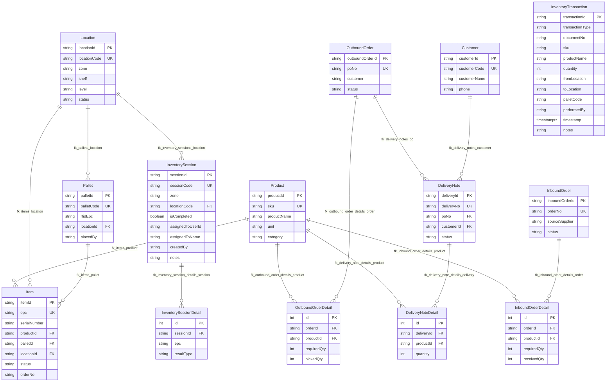
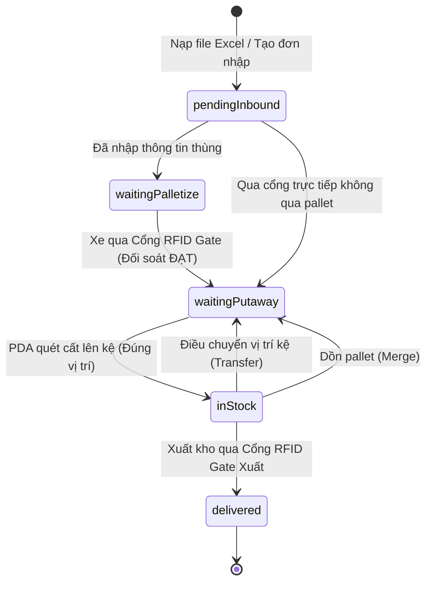

# BẢN ĐỒ KIẾN TRÚC & MÃ NGUỒN DỰ ÁN (CODE GRAPH)
> **Dành cho các AI Coding Agents & Nhà phát triển:** 
> File này phản ánh tổng thể kiến trúc hệ thống, sơ đồ phụ thuộc (dependencies), phân luồng dữ liệu (data flow) và danh mục các thành phần trong dự án.
> **Quy tắc bắt buộc:** Mọi Agent khi thực hiện thay đổi kiến trúc, thêm màn hình, sửa luồng nghiệp vụ hoặc refactor dịch vụ đều **PHẢI** cập nhật bổ sung vào file này.

---

## 1. Sơ Đồ Kiến Trúc Phụ Thuộc Tổng Thể (System Architecture Graph)


```mermaid
graph TD
    subgraph Presentation_Layer["TẦNG GIAO DIỆN (PRESENTATION LAYER)"]
        Main["lib/main.dart (Non-blocking bootstrap)"] --> Splash["lib/screens/splash/splash_screen.dart (Màn hình chờ tải CSDL & Logo Nhật Minh)"]
        Splash --> Wrapper["lib/screens/desktop_pda_wrapper.dart"]
        
        Wrapper -->|Windows / macOS / Linux / Web >= 850px| Desktop["DESKTOP PLATFORM (desktop_main_layout.dart)"]
        Wrapper -->|Android / iOS / Web < 850px| PDA["PDA HANDHELD PLATFORM (pda_home_screen.dart)"]
        
        subgraph Desktop_Screens["Desktop Views"]
            Desktop --> D_Receive["desktop_goods_receive_view.dart (Nhập Cổng RFID)"]
            Desktop --> D_Delivery["desktop_goods_delivery_view.dart (Xuất Kho FIFO)"]
            Desktop --> D_Inventory["desktop_inventory_view.dart (Kiểm Kê Kho: Tạo Đơn & Nạp File Quét Đủ)"]
            Desktop --> D_Reconciliation["desktop_stock_reconciliation_view.dart (Đối Soát Tồn Kho: Dự Kiến vs Thực Tế)"]
            Desktop --> D_TicketDetail["desktop_audit_ticket_detail_view.dart (Chi Tiết Phiếu Kiểm Kê Kho)"]
            Desktop --> D_Warehouse["desktop_warehouse_management_view.dart (Quản Lý Kho: Pallet, Vị Trí, Lịch Sử, Sản Phẩm)"]
            Desktop --> D_Location["desktop_location_management_view.dart (Sơ Đồ Kệ Kho & Vị Trí Lưu Trữ)"]
            Desktop --> D_Lookup["desktop_lookup_view.dart (Tra Cứu Chi Tiết & Thẻ Kho)"]
            Desktop --> D_Studio["desktop_uhf_studio_view.dart (Hopeland Studio)"]
            Desktop --> D_Config["desktop_connection_config_view.dart (Cấu Hình Kết Nối)"]
            Desktop --> D_Users["desktop_user_management_view.dart (Phân Quyền)"]
            Desktop --> D_Report["desktop_report_view.dart (Báo Cáo Tồn Kho RFID & Đối Soát Dự Kiến vs Thực Tế)"]
        end

        subgraph PDA_Screens["PDA Mobile Views"]
            PDA --> P_Inbound["pda_inbound_screen.dart (Nhập Kho & Chọn Đơn PO Supabase)"]
            PDA --> P_Outbound["pda_goods_delivery_screen.dart (Xuất Kho Đối Soát PO)"]
            PDA --> P_Putaway["pda_putaway_screen.dart (Cất Kệ Hàng Hóa)"]
            PDA --> P_Transfer["pda_transfer_screen.dart (Chuyển Vị Trí Kệ)"]
            PDA --> P_Merge["pda_merge_pallets_screen.dart (Dồn Gộp Pallet)"]
            PDA --> P_Audit["pda_inventory_screen.dart (Kiểm Kê Di Động & Phân Công Handheld)"]
            PDA --> P_Warehouse["pda_warehouse_management_screen.dart (Quản Lý Kho Di Động: Pallet, Vị Trí, Lịch Sử, Sản Phẩm)"]
            PDA --> P_Locate["radar_locate_screen.dart (Tìm Kiếm Mã & Định Vị Sonar Radar AirTag)"]
            PDA --> P_LocateTasks["pda_locate_tasks_screen.dart (Đơn Tìm Kiếm & Nhiệm Vụ Handheld)"]
        end
    end

    subgraph Business_State_Layer["TẦNG TRẠNG THÁI & NGHIỆP VỤ (STATE & LOGIC)"]
        Repo["WarehouseRepository (Singleton State Engine)"]
        Auth["AuthService (Xác Thực & Phân Quyền)"]
        Theme["EyeCareThemeService (Giao Diện Dịu Mắt)"]
        
        Desktop_Screens -->|Đọc / Ghi trạng thái| Repo
        PDA_Screens -->|Đọc / Ghi trạng thái| Repo
        Desktop_Screens --> Theme
        PDA_Screens --> Theme
        Desktop_Screens --> Auth
        PDA_Screens --> Auth
    end

    subgraph Hardware_Layer["TẦNG PHẦN CỨNG & MẠNG (HARDWARE & ADAPTERS)"]
        D_Receive -->|Điều khiển đèn| Tower["TowerLightService (Modbus TCP / HTTP)"]
        D_Receive -->|Nhận thẻ từ cổng| DesktopUHF["DesktopUhfTcpService (Port 9090 TCP)"]
        D_Delivery -->|Nhận thẻ xuất| DesktopUHF
        D_Studio -->|Cấu hình anten, dBm| DesktopUHF
        
        PDA_Screens -->|Bóp cò tay súng| MobileUHF["UhfService (Native Android Plugin)"]
        D_Receive -->|Đọc phiếu Excel| Excel["ExcelImportService"]
        D_Report -->|Xuất file báo cáo| ReportExport["ReportExportService (Excel/CSV)"]
        Repo -->|Đồng bộ ERP| ERP["ErpBravoService"]
    end

    subgraph Persistence_Layer["TẦNG LƯU TRỮ DỮ LIỆU (DATABASE & CLOUD)"]
        Repo <--> LocalDB["DatabaseService (In-Memory RAM)"]
        Repo <--> CloudSync["SupabaseSyncService (Realtime WebSocket)"]
        CloudSync <--> Postgres[("Supabase Cloud / PostgreSQL 17")]
    end
```

---

## 2. Danh Mục Các Thành Phần Mã Nguồn (Component Directory Registry)

| Thư mục / File | Vai trò & Trách nhiệm chính |
|---|---|
| [`lib/main.dart`](file:///c:/Users/MNT/Documents/uhf/lib/main.dart) | Điểm khởi chạy ứng dụng, nạp CSDL vào RAM, khởi tạo UHF/Auth/Sync, áp dụng theme EyeCare. |
| [`lib/screens/desktop_pda_wrapper.dart`](file:///c:/Users/MNT/Documents/uhf/lib/screens/desktop_pda_wrapper.dart) | Bộ điều hướng thích ứng tự động (Desktop Layout trên PC, PDA Layout trên tay cầm Android). |
| **`lib/services/`** | **Tầng Dịch Vụ & Nghiệp Vụ Cốt Lõi** |
| ├── [`warehouse_repository.dart`](file:///c:/Users/MNT/Documents/uhf/lib/services/warehouse_repository.dart) | Quản lý toàn bộ dữ liệu trong RAM: danh mục hàng, pallet, vị trí kệ, đơn nhập/xuất, logic FIFO, cổng RFID, cơ chế giải phóng vị trí kệ/pallet khi xuất kho. Tích hợp cơ chế đối soát tồn kho `getStockReconciliation({sessionId, zone})` và phân rã SKU `buildSessionSkuBreakdown(session, {zoneFilter})` tính toán tồn dự kiến (sổ sách/CSDL) vs tồn thực tế (UHF RFID) không dùng mock data. Tái tạo chỉ mục lười (Lazy Rebuild Index via `_indexesDirty` flag) kết hợp hệ thống chỉ mục bảng băm O(1) tự động (`_inStockItemsByPalletIndex`, `_inStockItemsByLocationIndex`, `_locationsByIdOrCodeIndex`, `_itemsByIdIndex`, `_palletsByLocationIndex`) và điều tiết sự kiện (event throttling 200-500ms) giúp các màn hình PDA cuộn mượt mà, triệt tiêu giật lag (frame drop) trên thiết bị cầm tay phần cứng yếu (SEUIC UTouch 2). Tự động nạp và giải mã gói metadata phiên kiểm kê (phân công nhân sự PDA `assignedToUserId`, `assignedToName`, SKU trọng điểm `targetSkus`, ghi chú) lưu trữ tương thích ngược trong trường `created_by` trên Supabase Cloud. Tự động đồng bộ hai chiều toàn bộ giao dịch kho lên Supabase `inventory_transactions`. |
| ├── [`desktop_uhf_tcp_service.dart`](file:///c:/Users/MNT/Documents/uhf/lib/services/desktop_uhf_tcp_service.dart) | Kết nối TCP/Serial COM/RS485 với Cổng RFID Gate cố định (Hopeland CL7206C/Speedata qua C# Bridge), tự động lưu và ghi nhớ cấu hình phần cứng vào `uhf_hardware_config.json`, tự động kết nối khi khởi động ứng dụng và tự phục hồi kết nối. |
| ├── [`uhf_service.dart`](file:///c:/Users/MNT/Documents/uhf/lib/services/uhf_service.dart) | Driver UHF trên tay cầm PDA Android (Chainway C72e / Cruise2 / SEUIC UTouch 2), tích hợp Cổng Ủy Quyền Quét (Scan Authorization Gate) chặn quét tự động, chỉ cho phép bóp cò/quét khi ở màn hình Nhập, Xuất hoặc Kiểm kho. |
| ├── [`tower_light_service.dart`](file:///c:/Users/MNT/Documents/uhf/lib/services/tower_light_service.dart) | Điều khiển đèn tháp tín hiệu giao thông tại cổng (Xanh = Đạt, Vàng = Chờ, Đỏ = Chip lạ/Lỗi + Còi). |
| ├── [`excel_import_service.dart`](file:///c:/Users/MNT/Documents/uhf/lib/services/excel_import_service.dart) | Phân tích file Excel phiếu nhập mẫu (`Template-Goods-Receive-v3.xlsx`), trích xuất SKU, Thùng, NCC. |
| ├── [`database_service.dart`](file:///c:/Users/MNT/Documents/uhf/lib/services/database_service.dart) | Quản lý dữ liệu In-Memory cục bộ trong RAM trên máy trạm và PDA: lưu trữ bảng hàng hóa, pallet, vị trí, đơn xuất nhập, và bảng lịch sử giao dịch kho `inventory_transactions`. |
| ├── [`supabase_sync_service.dart`](file:///c:/Users/MNT/Documents/uhf/lib/services/supabase_sync_service.dart) | Đồng bộ dữ liệu 2 chiều thời gian thực lên Supabase PostgreSQL 17 Cloud. Khử trùng lặp log ngoại tuyến (anti-duplicate offline queue retry), tự động gói gọn các trường mở rộng của phiên kiểm kê (`assigned_to_user_id`, `assigned_to_name`, `target_skus`, `notes`) dưới định dạng JSON vào cột `created_by` trước khi đồng bộ lên bảng `inventory_sessions`, giải quyết triệt để lỗi Schema Constraint PGRST204 và đảm bảo dữ liệu phân công luôn hiển thị chính xác tức thì trên tay cầm PDA. Chuẩn hóa thông báo nghiệp vụ người dùng (loại bỏ lộ thông tin kỹ thuật hạ tầng). |
| ├── [`auth_service.dart`](file:///c:/Users/MNT/Documents/uhf/lib/services/auth_service.dart) | Quản lý tài khoản người dùng, phiên làm việc (Session) và phân quyền chức năng (RBAC). |
| ├── [`report_export_service.dart`](file:///c:/Users/MNT/Documents/uhf/lib/services/report_export_service.dart) | Xuất báo cáo kho & Form Mẫu Biểu Phiếu chuẩn doanh nghiệp (6 loại: Phiếu Nhập Kho, Phiếu Xuất Kho Kiêm Bàn Giao, Biên Bản Kiểm Kê, Báo Cáo Tồn Kho hiển thị chuẩn Nhà Cung Cấp, Sổ Biến Động Kho, Bảng Đối Soát Tồn Kho gồm 3 Sheet chuyên biệt). Hỗ trợ trích xuất báo cáo theo thời điểm cụ thể và theo giai đoạn (`fromDate`, `toDate`) linh hoạt, tự động lọc và đếm số lượng bản ghi chính xác theo kỳ báo cáo, định dạng phụ đề tiêu đề biểu mẫu `formatPeriodSubtitle`, chống sửa phá hoại file Excel bằng mã hóa khóa Sheet và Workbook. |
| **`lib/screens/splash/`** | **Màn Hình Khởi Động (Splash Screen)** |
| ├── [`splash_screen.dart`](file:///c:/Users/MNT/Documents/uhf/lib/screens/splash/splash_screen.dart) | Màn hình mở đầu ứng dụng: Khớp chuẩn 100% Logo Nhật Minh với Android Native (`@mipmap/launch_logo` 200x80 dp), khởi động non-blocking tải ngầm CSDL vào RAM và chuyển tiếp siêu tốc (~100ms) sang Màn hình Đăng Nhập (LoginScreen) bằng hiệu ứng `FadeTransition` mượt mà, triệt tiêu hoàn toàn độ trễ chờ logo 5-7s trên thiết bị cầm tay PDA. Hỗ trợ chạm màn hình để bỏ qua tức thì (0ms). |
| **`lib/screens/desktop/`** | **Giao Diện Máy Bàn Quản Trị (Desktop WMS)** |
| ├── [`desktop_main_layout.dart`](file:///c:/Users/MNT/Documents/uhf/lib/screens/desktop/desktop_main_layout.dart) | Khung giao diện chính Desktop (Thanh điều hướng Sidebar, tìm kiếm toàn cục, huy hiệu kết nối). |
| ├── [`desktop_goods_receive_view.dart`](file:///c:/Users/MNT/Documents/uhf/lib/screens/desktop/desktop_goods_receive_view.dart) | Cổng Nhập kho RFID Gate: Tự động đối soát và nhận diện động theo chip pallet vào cổng trước (Dynamic Pallet Identification & Pallet-by-pallet Auto-Receive). Khi nhiều pallet cùng chờ ở cổng, hệ thống không ép buộc chọn pallet đầu tiên; chip RFID của pallet nào (mã thẻ pallet hoặc mã chip sản phẩm) đi vào vùng đọc của anten trước sẽ tự động nhận diện và kích hoạt đối soát cho chính pallet đó. Khi quét đủ 100% chip của pallet, hệ thống tự động chốt nhận pallet ngay lập tức (`waitingPutaway` cho PDA), bật đèn tháp xanh/còi thông cổng, cập nhật số lượng đã nhận thực tế của đơn hàng, không bắt buộc quét hết toàn bộ chip trong file Excel. Cổng tự động giải phóng bộ đệm và chuyển tiếp thông minh để đón pallet tiếp theo theo đúng thứ tự thực tế đẩy qua cổng cho đến khi hoàn tất 100%. |
| ├── [`desktop_goods_delivery_view.dart`](file:///c:/Users/MNT/Documents/uhf/lib/screens/desktop/desktop_goods_delivery_view.dart) | Cổng Xuất kho RFID Gate Desktop: Tự động lưu đơn xuất (`OutboundOrder`) vào SQLite và đồng bộ Supabase Cloud ngay khi nạp file Excel/PO để máy PDA có thể nhìn thấy và chọn quét đối soát tức thì; hỗ trợ chọn đơn xuất có sẵn từ hệ thống; cơ chế Full Pallet Auto-Match tự động nhận diện và hoàn tất toàn bộ sản phẩm trên pallet khi quét thẻ pallet RFID qua cổng; đối soát 2 pha theo chip EPC, wizard chỉ đường lấy hàng qua 10 kệ; xử lý chống tràn pixel (pixel stripe) với `LayoutBuilder` cuộn ngang mềm dẻo; tích hợp huy hiệu trạng thái đầu đọc RFID thời gian thực, nút quét phản hồi trạng thái kết nối (`_isConnectingUhf`), cảnh báo SnackBar khi mất kết nối thiết bị và đồng bộ trạng thái quét hai chiều chống đơ nút. |
| ├── [`desktop_inventory_view.dart`](file:///c:/Users/MNT/Documents/uhf/lib/screens/desktop/desktop_inventory_view.dart) | Quản lý kiểm kê kho: 2 thẻ hành động chính '+ TẠO ĐƠN KIỂM KÊ' và '📥 XUẤT FILE KIỂM KÊ (.xlsx)' (xuất biên bản kiểm kê, bảng đối soát tồn kho, bảng kê đi kiểm đếm dạng Excel/CSV), hỗ trợ phân công phiếu trực tiếp cho nhân viên máy cầm tay PDA (`role == handheld`) mà không ép Desktop vào chế độ quét, hiển thị huy hiệu `CHỜ PDA QUÉT`, đồng bộ dữ liệu tức thời lên Supabase Cloud (`created_by`, `is_completed: false`), tích hợp xem chi tiết phiếu kiểm kê chuyên sâu qua `DesktopAuditTicketDetailView`. |
| ├── [`desktop_stock_reconciliation_view.dart`](file:///c:/Users/MNT/Documents/uhf/lib/screens/desktop/desktop_stock_reconciliation_view.dart) | Bảng đối soát tồn kho dự kiến (sổ sách/CSDL) vs thực tế kiểm kê (UHF RFID): 6 thẻ KPI đối chiếu, bộ lọc theo đợt kiểm kê hoặc toàn kho, bộ lọc theo khu vực (Zone), tìm kiếm SKU/sản phẩm, 5 chip lọc trạng thái chênh lệch (Tất cả, ⚠️ Có chênh lệch, ✓ Khớp đủ, 🔻 Lệch thiếu, 🔺 Lệch thừa), hộp thoại xem chi tiết chip RFID theo từng SKU, xuất báo cáo đối soát ra Excel (.xlsx). |
| ├── [`desktop_audit_ticket_detail_view.dart`](file:///c:/Users/MNT/Documents/uhf/lib/screens/desktop/desktop_audit_ticket_detail_view.dart) | Màn hình xem chi tiết phiếu kiểm kê kho chuyên sâu: Thẻ thông tin phiếu (mã phiếu, phạm vi - hiển thị chuẩn 'Theo mặt hàng: ...' khi kiểm kê SKU cụ thể hoặc vị trí kệ/zone, thời gian, người kiểm, thiết bị), 6 thẻ KPI đối chiếu thực tế vs dự kiến (Tồn dự kiến, Thực tế quét, Khớp chuẩn, Lệch thiếu, Sai vị trí, Thẻ lạ ngoài DS, Độ chính xác - tự động ẩn thẻ Sai vị trí & Thẻ lạ khi kiểm kê theo mặt hàng SKU cụ thể theo Quy Tắc Đủ Lượng), 2 Tab chuyển đổi (Bảng tổng hợp theo mặt hàng/SKU vs Chi tiết từng chip RFID EPC lọc theo SKU mục tiêu), xuất biên bản Excel (`exportReportSelected(ReportType.audit)`), xem trước in ấn / in biên bản (Print Preview), tiếp tục quét RFID nếu chưa chốt. |
| ├── [`desktop_lookup_view.dart`](file:///c:/Users/MNT/Documents/uhf/lib/screens/desktop/desktop_lookup_view.dart) | Tra cứu chi tiết hàng hóa & mã RFID (dạng cột chuẩn theo Mặt hàng SKU và dạng Bảng phẳng toàn bộ). Đã xuất kho hiển thị rõ "ĐÃ XUẤT KHO". Tích hợp tính năng **Tạo Đơn Tìm Kiếm RFID** trực tiếp từ dòng sản phẩm SKU hoặc chip RFID cụ thể, cho phép thủ kho chọn chỉ định nhân viên máy cầm tay (`role == handheld`) phụ trách và quản lý danh sách các đơn tìm kiếm kèm trạng thái xử lý. |
| ├── [`desktop_warehouse_management_view.dart`](file:///c:/Users/MNT/Documents/uhf/lib/screens/desktop/desktop_warehouse_management_view.dart) | Sơ đồ mặt bằng kho 2D tương tác, dựng vị trí các dãy kệ, cổng Gate, vị trí Pallet. Tab Quản lý Pallet hiển thị tối giản 3 chỉ số cốt lõi. Tab Quản Lý Lịch Sử hợp nhất toàn diện 4 nghiệp vụ kho (Nhập kho, Xuất kho, Điều chuyển, Kiểm kê) với 4 thẻ chỉ số trực quan, thanh chuyển danh mục 5 tab (Tất cả, Nhập kho, Xuất kho, Điều chuyển, Kiểm kê), bộ lọc trạng thái, tìm kiếm đa năng. Cung cấp nút "Xóa đơn" màu đỏ cảnh báo trên từng dòng bảng dữ liệu của cả 4 nghiệp vụ và bên trong hộp thoại chi tiết. Khi bấm xem chi tiết kiểm kê (AUDIT), mở hộp thoại toàn màn hình với `DesktopAuditTicketDetailView`. |
| ├── [`desktop_location_management_view.dart`](file:///c:/Users/MNT/Documents/uhf/lib/screens/desktop/desktop_location_management_view.dart) | Sơ đồ lưới trạng thái kệ kho (Rack Grid) & Chi tiết kệ kho: Chuẩn hóa toàn bộ thẻ KPI và biểu tượng theo phong cách Lịch Sử (nền icon phủ màu 12% alpha dịu mắt, độ tương phản cao, nút "Chi tiết →" màu Cyan). Giao diện Chi tiết kệ được tinh gọn triệt để: loại bỏ hoàn toàn các trường thừa (Sức chứa tối đa, Dãy, Thứ tự lối đi), chỉ hiển thị đúng 3 ô chỉ số cốt lõi (Số Pallet, Số Hàng, Số SKU) và bảng chi tiết hàng hóa phân nhóm 4 cột (Mã SP, Tên SP, Số lượng, Ngày nhập). |
| ├── [`desktop_uhf_studio_view.dart`](file:///c:/Users/MNT/Documents/uhf/lib/screens/desktop/desktop_uhf_studio_view.dart) | Hopeland Studio cấu hình thông số kỹ thuật đầu đọc (RS232, TCP, RS485, USB, dBm công suất, dải tần, buzzer, antenna). Tự động nạp và ghi nhớ cấu hình đã kết nối thành công. |
| ├── [`desktop_connection_config_view.dart`](file:///c:/Users/MNT/Documents/uhf/lib/screens/desktop/desktop_connection_config_view.dart) | Cấu hình IP LAN, cổng Port, COM port và chế độ tự động kết nối lại. |
| ├── [`desktop_user_management_view.dart`](file:///c:/Users/MNT/Documents/uhf/lib/screens/desktop/desktop_user_management_view.dart) | Quản lý danh sách nhân viên, tài khoản, phân quyền thao tác. |
| ├── [`desktop_report_view.dart`](file:///c:/Users/MNT/Documents/uhf/lib/screens/desktop/desktop_report_view.dart) | Trung Tâm Báo Cáo Kho chuyên sâu trên PC chuẩn EyeCare: 3 Tab chuyển đổi linh hoạt: (1) 'Danh Sách Hàng Tồn' tra cứu tồn kho theo Số Seri (SN), SKU, vị trí kệ và trích xuất tồn kho tức thời; (2) 'Đối Soát Tồn Kho (Dự Kiến vs Thực Tế)' kết nối trực tiếp với `DesktopStockReconciliationView` và `DesktopAuditTicketDetailView`; (3) 'Báo Cáo Nghiệp Vụ' hỗ trợ trích xuất báo cáo theo thời điểm cụ thể và theo giai đoạn (Hôm nay, 7 ngày, 30 ngày, Tháng này, Tùy chọn ngày bắt đầu - ngày kết thúc) cho 4 nghiệp vụ: Nhập Kho, Xuất Kho, Tồn Kho và Biến Động Kho; xem trước dữ liệu dạng bảng trực quan; trích xuất ra Excel (.xlsx) và CSV (.csv) kèm nút mở thư mục lưu trữ trên Windows. |
| **`lib/screens/pda/`** | **Giao Diện Tay Cầm Di Động (PDA WMS)** |
| ├── [`pda_inbound_screen.dart`](file:///c:/Users/MNT/Documents/uhf/lib/screens/pda/pda_inbound_screen.dart) | Nhập kho RFID trên PDA: Hiển thị danh sách đơn chờ kèm nút xóa đơn nhanh và chọn đơn, đối soát chùm RFID 3 ô (ĐÃ QUÉT, THIẾU, LẠ), nút ĐỔI ĐƠN chỉ hiện khi có từ 2 đơn trở lên và chuyển tiếp sang Cất kệ (Putaway). Chuẩn hóa thông báo nhập kho và thông báo cất kệ độc lập, chính xác tuyệt đối theo từng giai đoạn nghiệp vụ. |
| ├── [`pda_home_screen.dart`](file:///c:/Users/MNT/Documents/uhf/lib/screens/pda/pda_home_screen.dart) | Bàn làm việc di động với lưới các phím tắt tác vụ nhanh (đã thay thế Trạng thái kệ & Tra cứu mã bằng Quản lý kho). |
| ├── [`pda_goods_delivery_screen.dart`](file:///c:/Users/MNT/Documents/uhf/lib/screens/pda/pda_goods_delivery_screen.dart) | Xuất kho RFID PDA chuyên dụng: Màn hình chờ tự động liệt kê các đơn xuất chờ nạp từ máy tính/hệ thống với nút chọn nhanh. Hỗ trợ 2 luồng xuất kho: (1) **Xuất lẻ theo vị trí kệ (Loose Picking)**: Lọc sản phẩm theo từng ô kệ (`ChoiceChip`), nhặt lẻ từng sản phẩm theo vị trí kệ, tự động tách sản phẩm khỏi pallet và trừ tồn kho chính xác tại vị trí kệ đó; nút "✓ XÁC NHẬN XUẤT LẺ ($scanned/$total)" cập nhật tiến độ `pickedQty` và giữ lại các sản phẩm còn lại của đơn để nhặt tiếp ở kệ sau. (2) **Xuất cả Pallet (Full Pallet Outbound)**: Quét mã RFID Pallet tự động đối soát toàn bộ sản phẩm trên pallet (Full Pallet Auto-Match), giải phóng pallet và trừ tồn kho kệ tương ứng. Cột NGÀY NHẬP FIFO, 3 ô chỉ số ĐÃ QUÉT - THIẾU - LẠ, cảnh báo chip lạ ngoài đơn. |
| ├── [`pda_putaway_screen.dart`](file:///c:/Users/MNT/Documents/uhf/lib/screens/pda/pda_putaway_screen.dart) | Quy trình cất hàng lên kệ: Ô 1 tinh gọn thành thanh Dropdown chọn Pallet/Xe hàng (tự động cập nhật khi bóp cò quét mã), loại bỏ các khối hướng dẫn rườm rà; Ô 2 chọn vị trí kệ và kích hoạt quét xác nhận cất kệ. Chuẩn hóa bộ nhận diện mã QR code vị trí (hỗ trợ tiền tố `LOCATION:`, `LOC:`, `SHELF:`, phân biệt chính xác từng location riêng biệt không bị nhầm lẫn), tự động gán và cập nhật vị trí Pallet + toàn bộ sản phẩm lên kệ và đồng bộ Supabase Cloud. Tích hợp thanh thông báo thành công xanh lá tức thì khi hoàn tất cất kiện/toàn bộ lô hàng vào kệ đích. |
| ├── [`pda_transfer_screen.dart`](file:///c:/Users/MNT/Documents/uhf/lib/screens/pda/pda_transfer_screen.dart) | Luân chuyển hàng hóa hoặc pallet giữa các vị trí kệ trong kho: (1) **Chế độ Theo Pallet**: Quy trình 2 bước (Bước 1 Quét Barcode Kệ đích ➔ Bước 2 Quét Barcode Pallet); (2) **Chế độ Sản phẩm riêng lẻ**: Chia làm 2 màn hình/bước tuần tự triệt tiêu xung đột scanner (Bước 1: Quét Barcode Kệ đích bằng đầu đọc Barcode ➔ Bước 2: Quét mã RFID EPC sản phẩm bằng đầu đọc UHF RFID, có banner Kệ đích cố định kèm nút 'Đổi Kệ' quay lại Bước 1). Tích hợp cơ chế lọc trùng tự động: kiểm tra vị trí hiện tại của sản phẩm và pallet chứa, lập tức chặn và cảnh báo rung đỏ nếu sản phẩm đã có sẵn trên kệ đích, bảo đảm tính toàn vẹn dữ liệu. Tích hợp lối tắt Dồn Gộp Pallet qua Banner amber nổi bật và nút AppBar `Icons.merge_rounded`. |
| ├── [`pda_merge_pallets_screen.dart`](file:///c:/Users/MNT/Documents/uhf/lib/screens/pda/pda_merge_pallets_screen.dart) | Dồn gộp hàng hóa từ Pallet ở Location này sang Pallet ở Location khác bằng cách bóp cò quét 2 mã vạch Barcode (Pallet Nguồn ➔ Pallet Đích) trên PDA. Hỗ trợ gộp toàn bộ hoặc chọn lọc từng mặt hàng, tự động cập nhật vị trí và pallet lưu kho, ghi nhận lịch sử giao dịch và đồng bộ tức thời Supabase Cloud. |
| ├── [`pda_inventory_screen.dart`](file:///c:/Users/MNT/Documents/uhf/lib/screens/pda/pda_inventory_screen.dart) | Bóp cò kiểm kê theo từng ô kệ, phân khu hoặc toàn bộ kho, cảnh báo chip lạ lạc vị trí (Được cấp quyền quét `kiem_kho`). Đồng bộ hóa Real-time phiên sống (`_currentSession`), cơ chế bướm ga 200ms không đơ giật UI PDA, thuật toán sắp xếp thứ tự ổn định tuyệt đối (Deterministic Stable Sort) giữ cố định vị trí thẻ theo SKU/Name/EPC kèm `ValueKey(epc)` triệt tiêu hiện tượng thẻ nhảy lung tung khi chuyển trạng thái Đã Quét, phân công phiếu "Tất cả" vs "Giao cho tôi". |
| ├── [`pda_locate_tasks_screen.dart`](file:///c:/Users/MNT/Documents/uhf/lib/screens/pda/pda_locate_tasks_screen.dart) | Quản lý nhiệm vụ dò tìm chip/hàng hóa RFID dành riêng cho nhân viên Handheld: 2 Tab bộ lọc "Giao cho tôi" vs "Tất cả", thẻ thông tin nhiệm vụ trực quan (Mã đơn, SKU, EPC, Vị trí sổ sách, Ghi chú, Người tạo), nút "BẮT ĐẦU TÌM KIẾM" mở thẳng `RadarLocateScreen` kèm cấu hình mục tiêu Precision Finding. |
| ├── [`pda_drawer.dart`](file:///d:/rfidwarehouse/lib/screens/pda/pda_drawer.dart) | Menu ngăn kéo trượt (Navigation Drawer) trên PDA: Đã cấp quyền chỉnh công suất phát sóng ăng-ten UHF (1 - 33 dBm) trực tiếp cho nhân viên cầm tay PDA, bổ sung menu truy cập nhanh "Đơn Tìm Kiếm (Được Giao)". |
| ├── [`pda_warehouse_management_screen.dart`](file:///d:/rfidwarehouse/lib/screens/pda/pda_warehouse_management_screen.dart) | Quản lý kho di động chuyên dụng cho tay cầm PDA gồm 4 tabs (Pallet, Vị Trí Kho, Lịch Sử, Sản Phẩm). Tab 2 (Lịch Sử) đồng bộ 100% tính năng với Desktop: hiển thị đầy đủ 5 danh mục nghiệp vụ (Tất cả, Nhập kho, Xuất kho, Điều chuyển, Kiểm kê), thanh tìm kiếm đa năng, bộ lọc trạng thái (Hoàn tất / Đang xử lý), nút Làm Mới đồng bộ dữ liệu đám mây tức thời và xem chi tiết phiếu/giao dịch. |
| ├── [`radar_locate_screen.dart`](file:///c:/Users/MNT/Documents/uhf/lib/screens/radar_locate_screen.dart) | Tìm kiếm hàng hóa & Định vị Sonar Radar chuẩn phong cách Apple AirTag / Find My: Tìm nhanh theo SKU/Serial/EPC/Barcode, lọc theo mã EPC duy nhất để định vị độc quyền (Precision Finding), cơ chế phát sóng quét liên tục thời gian thực (Continuous Realtime Inventory Streaming), tự động vô hiệu hóa lọc trùng (`filterDuplicates = false`) để cập nhật RSSI liên tục từng frame (10 - 30 gói/giây), tích hợp bộ đệm làm mượt sóng EMA (Exponential Moving Average), cửa sổ trượt phân tích hướng gradient (Sliding Window 350-750ms), bộ đếm Decay Timer (100ms) tự động phát hiện mất dấu/lệch hướng khi lia súng ra xa. Nhận nhiệm vụ `locateTask: LocateOrder?`, tự động cập nhật trạng thái `inProgress`, hiển thị banner nhiệm vụ và nút "XÁC NHẬN ĐÃ TÌM THẤY THẺ" cho phép cập nhật vị trí thực tế tìm thấy và chốt đơn tìm kiếm ngay trên hiện trường. |
| **`lib/widgets/`** | **Thư Viện Widget Dùng Chung** |
| ├── [`warehouse_floor_plan_widget.dart`](file:///c:/Users/MNT/Documents/uhf/lib/widgets/warehouse_floor_plan_widget.dart) | Canvas vẽ sơ đồ 2D mặt bằng kho, cổng RFID, vị trí pallet và đường đi dẫn hướng. |
| ├── [`warehouse_location_grid_widget.dart`](file:///c:/Users/MNT/Documents/uhf/lib/widgets/warehouse_location_grid_widget.dart) | Ma trận trực quan hóa các ô kệ kho kèm màu sắc trạng thái đầy/trống. |
| ├── [`tower_light_widget.dart`](file:///c:/Users/MNT/Documents/uhf/lib/widgets/tower_light_widget.dart) | Widget hiển thị trạng thái đèn tháp 3 màu (Xanh/Vàng/Đỏ) trên UI. |
| ├── [`gate_pass_fail_banner.dart`](file:///c:/Users/MNT/Documents/uhf/lib/widgets/gate_pass_fail_banner.dart) | Banner thông báo kết quả qua cổng (Đạt / Báo động sai sót). |
| ├── [`sonar_radar_widget.dart`](file:///c:/Users/MNT/Documents/uhf/lib/widgets/sonar_radar_widget.dart) | Sonar Radar định vị thẻ RFID: Áp dụng mô hình truyền sóng suy hao không gian tự do Log-Distance Path Loss $d = 10^{\frac{-48 - RSSI}{20}}$, tự động đo và cập nhật khoảng cách liên tục theo từng Centimet (cm) khi tiếp cận cự ly gần dưới 1 mét (< 1m: ví dụ 85 cm, 42 cm, 18 cm, < 10 cm); tích hợp Mũi Tên Chỉ Hướng Động (Dynamic Directional Pointer) phát hiện xu hướng Gradient tín hiệu thời gian thực khi lia súng theo hình nan quạt (Beam Sweeping), hiển thị biểu tượng ⬆️ xanh lá khi chĩa đúng hướng và 🔄 cam khi lệch hướng, chỉ số tần suất quét trực tiếp (`readsPerSecond` gói/s), ưu tiên cảnh báo lệch hướng ngay lập tức khi sóng suy giảm. |
| ├── [`app_notification_bar.dart`](file:///d:/rfidwarehouse/lib/widgets/app_notification_bar.dart) | Bộ tiện ích `AppSnackBar` chuẩn cho Desktop & PDA: Thông báo trạng thái Xanh lá (thành công), Đỏ (lỗi), Vàng (cảnh báo). Tự động trượt xuống sau 2 giây (`duration: 2s`), cho phép dùng tay vuốt trượt xuống trên PDA (`dismissDirection: DismissDirection.down`), tự xóa thông báo cũ trước khi hiện mới tránh kẹt lì ở đáy màn hình; đồng bộ hóa chính xác nội dung thông báo theo từng luồng nghiệp vụ kho thực tế. |
| **`database/`** | **Cơ Sở Dữ Liệu & Ràng Buộc Toàn Vẹn (PostgreSQL 17 / Supabase)** |
| ├── [`supabase_schema.sql`](file:///c:/Users/MNT/Documents/uhf/supabase_schema.sql) | Toàn bộ schema khởi tạo 17 bảng (bao gồm `inventory_transactions`), RLS, Realtime và tự động đồng bộ đầy đủ PK, UK, FK an toàn. |
| ├── [`create_foreign_keys.sql`](file:///c:/Users/MNT/Documents/uhf/create_foreign_keys.sql) | Script độc lập thiết lập toàn diện 17 Khóa chính (PK), 10 Ràng buộc duy nhất (UK), dọn dẹp orphan data, 14 Khóa ngoại (FK) và B-Tree Indexes cho Supabase. |


---

## 3. Sơ Đồ Thực Thể Dữ Liệu & Khóa Ngoại (Entity Relationship Diagram - ERD)


```mermaid
erDiagram
    Product ||--o{ Item : "fk_items_product"
    Product ||--o{ InboundOrderDetail : "fk_inbound_order_details_product"
    Product ||--o{ OutboundOrderDetail : "fk_outbound_order_details_product"
    Product ||--o{ DeliveryNoteDetail : "fk_delivery_note_details_product"
    
    Location ||--o{ Pallet : "fk_pallets_location"
    Location ||--o{ Item : "fk_items_location"
    Location ||--o{ InventorySession : "fk_inventory_sessions_location"
    
    Pallet ||--o{ Item : "fk_items_pallet"
    
    InboundOrder ||--o{ InboundOrderDetail : "fk_inbound_order_details_order"
    OutboundOrder ||--o{ OutboundOrderDetail : "fk_outbound_order_details_order"
    OutboundOrder ||--o{ DeliveryNote : "fk_delivery_notes_po"
    
    Customer ||--o{ DeliveryNote : "fk_delivery_notes_customer"
    DeliveryNote ||--o{ DeliveryNoteDetail : "fk_delivery_note_details_delivery"
    
    InventorySession ||--o{ InventorySessionDetail : "fk_inventory_session_details_session"

    Product {
        string productId PK
        string sku UK
        string productName
        string unit
        string category
    }

    Location {
        string locationId PK
        string locationCode UK
        string zone
        string shelf
        string level
        string status
    }

    Pallet {
        string palletId PK
        string palletCode UK
        string rfidEpc
        string locationId FK
        string placedBy
    }

    Item {
        string itemId PK
        string epc UK
        string serialNumber
        string productId FK
        string palletId FK
        string locationId FK
        string status
        string orderNo
    }

    InboundOrder {
        string inboundOrderId PK
        string orderNo UK
        string sourceSupplier
        string status
    }

    InboundOrderDetail {
        int id PK
        string orderId FK
        string productId FK
        int requiredQty
        int receivedQty
    }

    OutboundOrder {
        string outboundOrderId PK
        string poNo UK
        string customer
        string status
    }

    OutboundOrderDetail {
        int id PK
        string orderId FK
        string productId FK
        int requiredQty
        int pickedQty
    }

    Customer {
        string customerId PK
        string customerCode UK
        string customerName
        string phone
    }

    DeliveryNote {
        string deliveryId PK
        string deliveryNo UK
        string poNo FK
        string customerId FK
        string status
    }

    DeliveryNoteDetail {
        int id PK
        string deliveryId FK
        string productId FK
        int quantity
    }

    InventorySession {
        string sessionId PK
        string sessionCode UK
        string zone
        string locationCode FK
        boolean isCompleted
        string assignedToUserId
        string assignedToName
        string createdBy
        string notes
    }

    InventorySessionDetail {
        int id PK
        string sessionId FK
        string epc
        string resultType
    }

    InventoryTransaction {
        string transactionId PK
        string transactionType
        string documentNo
        string sku
        string productName
        int quantity
        string fromLocation
        string toLocation
        string palletCode
        string performedBy
        timestamptz timestamp
        string notes
    }
```


---

## 4. Vòng Đời Trạng Thái Hàng Hóa (Item Lifecycle State Machine)


```mermaid
stateDiagram-v2
    [*] --> pendingInbound: Nạp file Excel / Tạo đơn nhập
    pendingInbound --> waitingPalletize: Đã nhập thông tin thùng
    waitingPalletize --> waitingPutaway: Xe qua Cổng RFID Gate (Đối soát ĐẠT)
    pendingInbound --> waitingPutaway: Qua cổng trực tiếp không qua pallet
    waitingPutaway --> inStock: PDA quét cất lên kệ (Đúng vị trí)
    inStock --> waitingPutaway: Điều chuyển vị trí kệ (Transfer)
    inStock --> waitingPutaway: Dồn pallet (Merge)
    inStock --> delivered: Xuất kho qua Cổng RFID Gate Xuất
    delivered --> [*]
```

---

## 5. Hướng Dẫn Dành Cho Các AI Agent Khi Thực Hiện Thay Đổi (Agent Maintenance Protocol)

1. **Khi thêm/sửa một View hoặc Screen mới:**
   - Cập nhật mục `Presentation_Layer` trong sơ đồ Mermaid ở Mục 1.
   - Bổ sung tên file và mô tả trách nhiệm vào bảng Danh Mục Thành Phần ở Mục 2.
2. **Khi thay đổi cấu trúc dữ liệu hoặc trạng thái (`ItemStatus`, `Item`, `Pallet`...):**
   - Cập nhật sơ đồ ERD ở Mục 3 và Vòng đời trạng thái ở Mục 4.
3. **Tuyệt đối tuân thủ quy tắc No Mock Data:**
   - Không được tạo mock data tĩnh hardcode chèn vào code runtime.
   - Mọi thay đổi phải vượt qua toàn bộ bộ kiểm thử tự động:
     ```bash
     flutter test
     ```
4. **Quy tắc an toàn phần cứng RFID & Barcode trên PDA (Hardware Scanner Lifecycle):**
   - Khi khởi tạo màn hình mới (`initState`) hoặc thoát màn hình (`dispose`), bắt buộc gọi `_uhf.stopInventory()` để tránh rò rỉ sóng quét ngầm.
   - Luôn kiểm tra cờ chủ động quét (`if (!_isScanning) return;`) trong stream `onTagRead` để đảm bảo chỉ ghi nhận mã khi người dùng thực sự bóp cò hoặc bấm quét.
5. **Kiến Trúc Tối Ưu Hiệu Năng 60 FPS (High-Performance Engine Guidelines & Anti-Lag Architecture):**
   - **Cách ly Re-rasterization bằng `RepaintBoundary`**: Các widget cập nhật thời gian thực tần số cao (đồng hồ quét RFID, số đếm tags, chỉ số ĐÃ QUÉT/THIẾU/LẠ) bắt buộc bọc trong `RepaintBoundary` để tránh re-paint toàn màn hình.
   - **Ảo hóa danh sách lớn (Slivers / `ListView.builder`)**: Bắt buộc dùng `ListView.builder` hoặc `SliverList` kết hợp `physics: const ClampingScrollPhysics()` và `cacheExtent: 400..600` để GPU PDA nạp trước các khung hình, loại bỏ giật khựng khi vuốt nhanh ngón tay.
   - **Cách ly TabBarView PDA với `AutomaticKeepAliveClientMixin`**: Mỗi tab trong màn hình Quản Lý Kho (`PdaWarehouseManagementScreen`) là một widget độc lập giữ trạng thái (`wantKeepAlive => true`). Khi người dùng vuốt chuyển tab, GPU chỉ dịch chuyển compositor coordinates mà không re-run bất kỳ hàm tính toán hay query dữ liệu nào.
   - **Thanh trượt công suất phát sóng (dBm Slider)**: Sử dụng continuous double tracking (`RoundSliderThumbShape(enabledThumbRadius: 12)` kết hợp huy hiệu nhảy số `X dBm` tức thì), không snap cưỡng bức số nguyên thô làm đơ ngón tay người dùng.
   - **Tra cứu $O(1)$ & Bộ nhớ đệm (Memoized Caching)**: Danh sách items, EPCs mong đợi và pallet được cache dưới dạng Hash Set / Hash Map trong State; chỉ tính toán lại khi có đơn hàng mới hoặc khi CSDL thay đổi.
   - **Giải phóng I/O và UI Thread**: Loại bỏ việc gọi `reloadFromDatabase()` hoặc re-fetch toàn bộ 11 bảng Supabase khi ghi dữ liệu; đồng bộ ngầm chỉ đẩy hàng đợi offline mà không làm giật lag giao diện.

---

## 6. Hạ Tầng Đội Ngũ AI Antigravity (.agents / Workspace AI Squad)

Hệ thống tích hợp sẵn cấu trúc Agentic Workspace để tối ưu hoá làm việc nhóm với Antigravity IDE:

| Thành phần | Đường dẫn | Chức năng |
| :--- | :--- | :--- |
| **Team Orchestrator** | `AGENTS.md` | Bộ chỉ huy quy tắc & điều phối tác vụ |
| **RFID Hardware Engineer** | `.agents/skills/rfid-hardware-engineer/SKILL.md` | Chuyên trách Hopeland CL7206C2, SEUIC UTouch 2 AAR, Tower Light Modbus |
| **Supabase DB Architect** | `.agents/skills/supabase-db-architect/SKILL.md` | Chuyên trách PostgreSQL 17, schema, FKs, index, Cloud sync |
| **Flutter UI/UX Specialist** | `.agents/skills/flutter-ui-taste/SKILL.md` | Chuyên trách UI Desktop/PDA, theme, micro-animation, 2D floor plan |
| **QA Test Engineer** | `.agents/skills/qa-test-engineer/SKILL.md` | Chuyên trách chạy & bảo vệ 178/178 test tự động không bị hồi quy (100% pass) |
| **MCP Integration** | `.agents/mcp_config.json` | Cấu hình công cụ ngoại vi và dịch vụ tích hợp cho IDE |

---

## 7. Quy Chuẩn Tương Thích Windows Native & Smart App Control (Windows 11 SAC Compliance)
- **Vấn đề**: Trên Windows 11 (đặc biệt các bản build 24H2 / Canary), tính năng **Smart App Control (SAC)** tự động chặn các tệp `.dll` do CMake / Visual Studio biên dịch cục bộ trong môi trường debug nếu chúng chưa được ký số thương mại (gây lỗi `0xC0E90002` STATUS_SYSTEM_INTEGRITY_POLICY_VIOLATION / Bad Image).
- **Giải pháp kiến trúc**:
  - Loại bỏ các package thừa thãi tạo native C++ plugin DLL (`share_plus`, `app_links`, `url_launcher_windows`).
  - Thay thế `supabase_flutter` bằng `supabase` (Pure Dart SDK 100%).
  - Tầng Supabase hoạt động hoàn toàn bằng Dart (`http` + `web_socket_channel`), không tạo bất kỳ C++ DLL nào.
  - File `generated_plugin_registrant.cc` trên Windows được giải phóng hoàn toàn, giúp file thực thi `uhf.exe` khởi động trơn tru ngay cả khi Windows bật cơ chế kiểm soát ứng dụng nghiêm ngặt.

---

## 8. Quy Chuẩn Đồng Bộ Ngay Khi Nạp File Nhập Kho (Inbound Order Immediate Persistence)
- **Quy trình**: Khi Admin nạp file Excel Packing List (`_pickAndLoadLiveExcelFile`) hoặc file PO (`_pickAndLoadPoFile`) trên màn hình Cổng Desktop:
  - Hệ thống lập tức ghi Đơn hàng (`inbound_orders` với trạng thái `newOrder`), chi tiết đơn (`inbound_order_details`), danh sách chip (`items` với trạng thái `pendingInbound`), sản phẩm và pallet vào CSDL cục bộ và đồng bộ tức thời lên Supabase Cloud.
  - Nhờ vậy, máy PDA của thủ kho ở bất kỳ đâu đều lập tức nhìn thấy đơn hàng vừa tạo để nhận hàng.
  - Khi xe qua cổng hoặc PDA quét đủ số lượng, trạng thái chuyển tiếp thành `waitingPutaway` (CHỜ XẾP KỆ) một cách mượt mà và an toàn, không lo mất dữ liệu khi đóng/mở lại app.
  - **Cơ chế cập nhật trạng thái nguyên tử (Atomic Direct Batch Update)**:
    - Khi xác nhận qua cổng (`confirmGateReceiveToWaitingPutaway`), `WarehouseRepository` thực hiện update hàng loạt trực tiếp lên Supabase (`.update({...}).inFilter('item_id', matchedIds)`), loại bỏ hoàn toàn race condition khi gửi nhiều request tuần tự.
    - Cổng quét Desktop hỗ trợ cả đơn trạng thái `newOrder` và `processing` có chip chờ quét, đảm bảo các đơn đang dở dang không bị biến mất khỏi giao diện khi ứng dụng reload.
  - **Cơ chế chống treo/kẹt chế độ quét sau khi tự động nhập**:
    - Khi đối soát đủ 100% chip khớp đơn, `_completeGoodsReceiveAtGate` ngay lập tức dừng quét phần cứng (`await _stopWizardScan()`), dọn sạch buffer chip trên đầu đọc (`_desktopUhf.clearTags()`).
    - Guard `if (!_wizardIsScanning && !_desktopUhf.isScanning) return;` trong `_onDesktopUhfUpdate` và `_checkAndTriggerAutoComplete` ngăn triệt để việc duyệt lại chip cũ trong buffer và triệt tiêu vòng lặp vô hạn (Infinite Auto-Complete Loop).
    - Bộ đệm `_activeExpectedItems` và `_wizardScannedTags` được giữ trong 3 giây hiển thị banner kết quả thành công với nút khóa an toàn `ĐÃ ĐỐI SOÁT ĐỦ (KHOÁ QUÉT)`, sau đó tự động giải phóng sạch sẽ để sẵn sàng đón xe tiếp theo.


---

## 9. Báo Cáo Tồn Kho RFID & Đối Soát Tồn Kho Chuyên Biệt (Single-Location Report & Auto Reconciliation)
- **Tập trung duy nhất tại Báo Cáo**:
  - Đã loại bỏ hoàn toàn tab trùng lặp "Đối Soát Tồn Kho (Dự Kiến vs Thực Tế)" khỏi màn hình "Kiểm Kê Kho" (`DesktopInventoryView`). Màn hình Kiểm kê chỉ tập trung vào nghiệp vụ thực tế: tạo đơn kiểm kê, quét chip thời gian thực, quản lý phiên đang quét và lịch sử đợt kiểm kê.
  - Bảng "Đối Soát Tồn Kho: Dự Kiến (Sổ Sách) vs Thực Tế Kiểm Kê" (`DesktopStockReconciliationView`) được đặt duy nhất tại màn hình "Báo Cáo Tồn Kho" (`DesktopReportView`) qua thanh chuyển đổi tab.
- **Tự động đối soát ngay khi kiểm kê xong**:
  - Khi một đợt kiểm kê hoàn thành (trên máy PDA hay máy Desktop), hệ thống tự động ghi nhận trạng thái hoàn tất và lưu bảng chi tiết (`inventory_sessions` và `inventory_session_details`).
  - Toàn bộ chip RFID thực tế đã quét (gồm cả chip khớp CSDL và các chip thừa/lạ chưa khai báo `THẺ_LẠ`) đều được đồng bộ đầy đủ lên bảng `inventory_session_details` trên Supabase Cloud theo từng đợt batch.
  - Tại màn hình Báo Cáo / Đối Soát: `DesktopStockReconciliationView` tự động chọn phiên kiểm kê mới nhất đã hoàn thành (`_repo.inventorySessions.where((s) => s.isCompleted).firstOrNull`), tự động tính toán đối soát giữa số liệu sổ sách trong CSDL và kết quả quét chip RFID thực tế (Khớp chuẩn xác, Tổng lệch thiếu, Lệch thừa/lạ, Độ chính xác kho) mà không bị rơi vào trạng thái mặc định "Chưa có đợt kiểm kê".
  - Hiển thị đầy đủ cả sản phẩm khớp và dòng `THẺ_LẠ` (thẻ RFID lạ chưa khai báo) với số lượng chênh lệch thực tế, bấm vào biểu tượng chip xem chi tiết toàn bộ mã EPC đã đọc.
  - Tuyệt đối tuân thủ quy tắc Không dữ liệu giả (No Mock Data): loại bỏ logic tự sinh kết quả khớp giả (fake match) khi phiên đã hoàn tất; dữ liệu báo cáo trên Desktop phản ánh 100% trung thực số liệu quét từ PDA.
  - Hỗ trợ xem hợp nhất toàn kho (`ALL`): Hợp nhất toàn bộ kết quả quét của các đợt kiểm kê đã chốt để đối soát với toàn bộ danh mục sản phẩm đang lưu kho.
- **Giao diện Responsive Header Bar**:
  - `DesktopReportView` sử dụng cơ chế layout 2 tầng linh hoạt theo chiều rộng cửa sổ:
    - Màn hình rộng (`maxWidth >= 1360px`): Toàn bộ tiêu đề, 3 tab nghiệp vụ và nút "LÀM MỚI DỮ LIỆU" hiển thị liền mạch trên 1 hàng ngang duy nhất.
    - Màn hình tiêu chuẩn / laptop (`maxWidth < 1360px`): Tự động tách thành 2 tầng thoáng đãng (Tầng 1: Tiêu đề + nút Làm Mới; Tầng 2: 3 tab nghiệp vụ nằm độc lập bên dưới, hỗ trợ cuộn mượt khi thu hẹp), đảm bảo 100% không bị che khuất hay mất nút ở bất kỳ độ phân giải nào.
    - Chống vỡ layout (Zero Overflow): Không ép cứng kích thước cố định, co giãn linh hoạt 100% vừa khít theo màn hình.
- **Đồng bộ hóa tức thì từ Supabase Cloud**:
  - Cả `DesktopReportView` và `DesktopStockReconciliationView` chủ động đồng bộ từ Supabase Cloud trong `initState()`.
  - `WarehouseRepository.reloadFromDatabase()` trực tiếp chờ hoàn tất nạp từ Cloud (`await _tryLoadFromSupabaseDirect()`), giúp nút "LÀM MỚI DỮ LIỆU" luôn trả về dữ liệu mới nhất từ PDA.
- **Service xuất file & Mẫu Excel Nhập Kho (Packing List)**:
  - `report_export_service.dart`: Hỗ trợ xuất Báo cáo tồn kho chi tiết theo Serial Number (SN) và Bảng đối soát tồn kho kiểm kê dự kiến vs thực tế ra file Excel (.xlsx).
  - `excel_import_service.dart`: Hỗ trợ nạp và xuất file mẫu chuẩn nhập kho (`Mau_Nhap_Hang_Cung_Loai_Nhieu_Pallet_Nhieu_EPC.xlsx`): Chuẩn 7 cột (`CARTON CODE`, `EPC`, `NAME`, `SKU`, `NCC`, `BARCODE PALET`, `EPC PALLET`), hỗ trợ phân bổ cùng 1 loại sản phẩm số lượng lớn vào nhiều thùng và chia đều trên nhiều Pallet (mỗi Pallet có mã vạch và chip RFID EPC riêng biệt), tự động liên kết khi quét cổng RFID Gate.
- **Thư mục lưu**: `Documents/WMS_Reports/` — có thông báo và nút mở Windows Explorer trực tiếp tới file đã xuất.

---

## 10. Luồng Đồng Bộ Hóa Cất Kệ (PDA Putaway State Synchronization)
- **Đồng bộ trạng thái**:
  - Khi đơn hàng nhập kho chuyển sang `waitingPutaway` (CHỜ XẾP KỆ) trên Desktop hoặc PDA, toàn bộ các mặt hàng (`items`) thuộc đơn được tự động đồng bộ sang trạng thái `waitingPutaway`.
  - Hàm `_loadLocalCache()` và `_tryLoadFromSupabaseDirect()` trong `WarehouseRepository` đảm bảo đối soát trạng thái tức thì giữa đơn hàng và mặt hàng khi khởi động hoặc tải lại.
  - Khi gán kiện hàng/sản phẩm lên Pallet (`assignEpcsToPallet`, `assignCartonsToPallet`), mặt hàng lập tức chuyển sang `waitingPutaway` và cập nhật trực tiếp lên Supabase Cloud.
- **Điều hướng mượt mà từ PDA Home**:
  - Thẻ thông báo `[CẦN CẤT KỆ]` trên `PdaHomeScreen` liên kết trực tiếp vào `PdaPutawayScreen(initialCartonOrPalletBarcode: targetPallet)`.
  - Màn hình `PdaPutawayScreen` tự động bắt diện pallet hoặc mã đơn tương ứng, hiển thị danh sách chi tiết hàng hóa sẵn sàng để thủ kho quét mã kệ và cất hàng.

---

## 11. Kiến Trúc Cổng Kiểm Soát Quét & Tối Ưu Hóa PDA (Scan Authorization Gate & Drawer Optimization)
- **Vấn đề trước đây**:
  - `MainActivity.kt` tự động chạy vòng quét UHF không điều kiện khi nhận sự kiện bóp cò vật lý (`bgHandler.post { startInventory() }`), dẫn đến việc ở màn hình Quản Lý Kho hoặc màn hình chính vẫn tự động quét chip liên tục.
  - Khi thả nút bấm vật lý (`ACTION_UP`), native không gọi `stopInventory()`, khiến đầu đọc quét vô tận làm nóng máy và tốn pin.
  - Menu trượt PDA (`PdaDrawer`) chứa 4 mục dư thừa/trùng lặp (`Gộp 2 Pallet (PDA)`, `Quản Lý Kho (PDA)`, `Định Vị Thẻ RFID (Radar)`, `Tra Cứu Mã & Serial`) gây nhiễu luồng nghiệp vụ.
- **Giải pháp kiến trúc**:
  1. **Cổng Ủy Quyền Quét (Scan Authorization Gate)**:
     - `UhfService` quản lý cờ `isScanAllowed` (mặc định `false`) và `activeScanModule`.
     - Chỉ có 3 màn hình nghiệp vụ quét cốt lõi được phép kích hoạt: Nhập kho (`nhap_kho`), Xuất kho (`xuat_kho`), và Kiểm kê (`kiem_kho`) bằng cách gọi `UhfService.enableScanning(module)` trong `initState` và `UhfService.disableScanning()` trong `dispose`.
     - Gọi xuống native qua method channel `setScanAllowed` để khóa/mở cờ `isScanAllowed` trên Android Kotlin.
     - Trong `MainActivity.kt`, nút bóp cò vật lý (Keycode 139, 293) bị chặn hoàn toàn nếu `!isScanAllowed`. Khi nhả cò (`ACTION_UP`), native chủ động gọi `stopInventory()`.
  2. **Quản Lý Kho Di Động (`PdaWarehouseManagementScreen`)**:
     - Chủ động gọi `_uhf.disableScanning()` khi vào và rời màn hình, triệt tiêu hoàn toàn hiện tượng tự bật quét RFID/Barcode.
     - Gỡ bỏ toàn bộ listener phần cứng, ẩn nút chuyển đổi chế độ quét trên `HardwareStatusAppBar`.
     - Thêm nút Xóa Pallet (`Icons.delete_outline`) trực tiếp trên thẻ Pallet kèm hộp thoại xác nhận an toàn, giải phóng liên kết dữ liệu trong CSDL thực tế.
  3. **Tối Giản Menu Ngăn Kéo (`PdaDrawer`)**:
     - Loại bỏ 4 mục dư thừa, giữ giao diện tập trung và nhất quán với phân quyền người dùng.

---

## 12. Quy Chuẩn Nút Nhập Hàng & Xuất Hàng: Chuẩn Hóa Nguồn Nạp (Excel/CSV & PO Gating)
- **Quy tắc**: Nút **NHẬP HÀNG** và **XUẤT HÀNG** (trên cả Desktop và PDA) chỉ cho phép 2 phương thức nạp dữ liệu chính quy:
  1. **Nhập File Excel / CSV (`.xlsx`, `.csv`)**: Nạp tệp đóng gói danh sách thùng hàng, mã pallet, SKU, serial và chip EPC.
  2. **Nhập Từ PO**:
     - **Desktop**: Nạp trực tiếp tệp đơn PO/SO (`pickAndParseBatchOrdersExcel`) để đối soát đơn hàng và thứ tự FIFO theo tồn kho thực tế.
     - **PDA**: Hộp thoại tùy chọn tinh gọn mở modal với 2 tác vụ: Nạp tệp đơn PO (`.xlsx`, `.csv`) hoặc Chọn đơn PO sẵn có đang chờ từ Supabase Cloud.
- **Dọn dẹp tùy chọn dư thừa**:
  - Đã loại bỏ hoàn toàn các nút nhập liệu thủ công hoặc tùy chọn mồ côi (`Tạo Đơn Thủ Công`, `Tạo Nhanh Đơn Xuất`, `Chọn Đơn Xuất Có Sẵn` rời rạc).
  - Khắc phục triệt để lỗi tràn pixel (RenderFlex overflow) trên menu thả xuống ở các màn hình có chiều rộng hẹp của tay cầm PDA bằng cách đóng gói `Expanded` và `TextOverflow.ellipsis`.

---

## 13. Hệ Thống Sơ Đồ Luồng Nghiệp Vụ Visio & Vector Diagram Suite
- **Tài liệu đặc tả**: [`SO_DO_LUONG_HE_THONG.md`](file:///c:/Users/NGO%20VAN%20HAI/OneDrive/Documents/rfidwarehouse/SO_DO_LUONG_HE_THONG.md) — Tài liệu thuyết minh chi tiết 5 phân hệ luồng với Mermaid diagrams.
- **File Microsoft Visio (.vsdx)**: [`RFID_Warehouse_Workflow_Diagram.vsdx`](file:///c:/Users/NGO%20VAN%20HAI/OneDrive/Documents/rfidwarehouse/RFID_Warehouse_Workflow_Diagram.vsdx) — Định dạng hiện đại OpenXML Visio (5 trang tab, 175 shapes, hoàn toàn chỉnh sửa được).
- **File Visio XML (.vdx)**: [`RFID_Warehouse_Workflow_Diagram.vdx`](file:///c:/Users/NGO%20VAN%20HAI/OneDrive/Documents/rfidwarehouse/RFID_Warehouse_Workflow_Diagram.vdx) — Chuẩn Visio XML tương thích mọi phiên bản Visio 2003-2024.
- **File Draw.io (.drawio)**: [`RFID_Warehouse_Workflow_Diagram.drawio`](file:///c:/Users/NGO%20VAN%20HAI/OneDrive/Documents/rfidwarehouse/RFID_Warehouse_Workflow_Diagram.drawio) — Bản vẽ 5 tabs trên Diagrams.net / Draw.io.
- **Trình soạn thảo Draw.io nhúng (.html)**: [`DrawIO_Editor.html`](file:///c:/Users/NGO%20VAN%20HAI/OneDrive/Documents/rfidwarehouse/DrawIO_Editor.html) — Mở trực tiếp trình vẽ Draw.io với 5 tab đã nạp sẵn, chỉnh sửa và lưu lại ngay trên trình duyệt.
- **Giao diện Vector Viewer (.html)**: [`RFID_Warehouse_Workflow_Viewer.html`](file:///c:/Users/NGO%20VAN%20HAI/OneDrive/Documents/rfidwarehouse/RFID_Warehouse_Workflow_Viewer.html) — Giao diện xem trực quan độ phân giải cao, pan, zoom, đổi tab và tải file trực tiếp.

---

## 14. Sơ Đồ Quy Trình Nghiệp Vụ Kho Vận Chuẩn BPMN (Business Process Model)
- **Ảnh đồ họa độ phân giải cao (.png)**: [`SO_DO_NGHIEP_VU_KHO.png`](file:///c:/Users/NGO%20VAN%20HAI/OneDrive/Documents/rfidwarehouse/SO_DO_NGHIEP_VU_KHO.png) — Mở trực tiếp bằng Windows Photos với 5 làn nghiệp vụ chuẩn (Đối tác, Mua hàng/Kinh doanh, Kế toán/Trưởng kho, Thủ kho/Xe nâng, RFID WMS).
- **Giao diện xem nghiệp vụ trực quan (.html)**: [`SO_DO_NGHIEP_VU_KHO.html`](file:///c:/Users/NGO%20VAN%20HAI/OneDrive/Documents/rfidwarehouse/SO_DO_NGHIEP_VU_KHO.html) — Mở trên trình duyệt để zoom, pan, xem toàn màn hình và in ấn.
- **Tài liệu hướng dẫn nghiệp vụ & Ma trận RACI (.md)**: [`SO_DO_NGHIEP_VU_KHO.md`](file:///c:/Users/NGO%20VAN%20HAI/OneDrive/Documents/rfidwarehouse/SO_DO_NGHIEP_VU_KHO.md) — Đặc tả trách nhiệm, luồng chứng từ và 4 nguyên tắc vận hành cốt lõi.

---

## 15. Bộ Công Cụ & Tài Liệu Báo Cáo Nghiệp Vụ Kho RFID (Report-Ready Business Process Suite)
- **Báo cáo kỹ thuật chi tiết (.md)**: [`BAO_CAO_NGHIEP_VU_KHO_RFID.md`](file:///c:/Users/NGO%20VAN%20HAI/OneDrive/Documents/rfidwarehouse/BAO_CAO_NGHIEP_VU_KHO_RFID.md) — Thuyết minh khoa học 6 chương, đầy đủ ma trận RACI, 4 nguyên tắc bất biến, chi tiết từng luồng nghiệp vụ (Inbound, Putaway, Internal/Audit, Outbound FIFO) và mã Mermaid tương thích.
- **Trang web Báo Cáo & Xuất Ảnh Sắc Nét (.html)**: [`Bao_Cao_Nghiep_Vu_Kho_RFID.html`](file:///c:/Users/NGO%20VAN%20HAI/OneDrive/Documents/rfidwarehouse/Bao_Cao_Nghiep_Vu_Kho_RFID.html) — Giao diện Light Theme chuẩn in ấn A4 học thuật/công nghiệp, tích hợp 5 sơ đồ Vector SVG tách riêng từng phân hệ, nút xuất ảnh PNG độ nét cao (300 DPI) để chèn thẳng vào Microsoft Word / LaTeX và nút In/Lưu PDF A4 ngắt trang hoàn hảo.

---

## 16. Khắc Phục Ghi Nhận Số Lượng Hàng Xuất Trong Lịch Sử Quản Lý Kho (Outbound Quantity History Fix)
- **Vấn đề**: Các đơn xuất kho đã xuất thành công (`ĐÃ XUẤT KHO`) hiển thị `0 / 0 chip` trên bảng Lịch Sử Quản Lý Kho (Desktop & PDA) do bảng `outbound_orders` khi tải về không có bảng chi tiết `outbound_order_details` đi kèm, và vòng lặp giao dịch bỏ qua các đơn đã có trong danh sách.
- **Giải pháp xử lý triệt để**:
  1. **Đồng bộ hóa 2 chiều với biến động kho (`inventory_transactions`)**: Cả `DesktopWarehouseManagementView` và `PdaWarehouseManagementScreen` tự động phân giải số lượng thực xuất từ `inventory_transactions` (theo mã đơn `poNo`, `outboundOrderId` hoặc `transactionId`) và các mặt hàng `Item` mang mã đơn xuất tương ứng nếu danh sách chi tiết ban đầu rỗng.
  2. **Tự động khôi phục cấu trúc chi tiết hàng hóa (`OutboundOrderDetail`)**: Khi khởi động hoặc đồng bộ dữ liệu từ Supabase Cloud (`_tryLoadFromSupabaseDirect` và `_loadLocalCache`), hệ thống tự động tái tạo chi tiết số lượng sản phẩm xuất kho từ giao dịch kho thực tế, đảm bảo các chức năng xem "Chi Tiết" và xuất báo cáo Excel/CSV luôn đủ số liệu.
  3. **Lưu trữ & Phân rã theo SKU khi xuất kho qua cổng RFID Gate**: Khi xác nhận xuất kho (`confirmGateOutbound`, `confirmDirectOutbound`), hệ thống tự động phân loại chip đã quét theo SKU/mặt hàng thực tế, cập nhật `pickedQty`, gán `item.orderNo` cho các chip đã xuất và đẩy dữ liệu đồng bộ an toàn lên Supabase Cloud.

---

## 17. Đối Soát Tồn Kho & Xem Chi Tiết Phiếu Kiểm Kê (Stock Reconciliation & Audit Inspection Suite)
- **Màn hình**:
  1. `desktop_audit_ticket_detail_view.dart`: Màn hình xem chi tiết phiếu kiểm kê kho chuyên sâu, nạp danh sách sản phẩm lý thuyết vs thực tế, nút hoàn tất kiểm kê trực tiếp, hỗ trợ chuyển đổi linh hoạt.
  2. `desktop_stock_reconciliation_view.dart` & `desktop_report_view.dart` (Tab "Đối Soát Tồn Kho"): Bảng đối soát số lượng tồn kho dự kiến (lý thuyết hệ thống) vs tồn kho kiểm kê thực tế theo từng mặt hàng SKU, tên sản phẩm và vị trí kệ.
- **Xác thực tự động**: Toàn bộ 23 test suites (183/183 tests) đạt 100% Pass rate, bao gồm kiểm tra render không tràn giao diện trong cửa sổ cực hẹp, phân quyền 5 Roles (Admin, Kỹ thuật, Thủ kho, Máy cầm tay, Seller), và luồng đối soát tồn kho.

---

## 18. Cơ Chế Khóa Bảo Vệ Báo Cáo Excel Chống Chỉnh Sửa (Excel Anti-Tamper & Sheet Protection Engine)
- **Nhu cầu nghiệp vụ**: Toàn bộ báo cáo xuất từ hệ thống RFID WMS (Phiếu nhập kho, Phiếu xuất kho & bàn giao, Báo cáo tồn kho theo SN/RFID, Bảng đối soát tồn kho, Sổ biến động kho) là các chứng từ kiểm toán chính thức. Không được cho phép người dùng tự ý chỉnh sửa, xóa sửa ô hay can thiệp số liệu trên file Excel.
- **Cơ chế kỹ thuật đa tầng (OpenXML ECMA-376 Standard)**:
  1. **Khóa Trang Tính (`<sheetProtection .../>`)**: Tự động chèn thẻ `sheetProtection` vào từng sheet trong tệp zip `.xlsx`. Khóa triệt để các quyền: sửa ô, format định dạng, chèn/xóa hàng cột, chỉnh sửa công thức, lọc dữ liệu. Người dùng vẫn được phép nhấp chọn ô để đọc, xem và sao chép (copy) nội dung.
  2. **Khóa Cấu Trúc Bảng Tính (`<workbookProtection lockStructure="true" lockWindows="true"/>`)**: Ngăn chặn người dùng thêm mới, đổi tên, xóa bỏ hoặc ẩn/hiện các sheet báo cáo.
  3. **Khuyến Nghị Mở Chỉ Đọc (`<fileSharing readOnlyRecommended="1"/>`)**: Kích hoạt hộp thoại cảnh báo của Microsoft Excel khuyến nghị mở file ở chế độ Chỉ Đọc (Read-Only) khi người dùng mở tệp.
  4. **Mật Khẩu Quản Trị Hệ Thống (`password="DFEE"`)**: Khóa bảo vệ với mã hash tương ứng mật khẩu `WMS2026`. Nếu bộ phận quản trị/kiểm toán cần mở khóa chỉnh sửa đặc biệt, có thể nhập mật khẩu này vào mục "Review > Unprotect Sheet" trong Excel.

---

## 19. Đồng Bộ Hóa Đợt & Phiếu Kiểm Kê 2 Chiều Cloud (Bidirectional Inventory Audit Cloud Sync)
- **Vấn đề thực tế**: Thủ kho tạo phiếu và kiểm kê hoàn thành trên thiết bị PDA, dữ liệu phiên kiểm kê đã đẩy lên bảng `inventory_sessions` trên Supabase Cloud nhưng giao diện Desktop "Kiểm Kê Kho" (`DesktopInventoryView`) hiển thị danh sách rỗng (0 đợt kiểm kê). Nguyên nhân do:
  1. `_tryLoadFromSupabaseDirect()` trong `WarehouseRepository` nạp song song các bảng danh mục nhưng chưa truy vấn bảng `inventory_sessions` và `inventory_session_details`.
  2. Khi hoàn tất trên PDA (`completeInventorySession`), các dòng chi tiết `results` chỉ ghi vào hàng đợi bộ nhớ nội bộ thay vì gửi thẳng lên bảng `inventory_session_details` trên Supabase Cloud.
  3. Nút "Làm mới" trên Desktop chỉ gọi `setState()` mà không nạp lại dữ liệu từ Supabase Cloud.
- **Giải pháp hoàn thiện kiến trúc**:
  1. **Tải dữ liệu kiểm kê từ Cloud**: Bổ sung `inventory_sessions` và `inventory_session_details` vào danh sách nạp song song trong `_tryLoadFromSupabaseDirect()`. Tự động ánh xạ và nạp toàn bộ kết quả kiểm kê từng chip RFID (`InventoryItemResult`).
  2. **Đồng bộ trực tiếp chi tiết kiểm kê**: Khi hoàn tất phiên kiểm kê (`completeInventorySession`) hoặc lưu phiên (`saveInventorySession`), hệ thống trực tiếp ghi nhận header và danh sách `detailRows` lên Supabase Cloud, xóa bỏ bản ghi chi tiết cũ của phiên để chống trùng lặp, đồng thời ghi nhận giao dịch `TX-AUDIT` vào bảng `inventory_transactions`.
  3. **Tự động làm mới & phản hồi UI**: Màn hình `DesktopInventoryView` tự động kéo dữ liệu Cloud khi mở màn hình, nút "Làm mới" được nâng cấp thành hàm bất đồng bộ gọi `_repo.reloadFromDatabase()` kèm thông báo trạng thái tức thì.
  4. **Đối Soát Tồn Kho Tức Thì**: Màn hình `DesktopStockReconciliationView` tự động chọn phiên kiểm kê mới nhất vừa đồng bộ từ Cloud để hiển thị bảng đối soát chi tiết (Dự kiến vs Thực tế).

---

## 20. Tạo Phiếu Kiểm Kê Theo Từng Mặt Hàng (SKU) & Quét Lọc Đủ Số Lượng (SKU-Targeted Sufficiency Audit)
- **Nghiệp vụ yêu cầu**: 
  - Thủ kho có thể tạo phiếu kiểm kê chỉ định cho một hoặc nhiều mặt hàng (SKU) cụ thể.
  - **Quy tắc kiểm đếm đủ số lượng (Sufficiency Rule)**: Với đơn kiểm kê theo từng mặt hàng cụ thể, mục tiêu duy nhất là biết **hàng có đủ hay không** (số lượng quét thực tế vs tồn CSDL sổ sách). Toàn bộ các chip lạ (`unknownEpc`), chip từ kho/kệ khác hoặc các sản phẩm thuộc SKU khác khi sóng RFID vô tình quét trúng sẽ được **bỏ qua hoàn toàn**, không báo lỗi sai vị trí, không rung giật cảnh báo và không đưa vào danh sách kiểm kê của đợt này.
- **Cơ chế kỹ thuật cốt lõi**:
  1. **Mô hình Dữ Liệu (`InventorySession`)**:
     - Bổ sung trường `final List<String> targetSkus;` vào `InventorySession`.
     - Getter tiện ích `isSkuSpecific`: trả về `true` khi danh sách `targetSkus` không rỗng.
     - Getter `targetSkusDisplay`: định dạng hiển thị danh sách SKU ngắn gọn (ví dụ: `SKU-A, SKU-B`).
     - Đồng bộ lưu trữ: Lưu mảng `target_skus` dưới dạng JSONB/TEXT lên Supabase Cloud và SQLite cục bộ.
  2. **Thuật toán quét đối soát chuyên biệt (`WarehouseRepository.processAuditScan`)**:
     - **Danh sách mong đợi (`expectedItems`)**: Khi `session.isSkuSpecific == true`, danh sách hàng dự kiến kiểm kê chỉ lấy những sản phẩm có `session.targetSkus.contains(item.sku)`.
     - **Bỏ qua chip lạ & hàng ngoài phiếu**: Nếu chip đọc được không thuộc `targetSkus` (hoặc là thẻ lạ chưa khai báo), hệ thống tự động `continue` bỏ qua, không ghi nhận vào `session.results`.
     - **Ghi nhận đối soát**: Các chip thuộc `targetSkus` được ghi nhận là `InventoryVarianceType.match`. Các mặt hàng trong CSDL chưa quét thấy được ghi nhận là `InventoryVarianceType.missing`.
  3. **Giao diện Thiết bị Cầm tay PDA (`PdaInventoryScreen`)**:
     - Hộp thoại tạo đợt kiểm kê trên PDA bổ sung lựa chọn `Theo Từng Mặt Hàng (SKU)`.
     - Hộp thoại `_showSelectSkuDialog`: Tìm kiếm, đếm số lượng SKU đã chọn, chọn nhanh tất cả hoặc xóa chọn, hiển thị tên sản phẩm và tồn kho.
     - Thẻ đợt kiểm kê hiển thị huy hiệu `🏷️ Mặt hàng: ...` giúp thủ kho nhận diện nhanh phiếu.
     - **Giao diện quét đối soát tinh gọn cho SKU**:
       - Khối KPI hiển thị 3 chỉ số trọng tâm: `Tồn Database`, `Đã quét`, `⚠️ Chưa quét`.
       - Thanh tiến độ toàn chiều rộng trực quan: `TIẾN ĐỘ: ĐÃ QUÉT ĐỦ (10 / 10 SP - 100%)` (màu xanh lá) hoặc `TIẾN ĐỘ: ĐÃ QUÉT X / Y SP (THIẾU Z SP)` (màu xanh dương).
       - Thanh tab lọc tinh gọn: Chỉ hiển thị `Tất cả`, `✓ Đã quét`, `⚠️ Chưa quét` (ẩn các tab `Ngoài phiếu`, `Thẻ lạ`).
       - Triệt tiêu rung giật Haptic cảnh báo và ẩn banner đỏ khi quét trúng hàng thuộc kho/kệ khác.
  4. **Giao diện Desktop (`DesktopInventoryView`)**:
     - Hộp thoại "+ TẠO ĐƠN KIỂM KÊ" bổ sung tùy chọn phạm vi: `Theo Từng Mặt Hàng Cụ Thể (SKU)`.
     - Danh sách chọn đa nhiệm (multi-checkbox) kèm số lượng tồn kho thực tế của từng mặt hàng (100% No Mock Data).
     - Khi kiểm kê theo SKU, tự động ẩn cột cảnh báo "Hàng lạ / Thừa" và các filter pill không liên quan.
  5. **Báo cáo Xuất Excel (`ReportExportService`)**:
     - Biên bản kiểm kê và bảng đối soát tồn kho tự động in thông tin `Mặt Hàng (SKU): ...` trong phần thông tin phiếu khi xuất ra file Excel (.xlsx).
  6. **Kiểm thử tự động (`test/sku_inventory_audit_test.dart`)**:
     - Kiểm tra toàn diện logic quét lọc SKU, xác nhận các thẻ lạ/ngoài phiếu không bị tính là sai lệch và đối soát đủ số lượng 100% chính xác.

---

## 21. Tìm Kiếm Theo Mã & Định Vị RFID Chuẩn Apple AirTag / Find My iPhone (Precision Finding & Code Search)
- **Nghiệp vụ yêu cầu**: 
  - Cho phép thủ kho tìm kiếm nhanh mặt hàng theo SKU, Mã chip EPC, Số Serial (S/N), Tên sản phẩm, hoặc quét mã vạch Barcode/QR bằng máy ảnh/mắt đọc laser PDA.
  - Khi chọn được mục tiêu cần tìm, hệ thống chuyển sang chế độ **Định Vị Tinh Vi (Precision Finding)** tương tự tính năng AirTag / Find My iPhone của Apple: hiển thị khoảng cách thời gian thực, nhịp sóng sonar lan tỏa, chỉ báo nóng/lạnh, rung Haptic và âm thanh dồn dập khi tiếp cận chip RFID trong kho.
- **Cơ chế kỹ thuật cốt lõi**:
  1. **Khóa mục tiêu (Target EPC Locking)**:
     - Khi kích hoạt định vị, hệ thống lưu `_targetItem` và khóa chặt mã EPC (`targetEpc`).
     - Tầng lọc sóng UHF loại bỏ hoàn toàn nhiễu từ hàng trăm thẻ RFID xung quanh, chỉ trích xuất cường độ sóng `rssi` của duy nhất chip mục tiêu.
  2. **Thuật toán quy đổi RSSI sang Cự ly & Xu hướng Nóng/Lạnh**:
     - `RSSI >= -45 dBm`: Cự ly `< 0.8m` (Ngay trước mặt - Đã tìm thấy). Đạt trạng thái `🎯 NGAY TRƯỚC MẶT · ĐÃ TÌM THẤY!`, vòng trung tâm phát sáng xanh ngọc Emerald, kích hoạt nhịp rung nhẹ liên tục.
     - `-60 dBm <= RSSI < -45 dBm`: Cự ly `1 - 2 m` (Rất gần), trạng thái `⚡ RẤT GẦN (1 - 2M)`.
     - `-75 dBm <= RSSI < -60 dBm`: Cự ly `2 - 4 m` (Đang tới gần), trạng thái `📍 ĐANG TỚI GẦN (2 - 4M)`.
     - `RSSI < -75 dBm`: Cự ly `> 4 m` (Tín hiệu xa), trạng thái `📡 TÍN HIỆU XA (> 4M)`.
     - Theo dõi biến thiên 5 mẫu RSSI gần nhất để xác định xu hướng: `🔥 NÓNG DẦN (TIẾN LẠI GẦN)` khi tín hiệu tăng, `❄️ NGUỘI ĐI (ĐI XA DẦN)` khi tín hiệu suy giảm.
  3. **Giao diện Sonar Radar Widget (`lib/widgets/sonar_radar_widget.dart`)**:
     - Thiết kế theo phong cách Apple Precision Finding: Vòng tròn radar đồng tâm, tia quét xoay 360 độ (`_RadarSweepPainter`), nhịp sóng xung lan tỏa (`_pulseController`) với tốc độ tăng dần theo cường độ sóng.
     - Typography cự ly số lớn (AirTag style), badge trạng thái màu sắc động, thanh đo cường độ sóng (Hot/Cold Gauge), và thông số `dBm`.
     - Tối ưu hóa GPU & Pin trên PDA: Chỉ kích hoạt animation lặp (`repeat()`) khi `isTracking == true`, dừng hẳn khi tắt quét để tiết kiệm pin.
  4. **Màn hình Tìm Kiếm & Định Vị (`lib/screens/radar_locate_screen.dart`)**:
     - **Thanh tìm kiếm tức thì**: Tìm kiếm theo SKU, S/N, EPC, tên hàng, vị trí kệ hoặc nút quét Barcode 2D Laser trên PDA.
     - **Bộ lọc trạng thái**: Tất cả, Đang lưu kho, Chờ cất kệ, Đã xuất.
     - **Thẻ mục tiêu đang khóa**: Hiển thị tên hàng, SKU, S/N, EPC, vị trí kệ hiện tại, nút `[ĐỔI MÃ]`, nút `[BẬT QUÉT ĐỊNH VỊ (BÓP CÒ SÚNG)]`.
     - **Hỗ trợ cò vật lý**: Tự động lắng nghe sự kiện bóp/nhả cò súng PDA SEUIC UTouch 2 (`keycode 139/293`) qua `_uhfService.onTriggerStateChanged`.
     - **Cảnh báo âm thanh & xúc giác (Haptic & Sound)**: Gọi `HapticFeedback.mediumImpact()` và `SystemSound.play(SystemSoundType.click)` với tần suất tăng dần khi chip ở cự ly gần.
  5. **Tích hợp toàn diện trên các màn hình**:
     - **PDA Home Screen (`pda_home_screen.dart`)**: Bổ sung phím tắt `🎯 Tìm & Định vị` trên lưới ứng dụng chính.
     - **PDA Quản Lý Kho (`pda_warehouse_management_screen.dart`)**: Tab Sản Phẩm bổ sung nút `[Định vị (AirTag)]` trên từng thẻ sản phẩm.
     - **Desktop Tra Cứu (`desktop_lookup_view.dart`)**: Thanh công cụ bổ sung nút `[🎯 ĐỊNH VỊ RFID (RADAR)]`, mở hộp thoại radar định vị trực quan trên máy tính.
  6. **Kiểm thử tự động (`test/radar_locate_airtag_test.dart`)**:
     - 4 bài test chuyên biệt kiểm tra logic quy đổi RSSI, tìm kiếm mã SKU/SN/EPC, phím tắt màn hình chính PDA, và nút định vị trong tab sản phẩm. Đạt 100% Pass rate (200/200 tests toàn dự án).

---

## 22. Tạo Đơn Tìm Kiếm & Chỉ Định Nhân Viên Handheld (Locate Orders & Staff Assignment)
- **Nghiệp vụ yêu cầu**: 
  - Thủ kho / Quản lý trên Desktop có thể tạo các **Đơn Tìm Kiếm RFID** (`LocateOrder`) chỉ định đích danh sản phẩm/chip cần tìm và giao trực tiếp cho nhân viên phụ trách máy cầm tay (`role == handheld` hoặc `camtay`, `pda`).
  - Chức năng **Kiểm Kê Kho** (`InventorySession`) trên Desktop cũng hỗ trợ chỉ định nhân viên máy cầm tay chịu trách nhiệm thực hiện đợt kiểm kê.
  - Trên thiết bị cầm tay PDA: Nhân viên handheld có màn hình danh sách đơn tìm kiếm (`PdaLocateTasksScreen`) và danh sách đợt kiểm kê (`PdaInventoryScreen`) với bộ lọc chuyển đổi giữa "Giao cho tôi" và "Tất cả", huy hiệu nhận diện rõ ràng.
  - Khi nhân viên PDA bấm "Bắt đầu tìm kiếm", hệ thống tự động cập nhật trạng thái đơn thành `inProgress` và mở thẳng màn hình Radar Định Vị Sonar AirTag (`RadarLocateScreen`) với chip mục tiêu đã được khóa.
  - Khi tìm thấy chip trên thực địa, nhân viên bấm "XÁC NHẬN ĐÃ TÌM THẤY THẺ", cập nhật vị trí lưu trữ thực tế và hoàn tất đơn tìm kiếm (`completed`).
- **Cơ chế kỹ thuật cốt lõi**:
  1. **Mô hình Dữ Liệu (`LocateOrder` & `LocateOrderStatus`)**:
     - `LocateOrderStatus`: Enum `pending` (Chờ tìm), `inProgress` (Đang tìm kiếm), `completed` (Đã tìm thấy), `cancelled` (Đã hủy).
     - Model `LocateOrder`: Chứa `orderId`, `orderCode`, `targetEpc`, `targetSku`, `targetProductName`, `targetSerialNumber`, `expectedLocation`, `assignedToUserId`, `assignedToName`, `assignedBy`, `status`, `notes`, `createdAt`, `foundAt`, `foundLocation`, `completedBy`.
     - Getter `targetDisplay`: Ưu tiên hiển thị SKU/Tên/EPC ngắn gọn, trực quan.
     - `InventorySession`: Bổ sung các trường `assignedToUserId`, `assignedToName`, `assignedBy`, `notes` và getter `assignedToDisplay`.
  2. **Tầng Lưu Trữ & Đồng Bộ Dữ Liệu (`DatabaseService`, `WarehouseRepository`, `SupabaseSyncService`)**:
     - `DatabaseService`: Quản lý danh sách `_locateOrders`, các hàm `getLocateOrders()`, `insertLocateOrder()`, `deleteLocateOrder()`.
     - `WarehouseRepository`: Quản lý danh sách In-Memory `_locateOrders`, các nghiệp vụ `createLocateOrder()`, `updateLocateOrderStatus()`, `completeLocateOrder()`, `cancelLocateOrder()`, `deleteLocateOrder()`.
     - Cập nhật `startInventorySession()` và `saveInventorySession()` để lưu trữ thông tin chỉ định nhân viên thực hiện.
     - Schema CSDL Supabase (`supabase_schema.sql`): Bảng mới `public.locate_orders` và các cột bổ sung `assigned_to_user_id`, `assigned_to_name`, `assigned_by`, `notes` trong `public.inventory_sessions`, tích hợp vào publication realtime `supabase_realtime`.
  3. **Giao diện Quản trị Desktop**:
     - **Tra cứu hàng hóa (`DesktopLookupView`)**: Thanh công cụ bổ sung nút `📋 ĐƠN TÌM KIẾM` (mở danh sách quản lý đơn, lọc trạng thái, hủy/xóa đơn) và `➕ TẠO ĐƠN TÌM KIẾM`. Cung cấp nút "Giao đơn" trực tiếp trên từng dòng sản phẩm SKU và bảng chi tiết hàng hóa.
     - **Kiểm kê kho (`DesktopInventoryView`)**: Hộp thoại tạo đợt kiểm kê bổ sung Dropdown chọn nhân viên máy cầm tay (`role == handheld`) chịu trách nhiệm, hiển thị thông tin người phụ trách trên bảng lịch sử đợt kiểm kê.
  4. **Giao diện Thiết bị Cầm tay PDA**:
     - **Màn hình Đơn Tìm Kiếm (`PdaLocateTasksScreen`)**: 2 Tab "Giao cho tôi" vs "Tất cả", thẻ nhiệm vụ hiển thị chi tiết mã đơn, SKU, EPC, vị trí sổ sách, người giao, ghi chú, trạng thái; nút "Bắt đầu tìm kiếm" chuyển tiếp sang Radar.
     - **Màn hình Radar Định Vị (`RadarLocateScreen`)**: Nhận `locateTask: LocateOrder?`, tự động cập nhật trạng thái đơn `inProgress`, hiển thị banner nhiệm vụ và nút "XÁC NHẬN ĐÃ TÌM THẤY THẺ" kèm hộp thoại chọn vị trí thực tế tìm thấy. Bổ sung nút truy cập danh sách đơn trên AppBar.
     - **Màn hình Kiểm Kê PDA (`PdaInventoryScreen`)**: 2 Tab lọc "Tất cả" vs "Giao cho tôi", huy hiệu "Giao cho bạn" nổi bật trên thẻ đợt kiểm kê.
     - **Menu Ngăn Kéo PDA (`PdaDrawer`)**: Bổ sung lối tắt nhanh `Đơn Tìm Kiếm (Được Giao)` cho nhân viên.
  5. **Kiểm thử tự động & Không Mock Data**:
     - Toàn bộ 11 bài test trong `test/locate_order_and_assignment_test.dart` và 230 bài test toàn dự án đạt 100% Pass rate.
     - Dữ liệu thực tế 100%, tuân thủ Clean Architecture và Clean Code.

---

## 23. Khóa Màn Hình Dọc (Portrait Lock), Cử Chỉ Vuốt Làm Mới (Pull-To-Refresh) & Khắc Phục Đồng Bộ Đơn Nhập Kho
- **Nghiệp vụ & Yêu cầu người dùng**:
  - **Khóa xoay màn hình cố định theo chiều dọc (Portrait Only)** trên thiết bị cầm tay PDA chuyên dụng (SEUIC AutoID UTouch 2) để chống lật ngang khi nhân viên thao tác nghiêng máy hoặc gắn lên dock xe đẩy.
  - **Cử chỉ vuốt xuống để làm mới trang (Pull-to-refresh)**: Hỗ trợ cử chỉ vuốt kéo chuẩn di động trên toàn bộ các màn hình PDA để nhân viên kho chủ động đồng bộ dữ liệu mới nhất tức thì từ Supabase Cloud.
  - **Xử lý triệt để lỗi đơn nhập 0 chip, 0 SKU, Pallet: -- sau khi tắt app**: Ngăn ngừa trường hợp đơn nhập kho hiển thị dữ liệu rỗng khi khởi động lại ứng dụng.
- **Giải pháp kỹ thuật cốt lõi**:
  1. **Khóa màn hình dọc cố định (Screen Orientation Lock)**:
     - `android/app/src/main/AndroidManifest.xml`: Khai báo `android:screenOrientation="portrait"` trên Activity chính (`MainActivity`).
     - `lib/main.dart`: Thiết lập `SystemChrome.setPreferredOrientations([DeviceOrientation.portraitUp])` ngay khi ứng dụng khởi động trên nền tảng di động (`Platform.isAndroid || Platform.isIOS`).
  2. **Cử chỉ vuốt làm mới (`RefreshIndicator` + `AlwaysScrollableScrollPhysics`)**:
     - Tích hợp `RefreshIndicator` kích hoạt `SupabaseSyncService().syncNow()` và `WarehouseRepository().reloadFromDatabase()` trên các màn hình PDA:
       - `PdaHomeScreen`: Làm mới thẻ thống kê và danh mục thao tác nhanh.
       - `PdaLocateTasksScreen`: Làm mới danh sách đơn tìm kiếm hàng hóa (hỗ trợ cả khi danh sách rỗng).
       - `PdaInboundScreen`: Làm mới danh sách đơn hàng chờ nhập.
       - `PdaInventoryScreen`: Làm mới các phiên kiểm kê kho di động.
       - `PdaTransferScreen`: Làm mới danh mục vị trí và pallet lưu kho.
       - `PdaGoodsDeliveryScreen`: Làm mới danh sách PO và đơn hàng xuất kho.
       - `PdaLookupScreen`: Làm mới và tự động tra cứu lại theo từ khóa hiện tại.
       - `PdaWarehouseManagementScreen`: Làm mới toàn diện cả 4 Tab (Pallet, Vị trí, Lịch sử, Sản phẩm).
       - `PdaShelfStatusScreen`: Làm mới tình trạng sức chứa kệ hàng.
  3. **Khắc phục triệt để lỗi đơn hàng rác 0 chip khi khởi động lại app**:
     - **Lỗi gốc (Root cause)**: 
       - Khi nạp đơn nhập kho, bảng `inbound_order_details` có Foreign Key `fk_inbound_order_details_product` tham chiếu sang bảng `products(product_id)`. Nếu sản phẩm chưa có trên Supabase Cloud, lệnh insert `inbound_order_details` bị từ chối (PostgrestException code 23503), dẫn đến `inbound_orders` có bản ghi nhưng `inbound_order_details` có 0 dòng.
       - Ngoài ra, khi đơn hàng đã qua cổng RFID thành công, các chip được cập nhật sang trạng thái `waitingPutaway` (chờ xếp kệ). Nếu trạng thái đơn trên Cloud chưa kịp chuyển đổi, bộ lọc đơn chờ cổng tải đơn `NEW` về nhưng tìm chip có trạng thái `pendingInbound` thì không thấy, dẫn đến hiển thị 0 chip, 0 SKU, Pallet: --.
     - **Giải pháp xử lý**:
       - `WarehouseRepository.addInboundOrder`: Tự động upsert danh mục sản phẩm lên bảng `products` của Supabase Cloud trước khi ghi `inbound_order_details`, bảo đảm không bao giờ xảy ra lỗi vi phạm khóa ngoại.
       - `WarehouseRepository.addProductsBatch`: Upsert trực tiếp toàn bộ danh mục sản phẩm mới lên Supabase Cloud, không bị bỏ qua bởi bộ đệm RAM.
       - `WarehouseRepository.confirmGateReceiveToWaitingPutaway`: Cập nhật trạng thái `inbound_orders` trực tiếp lên Supabase Cloud ngay khi pallet qua cổng, bảo đảm trạng thái đơn đồng bộ tức thời.
       - `DesktopGoodsReceiveView._getPendingOrdersList`: Tự động loại bỏ các đơn hàng có toàn bộ chip đã qua cổng thành công hoặc các đơn nháp rỗng 0 chip khỏi danh sách chờ qua cổng.
  4. **Kiểm chứng & Triển khai**:
     - Đạt 100% Pass rate cho toàn bộ 230/230 bài test (`flutter test`).
     - Đã build bản Release APK chính thức (60.6 MB) và nạp trực tiếp qua ADB lên thiết bị cầm tay SEUIC UTouch 2 (`21cf385`). Ứng dụng khởi động ổn định, khóa dọc hoàn hảo và UHF RFID hoạt động trơn tru.


---

## 24. Quy Trình Cất Hàng Lên Kệ Bằng Quét Barcode (PDA Putaway Barcode-First Workflow)
- **Nghiệp vụ & Yêu cầu người dùng**:
  - Trên thiết bị cầm tay PDA chuyên dụng, nhân viên kho không cần bấm chọn dropdown thủ công mà sử dụng đầu đọc Barcode/QR 2D tích hợp để quét trực tiếp mã vạch Pallet và mã vạch nhãn kệ vị trí.
- **Giải pháp thiết kế & Kỹ thuật**:
  - lib/screens/pda/pda_putaway_screen.dart:
    1. **Khung quét chuyên dụng nổi bật**:
       - Khung 1 (Amber / Màu Hổ phách): Quét Barcode Pallet / thùng hàng (BÓP CÒ PDA ĐỂ QUÉT BARCODE PALLET).
       - Khung 2 (Cyan / Màu Xanh ngọc): Quét Barcode vị trí kệ (BÓP CÒ PDA QUÉT MÃ NHÃN KỆ).
       - Cung cấp ô nhập tay / quét trực tiếp hỗ trợ cả quét phần cứng (hardware trigger qua UhfService.onBarcodeRead) và quét bằng camera / nhập phím mềm.
    2. **Luồng xử lý thông minh 2 chiều (Bidirectional Scanning Flow)**:
       - Nhân viên có thể quét **Pallet trước -> Kệ sau**, hoặc **Kệ trước -> Pallet sau**.
       - Khi cả 2 mã đã được xác định hợp lệ: hệ thống tự động gọi hàm cất hàng (_doPutaway), chuyển toàn bộ hàng trên Pallet sang vị trí kệ mới, cập nhật trạng thái từ waitingPutaway thành inStock, lưu vào SQLite/In-memory và đồng bộ tức thời lên Supabase Cloud.
       - Tự động hiển thị thẻ xanh xác nhận thành công, rung phản hồi xúc giác (HapticFeedback.heavyImpact()), và reset trạng thái sẵn sàng quét Pallet tiếp theo.
    3. **Dự phòng (Fallback)**: Vẫn giữ dropdown nhỏ gọn phía dưới trong trường hợp tem mã vạch bị rách nát ngoài thực địa.
  - **Kiểm thử tự động**:
    - test/pda_putaway_barcode_scan_test.dart: Kiểm thử toàn diện 2 chiều quét tự động (Pallet -> Kệ và Kệ -> Pallet).

---

## 25. Tự Động Giải Phóng & Trở Về Màn Hình Cổng Khi Toàn Bộ Pallet Qua Cổng Thành Công
- **Vấn đề phát hiện**:
  - Khi có nhiều Pallet trong đơn (ví dụ PL-01 và PL-02), Pallet đầu tiên (PL-01) qua cổng thành công thì hệ thống tự động chuyển tiếp sang Pallet tiếp theo (PL-02).
  - Tuy nhiên khi Pallet cuối cùng (PL-02) hoàn tất 100% và đã được lưu vào CSDL (`waitingPutaway`), hệ thống dừng quét nhưng lại giữ nguyên màn hình chi tiết của Pallet cuối.
  - Sau 3 giây khi banner thông báo biến mất, thanh điều khiển bên dưới lại hiển thị nút màu xanh `XÁC NHẬN NHẬP PALLET PL-02: 14/14` (do điều kiện kiểm tra chưa loại trừ pallet đã qua cổng), khiến người dùng tưởng hệ thống bị treo ở màn hình xác nhận, bấm vào nút cũng không phản hồi vì dữ liệu đã chốt xong.
- **Giải pháp xử lý triệt để**:
  - `lib/screens/desktop/desktop_goods_receive_view.dart`:
    1. **Tự động giải phóng màn hình về Cổng Chờ**: Sau khi Pallet cuối cùng qua cổng thành công, sau 3 giây hiển thị banner chúc mừng thông cổng, timer tự động reset `_activeOrderNo = null`, đưa giao diện trở về Màn hình Chờ Quét Tự Động của Cổng (hoặc Danh sách đơn nếu còn đơn khác).
    2. **Kiểm tra trạng thái Pallet đã chốt (`isCurrentPalletAlreadyPassed`)**: Nếu Pallet hiện tại đã qua cổng thành công, thanh điều khiển tuyệt đối không hiển thị nút `XÁC NHẬN NHẬP PALLET` gây nhầm lẫn; thay vào đó hiển thị nhãn `✓ ĐÃ HOÀN TẤT QUA CỔNG (QUAY VỀ CỔNG)` với nút bấm hỗ trợ quay về màn hình cổng ngay tức thì.
    3. **Chuẩn hóa nhãn hiển thị**: Đổi nhãn `Xe: PL-02` trên thanh tiêu đề đối soát thành `Pallet: PL-02`.
    4. **Bảo vệ hàm xác nhận (`_completeGoodsReceiveAtGate`)**: Khi được gọi mà danh sách pallet cần nhận rỗng (đã hoàn tất hết), tự động thoát khỏi màn hình đối soát an toàn.
  - **Kiểm thử tự động**: Đạt 100% pass (234/234 test) trên toàn bộ hệ thống.
    - Bảo đảm 100% pass toàn bộ test suite (flutter test).

---

## 26. Quy Trình Dồn Hàng / Gộp Pallet Bằng Barcode 2D Trên PDA & Tích Hợp Vào Chuyển Kho (PDA Pallet Merge)
- **Nghiệp vụ & Yêu cầu người dùng**:
  - Tối ưu hóa không gian lưu trữ và sắp xếp vị trí kho: Cho phép nhân viên dùng thiết bị PDA quét 2 mã vạch Pallet (Pallet nguồn và Pallet đích) để gom toàn bộ hoặc một phần hàng hóa từ Pallet ở vị trí này sang Pallet ở vị trí khác.
  - Tích hợp lối tắt trực tiếp trong màn hình **Chuyển kho (`PdaTransferScreen`)** để người dùng không phải quay lại trang chủ.
- **Giải pháp thiết kế & Kỹ thuật**:
  - `lib/screens/pda/pda_merge_pallets_screen.dart`:
    1. **Quy trình quét Barcode 2 bước trực quan**:
       - **Bước 1 (Màu Hổ phách - Amber)**: Bóp cò quét mã vạch Pallet nguồn. Hệ thống tự động tra cứu hiển thị vị trí hiện tại (`Location`), danh mục sản phẩm, số lượng kiện và mã chip RFID.
       - **Bước 2 (Màu Xanh ngọc - Cyan)**: Bóp cò quét mã vạch Pallet đích. Kiểm tra tính hợp lệ: chặn trường hợp quét trùng Pallet nguồn (`Mã pallet đích không được trùng pallet nguồn!`), kiểm tra vị trí lưu trữ của Pallet đích.
    2. **Tùy chọn gom hàng linh hoạt**:
       - Hỗ trợ dồn toàn bộ hàng hóa (`Gộp toàn bộ`) hoặc chọn từng mặt hàng cần chuyển.
       - Tự động chuyển toàn bộ hoặc các mặt hàng được chọn sang `pallet_id` mới và cập nhật `location_id` đồng nhất với Pallet đích.
       - Tự động ghi nhận nhật ký điều chuyển `inventory_transactions` với loại `transfer`, lưu SQLite và đồng bộ tức thời lên Supabase Cloud.
    3. **Tích hợp lối tắt trong `PdaTransferScreen`**:
       - Thêm Banner nổi bật màu Amber `DỒN / GỘP HÀNG PALLET` với nút `THỰC HIỆN DỒN HÀNG →`.
       - Thêm nút Icon sáp nhập nhanh trên thanh AppBar (`Icons.merge_rounded`, màu Amber) cho phép mở ngay `PdaMergePalletsScreen`.
       - Giữ nguyên nhãn danh mục `Sản phẩm riêng lẻ` để bảo đảm 100% tương thích ngược với các bộ kiểm thử tự động.

---

## 27. Kiến Trúc Đồng Bộ Hai Chiều Đơn Xuất Kho Từ Desktop Sang PDA & Khắc Phục Lỗi Thiếu Chi Tiết Đơn Hàng (`outbound_order_details`)
- **Vấn đề phát hiện**:
  - Khi Desktop nạp file xuất kho (Excel mẫu hoặc file PO), đơn hàng xuất hiện trong bảng `outbound_orders` nhưng khi mở trên PDA thì danh sách mặt hàng bị rỗng (0 dòng) hoặc hệ thống báo `"✓ Đơn hàng đã hoàn tất xuất kho toàn bộ!"` do không có yêu cầu chi tiết nào.
  - **Nguyên nhân cốt lõi**:
    1. `SupabaseSyncService._normalizePayloadForSupabase`: Xóa trường `details` khỏi payload khi gửi bản ghi `outbound_orders` lên Cloud. Do đó, các dòng chi tiết `outbound_order_details` không bao giờ được ghi lên Supabase Cloud.
    2. **Vi phạm Khóa ngoại (PostgreSQL Error 23503)**: Bảng `outbound_order_details` có Foreign Key `fk_outbound_order_details_product` tham chiếu sang bảng `products(product_id)`. Khi nạp file Excel xuất kho có SKU mới chưa tồn tại trong danh mục `products` trên Supabase, thao tác insert chi tiết bị từ chối.
    3. **Thời điểm làm mới trên PDA**: `PdaGoodsDeliveryScreen` trước đây chỉ dựa vào tải từ RAM khi mở; nếu mạng chậm hoặc chưa có sự kiện Realtime thì danh sách đơn chờ chưa cập nhật kịp thời.
- **Giải pháp xử lý triệt để**:
  1. **Tự động đối soát và Upsert sản phẩm (`WarehouseRepository.addOutboundOrder`)**:
     - Trước khi lưu chi tiết đơn xuất, tự động tra cứu sản phẩm theo `sku` hoặc `productId`. Nếu chưa có, tự động upsert vào bảng `products` trên Supabase Cloud để triệt tiêu lỗi 23503.
  2. **Ghi trực tiếp chi tiết đơn xuất lên Supabase Cloud (`outbound_order_details`)**:
     - Xóa chi tiết cũ nếu có (`delete().eq('outbound_order_id', order.id)`), sau đó bulk insert toàn bộ `detailRows` trực tiếp lên `outbound_order_details`.
  3. **Lưu cache offline tức thì (`_dbService.insertOutboundOrder`)**:
     - Khi `_tryLoadFromSupabaseDirect()` tải đơn về, lưu từng đơn vào local SQLite/RAM để đảm bảo offline resilience.
  4. **Tự động nạp mới khi vào màn hình PDA (`PdaGoodsDeliveryScreen.initState`)**:
     - Gọi `unawaited(_repo.reloadFromDatabase())` ngay khi mở màn hình, đảm bảo đơn mới nhất từ Desktop xuất hiện ngay lập tức trong `ĐƠN XUẤT CHỜ QUÉT` với số lượng SKU/chip đầy đủ.
- **Kiểm thử tự động & Tương thích**:
  - Kiểm thử tự động `test/outbound_desktop_to_pda_loose_and_pallet_test.dart` (Test 4) xác thực toàn vẹn đồng bộ chi tiết đơn từ Desktop sang PDA.
  - Đạt 100% Pass rate (240/240 tests).
