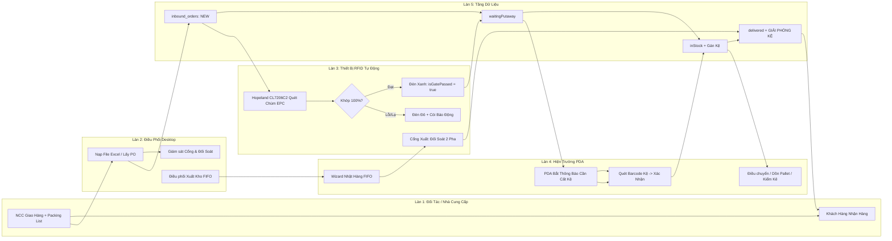

# TÀI LIỆU SƠ ĐỒ LUỒNG TOÀN DIỆN HỆ THỐNG QUẢN LÝ KHO RFID (RFID WMS)
> **Tương thích định dạng Microsoft Visio (.vsdx, .vdx), Draw.io (.drawio) và Vector SVG**
> **Tác giả:** Antigravity AI Specialized Squad  
> **Dự án:** RFID Warehouse Management System (WMS)

---

## 1. TỔNG QUAN HỆ THỐNG FILE SƠ ĐỒ XUẤT RA CHO VISIO

Người dùng có thể trực tiếp mở, chỉnh sửa các khối hình (shapes), mũi tên kết nối (connectors), nội dung văn bản (text), màu sắc và bơi theo làn (swimlanes) bằng các file được tạo trong thư mục dự án:

| Tên File | Định dạng | Phần Mềm Mở / Chỉnh Sửa Tối Ưu | Mục đích sử dụng |
| :--- | :--- | :--- | :--- |
| **`RFID_Warehouse_Workflow_Diagram.vsdx`** | Microsoft Visio Drawing (OpenXML) | **Microsoft Visio 2013 / 2016 / 2019 / 2021 / 365, Visio Online** | Định dạng chuẩn hiện đại của Visio, đầy đủ 5 trang tabs bên dưới, kéo thả shape tự do |
| **`RFID_Warehouse_Workflow_Diagram.vdx`** | Visio XML Drawing standard | **Mọi phiên bản Visio (kể cả Visio 2003-2010, LibreOffice Draw)** | Định dạng XML chuẩn của Microsoft, không lo lỗi zip giải nén, chỉnh sửa trực tiếp |
| **`RFID_Warehouse_Workflow_Diagram.drawio`** | Diagrams.net / Draw.io XML | **Draw.io, diagrams.net, VS Code Draw.io Integration, Visio** | Chỉnh sửa miễn phí trực tiếp trên web hoặc ứng dụng desktop |
| **`RFID_Warehouse_Workflow_Viewer.html`** | Interactive Vector SVG HTML | **Google Chrome, Microsoft Edge, Firefox, Safari** | Xem ngay lập tức với giao diện hiện đại, Zoom/Pan, chuyển tab 5 trang mượt mà |

---

## 2. NỘI DUNG 5 PHÂN HỆ LUỒNG NGHIỆP VỤ

### Trang 1: Sơ Đồ Tổng Thể Vòng Đời & Kiến Trúc Phân Tầng (End-to-End System Flow)
Phản ánh toàn bộ hành trình của một sản phẩm từ khi nhà cung cấp xuất xưởng tới khi đến tay khách hàng, đi qua 5 làn bơi trách nhiệm:
1. **Làn Đối Tác (Suppliers / Customers)**: Giao hàng kèm Packing List/PO và nhận hàng xuất.
2. **Làn Điều Phối Desktop (WMS Desktop)**: Admin tải phiếu Excel hoặc tạo đơn trên hệ thống, theo dõi tháp đèn và trạng thái cổng Gate.
3. **Làn Thiết Bị RFID Tự Động (Hardware Gate CL7206C2 / Tower Light Modbus)**: Bắt sóng chùm chip EPC qua cổng TCP 9090, phân loại thẻ tức thời, đổi màu đèn tháp (Xanh/Vàng/Đỏ) và hú còi khi có lỗi.
4. **Làn Hiện Trường & PDA (SEUIC Utouch 2 Android)**: Thủ kho nhận nhiệm vụ `[CẦN CẤT KỆ]`, dùng súng quét mã barcode kệ, xác nhận cất kệ, điều chuyển, dồn pallet và kiểm kê di động.
5. **Làn Trạng Thái & CSDL (WarehouseRepository / Supabase Cloud / SQLite)**: Quản lý biến động trạng thái từ `PENDING_INBOUND` -> `WAITING_PUTAWAY` -> `IN_STOCK` -> `DELIVERED`, giải phóng vị trí kệ khi xuất hàng.

---

### Trang 2: Quy Trình Nhập Kho & Đối Soát Cổng RFID Gate (Inbound Verification)
Chi tiết từng pha đối soát và điều khiển ngoại vi:
1. **Nạp Đơn Hàng**: Admin nạp Excel Packing List (`Template-Goods-Receive-v3.xlsx`) hoặc chọn PO Supabase. Lưu ngay lập tức `inbound_orders: newOrder` và `items: pendingInbound`.
2. **Thu Thập Tín Hiệu RFID**:
   - Cổng Gate cố định: Hopeland CL7206C2 qua TCP 9090, đèn tháp bật VÀNG (`GPO 3 -> ON`).
   - Hoặc Súng PDA: Bóp cò vật lý, cơ chế Debounce 250ms tránh lặp thẻ.
3. **Bộ Máy Đối Soát Thời Gian Thực (Verification Engine)**:
   - Tra cứu tập hợp $O(1)$ Hash Set so với danh mục EPC mong đợi.
   - Phân loại 3 ô: **ĐÃ QUÉT** (Khớp), **THIẾU** (Chưa thấy), **LẠ** (Thẻ ngoài đơn).
4. **Phản Hồi Ngoại Vi & Chuyển Trạng Thái**:
   - Nếu có thẻ lạ / thiếu: Bật Đèn Đỏ + Còi hú (`GPO 1 -> ON`).
   - Nếu đủ 100% chip sản phẩm: Bật Đèn Xanh (`GPO 2 -> ON`), `isGatePassed = true`, tự động chuyển đơn và hàng loạt items sang `WAITING_PUTAWAY`.

---

### Trang 3: Quy Trình Cất Kệ & Lưu Trữ (PDA Putaway & Location Storage)
Thiết kế luồng 2-hộp thao tác tối ưu cho màn hình cảm ứng tay cầm:
1. **Tiếp Nhận**: Thẻ `[CẦN CẤT KỆ]` trên `PdaHomeScreen` chuyển thẳng vào `PdaPutawayScreen`.
2. **Hộp 1 - Thông Tin Hàng**: Quét barcode pallet/thùng hàng, nạp thông tin SKU, tên hàng, đơn hàng.
3. **Hộp 2 - Gợi Ý Kệ**: Hệ thống tự động tìm kiếm kệ còn trống trong Zone tương ứng, hiển thị bản đồ 2D (`warehouse_floor_plan_widget.dart`).
4. **Xác Nhận Kệ**: Thủ kho đến vị trí, quét barcode tem kệ (`A1-01-01`), bấm "XÁC NHẬN CẤT KỆ".
5. **Cam Kết Dữ Liệu**: `items: IN_STOCK`, gán `locationId`, cập nhật trạng thái ô kệ (ĐẦY / CÒN CHỖ), ghi nhận `InventoryTransaction` (`IN`).

---

### Trang 4: Quản Lý Kho Nội Bộ, Luân Chuyển & Kiểm Kê (Internal Transfers, Merge & Audit)
1. **Điều Chuyển Kệ (Transfer)**: Quét kệ nguồn -> Quét hàng/pallet -> Quét kệ đích -> Cập nhật vị trí mới, ghi log `MOVE`.
2. **Dồn Gộp Pallet (Merge)**: Quét pallet nguồn -> Chọn các thùng cần dồn -> Quét pallet đích -> Cập nhật liên kết `palletId`, giải phóng pallet cũ nếu rỗng.
3. **Kiểm Kê Định Kỳ (Audit)**: Tạo phiên `inventory_sessions`, bóp cò PDA quét RFID, phân loại 4 trạng thái sai lệch:
   - `MATCH`: Khớp 100% (Xanh lá).
   - `MISSING`: Thiếu thực tế (Đỏ).
   - `WRONG_LOCATION`: Lạc vị trí kệ (Cam).
   - `UNKNOWN_EPC`: Thẻ chưa khai báo trong hệ thống (Tím).
4. **Quản Lý Kệ 4-Tab & Bản Đồ 2D**: Pallet, Vị trí (3 nút 1-chạm ĐẦY/SẮP HẾT/CÒN CHỖ), Lịch sử, Sản phẩm.

---

### Trang 5: Quy Trình Xuất Kho & Đối Soát FIFO Cổng RFID (Outbound FIFO & Location Release)
1. **Tiếp Nhận Đơn Xuất**: Khởi tạo `outbound_orders` từ PO của khách hàng.
2. **Thuật Toán Kiểm Tra FIFO**:
   - Quét toàn bộ tồn kho `IN_STOCK` có cùng SKU.
   - Sắp xếp theo ngày nhập `created_at` xa nhất.
   - Bắt buộc / cảnh báo ưu tiên xuất kiện hàng có ngày nhập cũ nhất.
3. **Wizard Chỉ Đường Lấy Hàng**: Tính toán lộ trình nhặt hàng tối ưu qua 10 kệ kho.
4. **Đối Soát 2 Pha Tại Cổng Xuất**:
   - Pha 1: Bắt sóng thẻ RFID Pallet xuất.
   - Pha 2: Bắt toàn bộ chip RFID sản phẩm trên pallet.
   - Đèn tháp: Xanh (Đủ hàng và đúng FIFO) / Đỏ (Sai hàng hoặc vi phạm FIFO).
5. **Cơ Chế Giải Phóng Lưu Trữ Tuyệt Đối**:
   - `item.status = DELIVERED` (hoặc `OUT`).
   - `item.locationId = null` (Xóa hoàn toàn liên kết kệ lưu trữ).
   - `pallet.locationId = null`.
   - Kệ được trả về trạng thái CÒN CHỖ / TRỐNG ngay lập tức.
   - Tạo phiếu xuất `delivery_notes` và ghi log `InventoryTransaction` (`OUT`).
